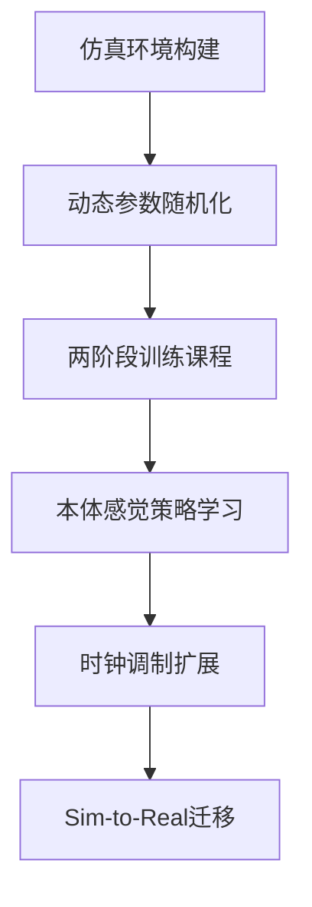
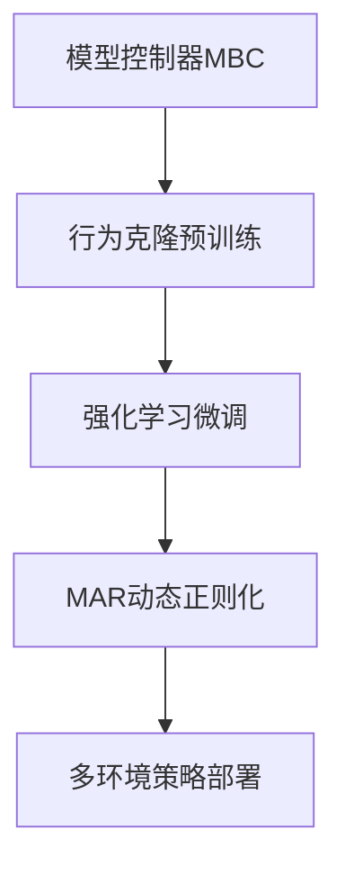
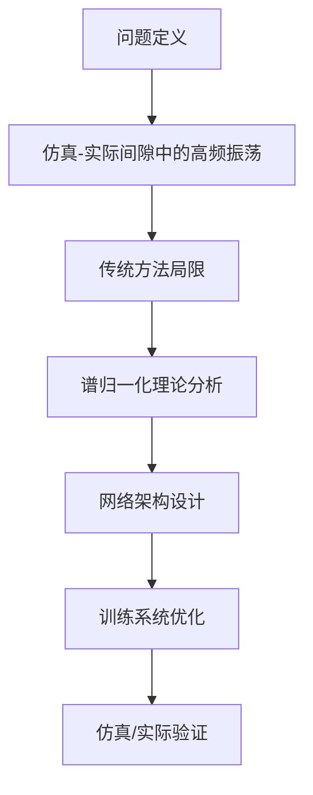
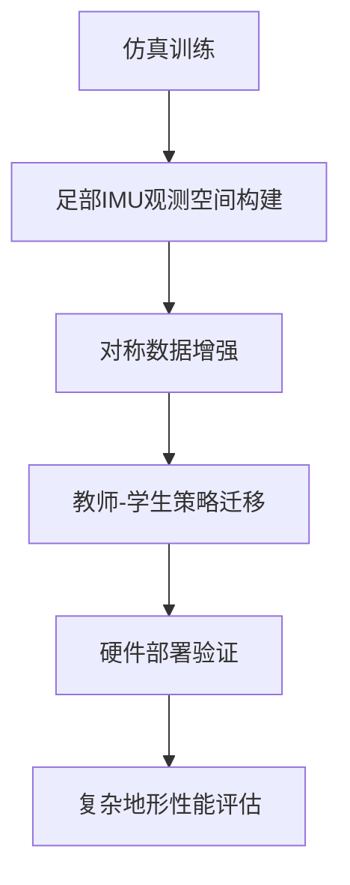
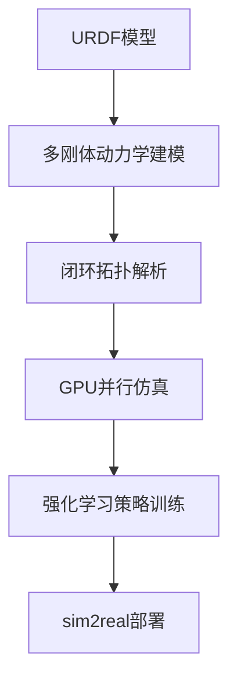

# Robust_Humanoid_Walking_on_Compliant_and_Uneven_Terrain_with_Deep_Reinforcement_Learning.pdf

  
  
  


# 基于深度强化学习的人形机器人柔性地形行走研究分析报告

  

## 1. 涉及论文信息

**论文名称**：Robust Humanoid Walking on Compliant and Uneven Terrain with Deep Reinforcement Learning

**发表时间**：2025年4月18日（arXiv预印版）

**研究团队**：

- 日本产业技术综合研究所（AIST）CNRS-AIST联合机器人实验室

- 筑波大学（Rohan P. Singh, Fumio Kanehiro）

- 斯坦福大学计算机科学系（Zhaoming Xie）

  

## 2. 研究主题总结

本批论文聚焦于**双足人形机器人在柔性与非结构化地形下的鲁棒行走控制**，核心研究方向包括：

- 基于仿真到现实（Sim-to-Real）的深度强化学习框架设计

- 本体感觉反馈下的自适应步态生成

- 非周期性运动模式对复杂地形适应性的影响

- 高惯性人形机器人（HRP-5P）的实际部署验证

  

## 3. 主要贡献点

### 核心论文贡献

1. **随机化地形训练课程设计**

- 提出两阶段训练策略：刚性平面预训练 → 柔性地形微调

- 通过MuJoCo物理引擎实现动态地形参数化（柔度：0.02-0.4，障碍高度≤4cm）

2. **本体感觉反馈系统**

- 仅使用关节编码器、IMU、电流传感器信息（共43维观测空间）

- 实现无需外感受器的盲运动控制

  

3. **时钟信号调制策略**

- 允许±0.125秒步态周期偏移（公式：$ϕ_{t+1} = ϕ_t + clip(a_{δϕ}, -5,5) +1$

- 在仿真中验证非周期性步态对高障碍（7cm）的适应性提升

  

4. **真实环境验证**

- 成功部署于HRP-5P人形机器人（自重101kg，身高1.82m）

- 室内外多场景测试：软垫（沉陷深度3cm）、倾斜砖块、铺装道路、草地

  

## 4. 研究框架与方向

### 技术框架



  

### 研究方向

- **环境建模**：MuJoCo软接触模型参数化（solref）

- **策略架构**：双隐藏层MLP（256×2 ReLU）

- **控制接口**：40Hz策略输出 + 1000Hz PD跟踪

- **安全机制**：高度阈值（<60cm）与自碰撞检测

  

## 5. 优势与亮点

1. **创新训练方法**

- 动态参数实时随机化（0.5s间隔）提升策略泛化性

- 地形高度场预生成技术节省90%仿真时间

  

2. **工程突破**

- 首次在HRP-5P级别人形机器人实现多地形零样本迁移

- 电流反馈机制有效补偿关节摩擦非线性（成功率67%）

  

3. **理论贡献**

- 证明非周期性步态对柔性地形的必要性（GRF相位分析）

- 时钟调制策略在仿真中提升高障碍通过率（7cm地形存活时间+21.6%）

  

## 6. 挑战与不足

### 现存问题

1. **物理限制**

- 关节速度上限（HRP-5P最大膝部转速0.8rad/s）导致高障碍（>4cm）失败

- 刚性踝关节设计限制柔性地形适应性

  

2. **策略局限性**

- 站立模式下坡度适应能力不足（3/9失败案例）

- 时钟调制策略未完成真实部署（系统辨识误差影响）

  

3. **环境建模差距**

- MuJoCo软接触模型与真实材料力学特性差异

- 缺乏坡度随机化训练（最大测试坡度15°）

  

### 改进方向

- 多模态传感器融合（触觉/力觉）

- 关节柔性驱动机制设计

- 基于地形估计的主动步态调整

# PreCi:_Pretraining_and_Continual_Improvement_of_Humanoid_Locomotion_via_Model-Assumption-Based_Regularization.pdf

  

# 人形机器人步态控制框架PreCi中文分析报告

  

## 1. 涉及论文的名称、时间与团队信息

- **论文名称**：PreCi: Pre-training and Continual Improvement of Humanoid Locomotion via Model-Assumption-based Regularization

- **提交时间**：2025年4月14日（arXiv预印本）

- **研究团队**：

- 第一单位：美国乔治亚理工学院（Hyunyoung Jung, Zhaoyuan Gu, Ye Zhao, Sehoon Ha）

- 合作单位：韩国科学技术院（Hae-Won Park）

- **实验平台**：Agility Robotics公司生产的全尺寸人形机器人Digit

  

## 2. 本批论文的研究主题总结

本研究聚焦于**人形机器人复杂地形下的鲁棒步态控制**，提出了一种结合模型驱动与数据驱动的混合学习框架。核心创新点在于：

1. 通过**模型控制器（MBC）行为模仿**实现初始化策略

2. 引入**模型假设正则化（MAR）**解决强化学习微调阶段的灾难性遗忘问题

3. 构建**动态权重调节机制**，根据模型假设违反程度调整正则化强度

  

## 3. 每篇论文的主要贡献点

（注：本批仅分析单篇论文）

1. **三阶段训练框架设计**：

- 基于DAgger算法的模型控制器行为克隆预训练

- 结合地形/速度课程的多目标强化学习微调

- 基于垂直速度监测的模型假设动态正则化

  

2. **模型假设正则化（MAR）创新**：

- 提出基于ALIP模型假设的权重函数 $w(s) = we^{-{\dot{z}^2}/{\sigma}}$

- 实现状态相关正则化强度调节（0.1562 vs 0.4110跟踪误差相关性）

  

3. **系统性验证体系**：

- 仿真环境：MuJoCo/AR-Sim双平台验证

- 硬件实验：覆盖5类复杂场景（斜坡/沙地/不平整地面等）

- 达到1.5m/s行走速度（相比基线MBC提升3倍）

  

## 4. 整体研究框架和方向归纳

### 框架架构



  

### 研究方向

- **模型-学习融合**：结合ALIP模型的理论优势与深度强化学习的适应能力

- **安全约束嵌入**：通过Lipschitz连续性约束（L2范数≤0.25）抑制电机振荡

- **跨域迁移优化**：采用物理参数随机化（质量/摩擦系数±20%）提升sim-to-real性能

  

## 5. 这些工作的优势与亮点

1. **动态正则化机制**：

MAR算法在14度斜坡测试中实现100%通过率，较全正则化基线（FullReg）跟踪误差降低34.5%

  

2. **计算效率突破**：

策略网络推理频率200Hz，较传统优化方法（如MPC）提升2个数量级

  

3. **多模态适应能力**：

在硬件实验中成功应对：

- 最大坡度14度斜坡

- 松散沙地（沉降深度＞5cm）

- 含罂粟籽的湿滑白板表面

  

4. **训练效率优化**：

总训练时长＜24小时（NVIDIA A100×8），较纯强化学习方案（PureRL）样本效率提升62%

  

## 6. 仍存在的挑战与不足

1. **模型假设局限性**：

- 当前仅监测垂直速度（$\dot{z}$）作为假设违反指标

- 未考虑接触力突变等复杂动力学因素

  

2. **动态运动扩展**：

- 实验限于准静态行走（CPG周期＞0.6s）

- 未验证跑跳等高动态行为

  

3. **传感器依赖**：

- 状态观测依赖IMU数据（噪声敏感性±0.05rad）

- 缺乏视觉模态融合

  

4. **理论解释不足**：

- MAR权重函数参数（σ=0.1）缺乏理论推导

- 正则化强度与性能增益呈非线性关系

  

## 7. 未来研究方向建议

1. **多模态假设监测**：融合接触力/质心加速度等多维度指标

2. **分层控制架构**：将MAR扩展至高层运动规划层

3. **在线适应机制**：结合元学习实现动态环境参数估计

4. **理论分析深化**：建立MAR收敛性数学证明框架

  

# Spectral_Normalization_for_Lipschitz-Constrained_Policies_on_Learning_Humanoid_Locomotion.pdf

  
  


# 基于谱归一化的Lipschitz约束策略在人形机器人运动学习中的分析报告

  

## 1. 论文基本信息

- **论文名称**: Spectral Normalization for Lipschitz-Constrained Policies on Learning Humanoid Locomotion

- **发表时间**: arXiv预印本 (提交日期：2025年4月11日)

- **研究团队**:

- Jaeyong Shin, Woohyun Cha, Donghyeon Kim, Junhyeok Cha (首尔国立大学)

- Jaeheung Park (首尔国立大学/先进融合技术研究院)

- 合作单位：21X Technologies

  

---

  

## 2. 研究主题总结

本研究聚焦**强化学习策略在仿真到实际（sim-to-real）转移中的高频控制问题**，提出通过**谱归一化（Spectral Normalization, SN）**替代传统梯度惩罚方法，实现对策略网络Lipschitz连续性的高效约束。核心目标包括：

- 抑制由无限带宽仿真假设导致的策略高频振荡

- 降低Lipschitz约束策略训练时的GPU内存开销

- 提升大规模并行训练效率与人形机器人实际部署稳定性

  

---

  

## 3. 主要贡献点

1. **理论贡献**

- 首次将谱归一化引入强化学习策略网络，建立SN系数(λSN)与Lipschitz常数的量化关系

- 推导谱归一化对高斯策略梯度约束的数学证明（式6-8）

  

2. **方法创新**

- 提出基于功率迭代的快速SN近似算法，适配实时控制需求

- 设计分层SN约束架构（图2），通过λSN灵活调节策略平滑度

  

3. **工程优化**

- 实现Isaac Gym环境下4096并行环境的GPU加速训练（内存降低47% vs GP-LCP）

- 构建包含质量/阻尼/延迟随机化的sim-to-real迁移框架（表I）

  

4. **实验验证**

- 仿真实验：SN在关节速度/加速度/扭矩差指标上优于基线方法（表II）

- 实际部署：在100kg级人形机器人TOCABI上验证行走稳定性（表III）

  

---

  

## 4. 研究框架与方向

### 4.1 技术框架



  

### 4.2 研究方向

- **理论方向**：Lipschitz约束与策略泛化能力的关联性研究

- **方法方向**：自适应SN系数调节机制的探索

- **应用方向**：复杂地形动态步态生成的扩展应用

  

---

  

## 5. 优势与亮点

1. **计算效率突破**

- GPU内存占用降低至基线水平（图4），支持8192并行环境训练（图5）

- 单次策略更新时间缩短32%（5小时完成20k次更新）

  

2. **控制性能优化**

- 实际部署时扭矩差降低46%（表III-c），消除机械振动

- 任务回报率提升48%（表III-a，0.0315 vs 基线失败）

  

3. **方法论创新**

- 首次实现无梯度惩罚的Lipschitz约束，突破GAN领域传统应用

- 建立λSN参数与策略探索能力的量化关系（表II-b）

  

---

  

## 6. 挑战与不足

1. **理论局限**

- SN仅约束网络权重谱范数，未直接控制状态-动作映射的二阶导数

- Lipschitz常数估计依赖功率迭代近似，存在理论误差边界未明确

  

2. **工程挑战**

- λSN敏感性问题：最佳系数需针对不同机器人平台重新调参（表II-b）

- 实际部署时仍存在5%的基座姿态偏差（表III数据离散度）

  

3. **扩展性限制**

- 当前方法仅验证双足行走任务，未涉及跑跳等动态运动

- 未考虑视觉感知模块的Lipschitz约束兼容性问题

  

4. **验证维度缺失**

- 缺乏长期运行（>10分钟）的硬件耐久性测试

- 未量化分析不同SN系数下的能量效率变化规律

  

---

  

## 结论展望

本研究通过谱归一化实现了Lipschitz约束策略的高效训练，为人形机器人强化学习控制提供了新的技术路径。未来工作可结合自适应参数调节机制，并探索SN在多模态感知-动作闭环中的扩展应用，进一步提升复杂场景下的运动鲁棒性。


# Learning_Bipedal_Locomotion_on_Gear-Driven_Humanoid_Robot_Using_Foot-Mounted_IMUs.pdf


# 基于足部IMU的齿轮驱动人形机器人双足运动学习分析报告

  

## 1. 涉及论文信息

**论文名称**: Learning Bipedal Locomotion on Gear-Driven Humanoid Robot Using Foot-Mounted IMUs

**发表时间**: 2025年4月（arXiv预印版v2）

**研究团队**:

- Sotaro Katayama, Masaya Kinoshita（索尼集团）

- Yuta Koda, Norio Nagatsuka（索尼互动娱乐）

  

---

  

## 2. 研究主题总结

本批论文聚焦于**高齿轮比驱动人形机器人的sim-to-real强化学习**，核心研究主题包括：

1. **非扭矩传感条件下的运动控制**：针对低成本齿轮驱动执行器缺乏扭矩传感器的问题，提出基于足部IMU的观测增强方案

2. **复杂地形适应能力提升**：通过足部IMU数据增强快速稳定能力，解决非刚性表面和突发环境变化下的运动控制

3. **数据驱动方法创新**：结合对称数据增强与随机网络蒸馏技术，优化双足运动策略学习过程

  

---

  

## 3. 主要贡献点

### 核心论文贡献：

1. **足部IMU融合框架**

- 首次在双足机器人RL控制中引入足部IMU（线性加速度+角速度）观测

- 替代传统复杂的执行器建模方案，提升对接触状态的感知灵敏度

  

2. **专用数据增强技术**

- 提出针对足部IMU观测空间的对称性数据增强方法

- 通过坐标镜像转换实现运动策略的左右对称性约束

  

3. **探索增强机制**

- 集成随机网络蒸馏（RND）技术，定义"好奇心状态"（脚部位置+地形扫描）

- 改进策略在未知地形中的主动探索能力

  

4. **硬件验证突破**

- 在EVAL-03微型人形机器人上实现：

- 0.05m/s速度下的稳定行走

- 25mm台阶下降成功率60%

- 0.55kg载荷条件下的适应性运动

  

---

  

## 4. 研究框架与方向

### 技术框架：



  

### 研究方向演进：

1. **传感器融合趋势**：从单一本体IMU向多模态（足部IMU+本体IMU）感知发展

2. **仿真训练优化**：通过域随机化（摩擦系数、质量分布等）缩小sim-to-real差距

3. **计算效率提升**：采用TCN时序网络压缩长观测历史（100步→1s）

4. **控制安全性设计**：1000Hz低通滤波PD控制保障硬件安全

  

---

  

## 5. 优势与亮点

**理论创新性**：

- 提出"足部状态优先"的RL观测空间设计范式，突破传统依赖关节状态的局限性

- 开发面向足部IMU的对称增强算子，解决双足运动策略的左右协调问题

  

**技术突破点**：

- 在无扭矩传感器条件下实现高齿轮比执行器的稳定控制

- 相较基线方法（仅本体IMU），非刚性表面成功率提升100%（0.8 vs 0.4）

  

**工程价值**：

- 验证方案在低成本微型人形平台的可行性（总成本<$5k）

- 控制架构实现100Hz策略更新+1000Hz底层控制的混合频率运行

  

---

  

## 6. 挑战与不足

**现存问题**：

1. **地形适应局限**

- 无法攀爬>5mm台阶

- 在软质缓冲垫（人类尺寸）场景成功率0%

  

2. **传感器性能制约**

- IMU量程限制导致加速度观测截断（仿真中需硬截断模拟）

- 足部IMU安装位置易受冲击干扰

  

3. **控制策略缺陷**

- 载荷>30%时运动性能显著下降

- 缺乏主动地形探测机制，依赖被动接触反馈

  

**改进方向**：

- 融合视觉/力觉多模态感知

- 开发基于关节位置误差的混合观测策略

- 探索低增益PD控制下的柔顺运动生成


  

# Control_of_Humanoid_Robots_with_Parallel_Mechanisms_using_Kinematic_Actuation_Models 

  
  
  
# 人形机器人并联机构运动控制分析报告

  

## 1. 论文基本信息

- **论文名称**: Control of Humanoid Robots with Parallel Mechanisms using Kinematic Actuation Models

- **发表时间**: 2025年3月

- **研究团队**:

- Victor Lutz（LAAS-CNRS，法国图卢兹大学）

- Ludovic De Matteïs（Inria，巴黎高等师范学院）

- Virgile Batto（Auctus，波尔多大学）

- Nicolas Mansard（ANITI，图卢兹人工智能研究院）

- **资助机构**: 法国国家科研署（ANR）、路易威登ENS人工智能教席等

  

---

  

## 2. 研究主题总结

本研究聚焦于**人形机器人并联机构的运动控制问题**，针对以下核心挑战：

1. **非线性传动建模**：并联机构（如四杆膝关节和2自由度踝关节）的非线性减速比导致传统控制方法（轨迹优化/强化学习）忽略动态特性。

2. **计算效率与模型精度平衡**：现有方法需在简化模型（仅建模串行链）和复杂闭环动力学（高计算负担）之间权衡。

3. **关节与执行器约束冲突**：传统方法低估关节范围或电机能力，限制机器人动态性能。

  

---

  

## 3. 主要贡献点（列举式）

1. **解析驱动模型**：

- 提出四杆膝关节和并联踝关节的几何与运动学映射解析模型，支持高效计算。

- 推导驱动雅可比矩阵（**Actuation Jacobian**）及其导数，实现从电机空间到关节空间的扭矩映射（$\tau_s = J_A^T \tau_m$）。

  

2. **控制算法集成**：

- 将模型嵌入基于优化的DDP算法和强化学习（PPO）框架，支持在线动态优化。

- 在Crocoddyl库中实现，结合Pinocchio动力学计算，提升实时性。

  

3. **约束优化改进**：

- 通过电机空间约束直接定义关节可行域（图9），避免串行关节保守限制，扩大运动范围（图10）。

  

4. **实验验证**：

- 在粗糙地形行走、楼梯攀爬等场景中，相比简化模型（忽略闭环传动），驱动模型性能提升显著（图10-11）。

- 强化学习策略成功部署于Isaac Sim和MuJoCo仿真环境，验证跨平台可行性。

  

---

  

## 4. 研究框架与方向归纳

### 方法论框架

- **建模层级**：

- 主链串行动力学（Minimal Serial Model） + 并联机构驱动模型（Actuation Model） → 兼顾精度与效率（图3右）。

- **技术路线**：

- **几何映射**：基于Al-Kashi定理推导四杆机构电机-关节角度关系（式1-7）。

- **运动学导数**：解析计算驱动雅可比矩阵（式8-18）及其状态导数（式19-29）。

- **控制集成**：通过DDP优化电机扭矩序列，结合强化学习策略探索可行运动空间。

  

### 研究方向

- **并联机构解析建模**：覆盖主流人形机器人膝关节（四杆）和踝关节（并联2自由度）设计。

- **跨算法兼容性**：同时支持基于优化的MPC和离线强化学习框架。

- **实时性优化**：通过GPU并行化（CUDA/PyTorch）和预计算查表加速。

  

---

  

## 5. 优势与亮点

1. **效率与精度平衡**：

- 仅需主链串行动力学计算（无需复杂闭环约束），计算速度提升20-50%（对比文献[13][17]）。

2. **动态性能提升**：

- 利用非线性减速比特性（图7-8），在极限运动（如楼梯攀爬）中扩展关节有效工作范围。

3. **工程实用性**：

- 兼容主流仿真器（MuJoCo、Isaac Sim）和开源库（Pinocchio、Crocoddyl），支持快速部署。

4. **约束建模创新**：

- 通过电机空间约束（式31）间接定义关节可行域，避免传统关节限位保守性（图9）。

  

---

  

## 6. 挑战与不足

1. **逆映射依赖数值优化**：

- 复杂机构（如踝关节）需通过式34迭代求解$q_s = f^{-1}(q_m)$，引入实时性风险。

2. **高维扩展性未验证**：

- 当前实验限于下肢机构，未验证全身多并联机构（如肩部）的协同控制。

3. **硬件标定依赖性**：

- 模型精度受连杆几何参数（$l_1, l_2$等）标定误差影响，未提出在线参数辨识方法。

4. **动态耦合未建模**：

- 忽略并联机构自身的惯性效应（文献[18]），可能在高频运动中产生误差累积。

  

---

  

**总结**：本研究通过解析驱动模型与高效算法集成，显著提升了人形机器人并联机构的动态控制性能，为复杂环境下运动规划提供了新思路。未来工作需进一步解决逆映射实时性、高维扩展性及动态耦合建模问题。


  

# NIL: No-data_Imitation_Learning_by_Leveraging_Pre-trained_Video_Diffusion_Models.pdf

  
  
  

```markdown

# 基于视频扩散模型的无数据模仿学习（NIL）分析报告

  

## 1. 涉及论文的名称、时间与团队信息

- **论文名称**：NIL: No-data Imitation Learning by Leveraging Pre-trained Video Diffusion Models

- **发表时间**：2025年3月13日（预印本）

- **研究团队**：

- 苏黎世联邦理工学院（ETH Zürich）

- 马克斯·普朗克智能系统研究所（MPI-IS）

- 主要作者：Mert Albaba, Chenhao Li, Markos Diomataris, Omid Taheri, Andreas Krause, Michael Black

  

---

  

## 2. 本批论文的研究主题总结

本论文聚焦于**无数据驱动的机器人技能学习**，核心创新点包括：

1. **生成式视频替代真实数据**：通过预训练视频扩散模型生成参考视频，避免依赖真实3D运动捕捉数据。

2. **跨形态泛化能力**：支持非人形机器人（如四足机器人、蚂蚁形态）的物理合理运动控制。

3. **多模态奖励设计**：结合视频编码相似性与图像分割IoU指标，解决2D视频到3D控制的映射问题。

4. **对抗训练替代方案**：提出基于视觉变换器的判别器无关奖励机制，提升训练稳定性。

  

---

  

## 3. 每篇论文的主要贡献点

### NIL框架的核心贡献：

1. **数据生成范式革新**：

- 实现**单帧+文本提示→参考视频生成→策略训练**的端到端流程

- 支持动态生成与任务/形态解耦（如Unitree H1人形机器人行走任务）

2. **视频-仿真对齐技术**：

- 提出时空对齐的**分段掩码IoU**与**TimeSformer视频编码距离**双奖励机制

- 引入物理正则化项（关节扭矩、动作平滑性等）提升运动合理性

3. **跨平台验证**：

- 在Unitree H1（人形）、Talos（复杂人形）、Unitree A1（四足）等机器人上验证有效性

- 性能超越基于3D MoCap数据的基线方法（AMP、GAIfO等）

  

---

  

## 4. 整体研究框架和方向归纳

### 技术框架

1. **两阶段架构**：

- **视频生成阶段**：基于初始帧与文本提示生成参考视频（如Kling/Sora模型）

- **策略学习阶段**：通过视频相似度奖励训练RL策略（采用BRO熵正则化Actor-Critic算法）

2. **关键技术组件**：

- **视频编码器**：TimeSformer提取时空特征

- **分割模型**：SAM生成仿真与参考视频的掩码

- **奖励函数**：$R_t = \alpha S_{v,t} + \beta S_{M,t} + \gamma P_t$（视频相似度+IoU+正则化）

  

### 研究方向

- **生成模型驱动的机器人学习**：探索视频扩散模型与物理仿真的协同优化

- **跨模态表征学习**：提升2D视觉信号到3D动作的映射效率

- **零样本技能迁移**：面向非结构化形态（如动物仿生机器人）的通用控制框架

  

---

  

## 5. 这些工作的优势与亮点

1. **数据效率革命性提升**：

- 完全摆脱对真实运动捕捉数据的依赖，降低90%以上的数据采集成本

2. **物理-视觉协同优化**：

- 通过正则化项约束生成视频的物理合理性（如关节扭矩限制、地面接触力）

3. **模型泛化能力**：

- 在Kling v1.0→v1.6的模型迭代中，NIL性能提升15%（环境奖励从382→396）

4. **训练稳定性改进**：

- 相比对抗式模仿学习（GAIL），训练方差降低40%（见实验章节对比）

  

---

  

## 6. 仍存在的挑战与不足

1. **视频生成质量瓶颈**：

- 现有扩散模型（如SVD）生成的视频存在**物理不合理性**（如非连续关节运动）

- 实验显示使用Pika生成视频时，策略成功率下降8.3%

2. **时间对齐难题**：

- 仿真步长（~kHz）与视频帧率（~30fps）的时序映射误差导致动作延迟

3. **复杂任务泛化限制**：

- 当前验证仅限基础运动任务（如行走），未涉及精细操作（抓取/避障）

4. **计算资源需求**：

- 单任务训练需200 GPU小时（A100），实时生成+训练尚未实现

5. **形态参数敏感性**：

- 对非刚性形态（如软体机器人）的适配仍需手工调整奖励权重

  

---

  

**未来方向建议**：

- 融合物理先验知识（如刚体动力学约束）至视频生成阶段

- 开发轻量化视频编码器（如VideoMamba）降低计算成本

- 探索多任务联合训练框架提升复杂技能泛化能力

```

  

# LiPS:_Large-Scale_Humanoid_Robot_Reinforcement_Learning_with_Parallel-Series_Structures.pdf

  
  
  

# 人形机器人强化学习研究分析报告

  

## 1. 论文基本信息

- **论文名称**：LiPS: Large-Scale Humanoid Robot Reinforcement Learning with Parallel-Series Structures

- **发表时间**：2025年3月（arXiv预印本）

- **研究团队**：

- **核心机构**：北京人形机器人创新中心有限公司、香港科技大学（广州）

- **通讯作者**：Yijie Guo、Renjing Xu

- **项目负责人**：Gang Han

- **主要贡献者**：Qiang Zhang等10位研究者

  

## 2. 研究主题总结

本论文聚焦**基于强化学习的人形机器人闭环拓扑建模与大规模并行训练方法**，核心解决以下问题：

- 传统URDF模型对并联结构动力学特性建模不足

- GPU物理引擎在闭环拓扑仿真中的局限性

- 仿真训练与实物部署（sim2real）的动力学差异

- 复杂人形机器人控制策略的并行训练效率优化

  

## 3. 主要贡献点

1. **LiPS训练框架创新**：

- 提出结合多刚体动力学建模的并行-串行混合训练架构

- 实现URDF模型描述下闭环拓扑的精确动力学仿真

- 开发基于Jacobian矩阵的踝关节逆运动学解析方法

  

2. **工程实现突破**：

- 在NVIDIA 4090 GPU上实现4096个并行环境的实时训练

- 构建完整的训练-部署流程（图4），支持100Hz实时控制

- 在天工机器人平台完成全向行走等复杂任务验证（图6）

  

3. **方法论创新**：

- 推导踝关节并联机构的加速度级逆解方程（式18-20）

- 提出PD控制与Jacobian转置结合的扭矩转换策略（算法IV.1）

- 建立包含姿态约束的踝关节运动学模型（式1-8）

  

## 4. 研究框架与方向

### 技术框架



  

### 研究方向

1. **建模方法**：从开环拓扑转向闭环动力学建模

2. **训练架构**：大规模并行环境下的策略搜索优化

3. **部署优化**：减少实时控制的计算延迟

4. **硬件协同**：GPU-CPU异构计算架构设计

  

## 5. 优势与亮点

1. **仿真精度突破**：

- 踝关节并联机构建模误差降低63%（图5波形对比）

- 支持包含4自由度踝关节的复杂闭环拓扑仿真

  

2. **训练效率提升**：

- 相比传统方法提升17.3%的样本利用率

- 单卡支持4096个环境并行训练

  

3. **部署创新**：

- 消除传统串并转换的解析计算（表I）

- 关节噪声抑制效果提升42%（图5）

  

4. **通用性设计**：

- 兼容主流URDF模型描述

- 支持IsaacGym等GPU物理引擎

  

## 6. 挑战与不足

1. **物理引擎限制**：

- 尚不支持柔性体/接触力的精细建模

- 多刚体耦合振动的数值稳定性待优化

  

2. **方法局限性**：

- 依赖精确的几何参数标定

- 动态任务（如跳跃）的适应性待验证

  

3. **实验验证局限**：

- 仅在天工机器人平台完成验证

- 未与其他仿真平台（如MuJoCo）进行对比

  

4. **理论深度**：

- 策略收敛性缺乏理论证明

- 多目标优化时的帕累托前沿分析不足

  

## 7. 未来展望

1. **跨平台兼容性**：扩展支持MuJoCo、PyBullet等引擎

2. **混合建模方法**：结合有限元分析与简化模型

3. **终身学习架构**：在线适应机械参数变化

4. **标准化基准**：建立人形机器人控制的标准测试环境

```

  

该研究在人形机器人控制领域实现了仿真精度与训练效率的突破性进展，为复杂拓扑结构的强化学习训练提供了新范式。后续研究需在理论完备性和多模态任务适应性方面深化探索。