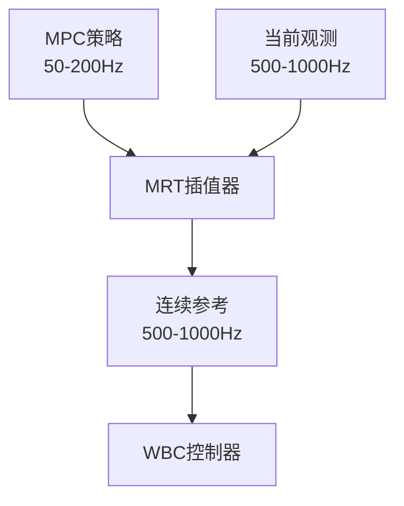
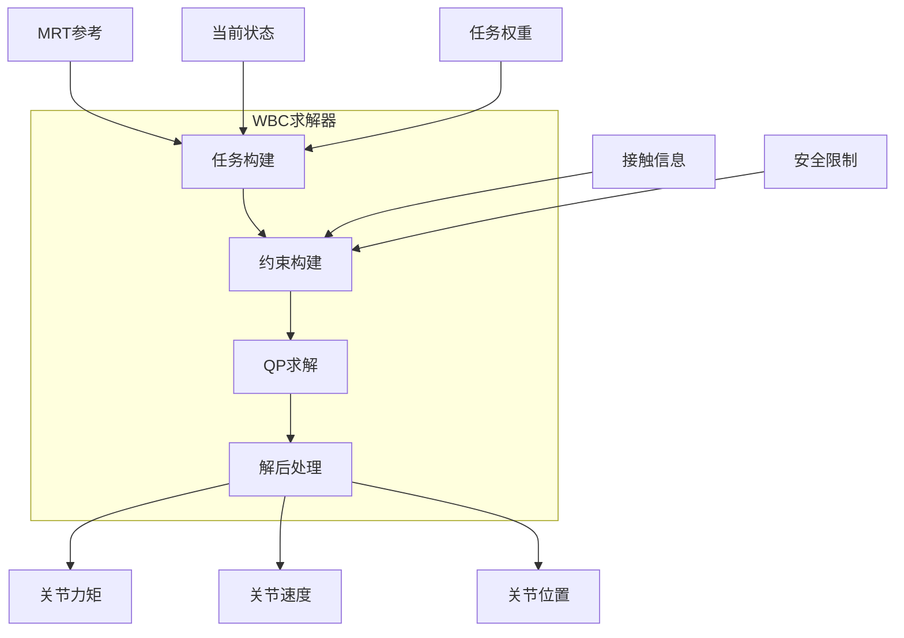
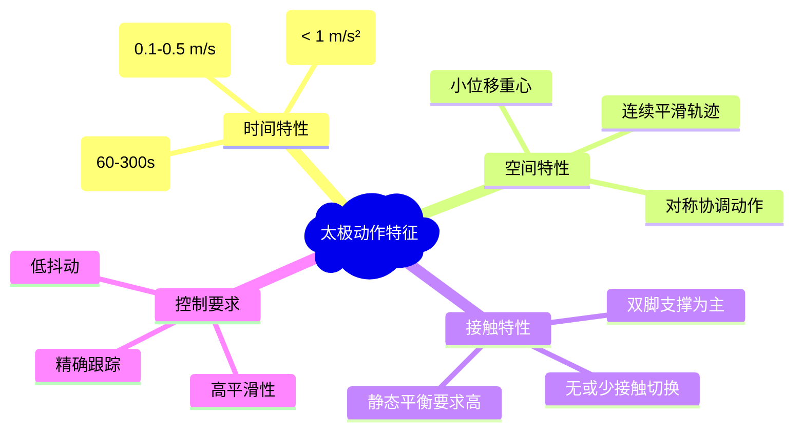
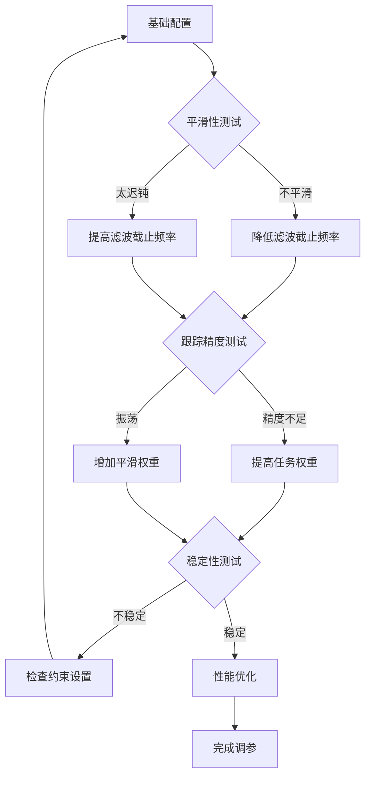

# 太极动作任务实现指南

## 目录
1. [系统架构概览](#系统架构概览)
2. [数据流与模块边界](#数据流与模块边界)
3. [状态估计 (State Estimation)](#状态估计-state-estimation)
4. [MPC (Model Predictive Control)](#mpc-model-predictive-control)
5. [MRT (Model Reference Tracking)](#mrt-model-reference-tracking)
6. [WBC (Whole-Body Control)](#wbc-whole-body-control)
7. [太极动作任务实现策略](#太极动作任务实现策略)
8. [目标轨迹构造与发送](#目标轨迹构造与发送)
9. [运行时话题与频率](#运行时话题与频率)
10. [调参指南](#调参指南)
11. [故障排查](#故障排查)

---

## 系统架构概览

```mermaid
graph TB
    subgraph "传感层"
        A[/sensors_data_raw] --> B[humanoidController]
        B --> C[/sensor_data/joint_pos]
        B --> D[/sensor_data/joint_vel]
        B --> E[/imu_data]
        B --> F[/kinematic_data]
    end
    
    subgraph "规划层"
        G[目标轨迹] --> H[MPC优化器]
        H --> I[/robotName_mpc_policy]
        J[/start_mpc] --> H
    end
    
    subgraph "执行层"
        I --> K[MRT参考跟踪]
        E --> L[WBC全身控制]
        F --> L
        K --> L
        M[/kuavo_arm_traj] --> L
        L --> N[关节命令输出]
    end
    
    subgraph "任务层"
        O[太极动作规划] --> G
        P[上肢直控] --> M
    end
```

### 核心组件功能
- **传感层**: 数据采集、滤波、状态估计
- **规划层**: MPC 优化、策略生成
- **执行层**: WBC 实时控制、关节命令生成
- **任务层**: 高级任务规划、动作序列生成

---

## 数据流与模块边界

### 主要数据流向

```
传感器数据 → 状态估计 → MPC/MRT → WBC → 关节命令
     ↓           ↓         ↓        ↓
  实时观测 → 滤波状态 → 参考轨迹 → 关节控制
```

### 频率分层
- **传感器采集**: 500-1000 Hz
- **状态估计**: 500-1000 Hz (与WBC同步)
- **WBC控制**: 500-1000 Hz (实时控制)
- **MPC优化**: 50-200 Hz (异步优化)
- **目标更新**: 1-100 Hz (取决于任务复杂度)

---

## 状态估计 (State Estimation)

### 功能描述
状态估计模块负责将原始传感器数据转换为控制系统可用的平滑状态信息。

### 输入数据
```cpp
// 来自 /sensors_data_raw
struct SensorData {
    vector_t jointPos_;     // 关节位置
    vector_t jointVel_;     // 关节速度
    vector_t jointAcc_;     // 关节加速度
    vector_t jointCurrent_; // 关节电流
    
    Eigen::Quaterniond quat_;      // IMU四元数
    vector_t angularVel_;          // 角速度
    vector_t linearAccel_;         // 线加速度
    ros::Time timeStamp_;          // 时间戳
};
```

### 处理流程
```cpp
void humanoidController::sensorsDataCallback(const kuavo_msgs::sensorsData::ConstPtr &msg) {
    // 1. 提取关节数据
    for (size_t i = 0; i < jointNumReal_+armNumReal_; ++i) {
        sensor_data.jointPos_(i) = joint_data.joint_q[i];
        sensor_data.jointVel_(i) = joint_data.joint_v[i];
        // ...
    }
    
    // 2. 立即发布关节观测（不含头部）
    if (total_no_head > 0) {
        ros_logger_->publishVector("/sensor_data/joint_pos", sensor_data.jointPos_.head(total_no_head));
        ros_logger_->publishVector("/sensor_data/joint_vel", sensor_data.jointVel_.head(total_no_head));
    }
    
    // 3. IMU数据滤波
    sensor_data.linearAccel_ = acc_filter_.update(sensor_data.linearAccel_);
    sensor_data.angularVel_ = gyro_filter_.update(sensor_data.angularVel_);
    
    // 4. 添加到数据缓冲区
    sensors_data_buffer_ptr_->addData(sensor_data.timeStamp_.toSec(), sensor_data);
}
```

### 输出数据
- `/imu_data` (sensor_msgs/Imu): 滤波后的IMU数据
- `/kinematic_data` (nav_msgs/Odometry): 融合后的里程计信息
- `/sensor_data/joint_pos`, `/sensor_data/joint_vel`: 实时关节状态

---

## MPC (Model Predictive Control)

### 功能描述
MPC模块在有限时域内求解最优控制问题，生成满足约束的参考轨迹和控制策略。在太极动作中，MPC负责生成平滑、连续的全身运动轨迹，确保重心稳定性和动作流畅性。

### 数学模型

#### 状态空间表示
太极动作的机器人状态向量定义为：

$$\mathbf{x} = \begin{bmatrix} \mathbf{p}_{base} \\ \mathbf{q}_{base} \\ \mathbf{q}_{joints} \\ \dot{\mathbf{p}}_{base} \\ \boldsymbol{\omega}_{base} \\ \dot{\mathbf{q}}_{joints} \end{bmatrix} \in \mathbb{R}^{n_x}$$

其中：
- $\mathbf{p}_{base} \in \mathbb{R}^3$: 基座质心位置
- $\mathbf{q}_{base} \in SO(3)$: 基座姿态（四元数表示）
- $\mathbf{q}_{joints} \in \mathbb{R}^{n_j}$: 关节角度向量
- $\dot{\mathbf{p}}_{base} \in \mathbb{R}^3$: 基座线速度
- $\boldsymbol{\omega}_{base} \in \mathbb{R}^3$: 基座角速度
- $\dot{\mathbf{q}}_{joints} \in \mathbb{R}^{n_j}$: 关节角速度

控制输入向量为：

$$\mathbf{u} = \begin{bmatrix} \mathbf{f}_{contacts} \\ \boldsymbol{\tau}_{joints} \end{bmatrix} \in \mathbb{R}^{n_u}$$

其中：
- $\mathbf{f}_{contacts} \in \mathbb{R}^{3n_c}$: 接触力向量（$n_c$个接触点）
- $\boldsymbol{\tau}_{joints} \in \mathbb{R}^{n_j}$: 关节力矩向量

#### 太极动作的动力学约束
机器人的动力学方程基于质心动力学模型：

$$\begin{align}
m\ddot{\mathbf{p}}_{com} &= \sum_{i=1}^{n_c} \mathbf{f}_i + m\mathbf{g} \\
\mathbf{I}_{com}\dot{\boldsymbol{\omega}}_{base} + \boldsymbol{\omega}_{base} \times (\mathbf{I}_{com}\boldsymbol{\omega}_{base}) &= \sum_{i=1}^{n_c} (\mathbf{r}_i - \mathbf{p}_{com}) \times \mathbf{f}_i + \boldsymbol{\tau}_{external}
\end{align}$$

其中：
- $m$: 机器人总质量
- $\mathbf{I}_{com}$: 绕质心的惯性张量
- $\mathbf{g} = [0, 0, -9.81]^T$: 重力加速度
- $\mathbf{r}_i$: 第$i$个接触点位置
- $\mathbf{f}_i$: 第$i$个接触点的接触力

#### 太极专用优化目标函数

$$\begin{align}
J &= \int_{t_0}^{t_0+T} \left[ \|\mathbf{x}(t) - \mathbf{x}_{ref}(t)\|^2_{\mathbf{Q}} + \|\mathbf{u}(t) - \mathbf{u}_{ref}(t)\|^2_{\mathbf{R}} \right. \\
&\quad + \|\dot{\mathbf{u}}(t)\|^2_{\mathbf{S}} + \|\ddot{\mathbf{x}}(t)\|^2_{\mathbf{H}} \left. \right] dt + \|\mathbf{x}(t_0+T) - \mathbf{x}_{ref}(t_0+T)\|^2_{\mathbf{Q}_f}
\end{align}$$

权重矩阵的太极专用设置：

**状态权重矩阵** $\mathbf{Q}$:
$$\mathbf{Q} = \text{diag}(\mathbf{Q}_{pos}, \mathbf{Q}_{ori}, \mathbf{Q}_{joints}, \mathbf{Q}_{vel}, \mathbf{Q}_{\omega}, \mathbf{Q}_{\dot{q}})$$

其中：
- $\mathbf{Q}_{pos} = \text{diag}(100, 100, 50)$: 基座位置权重（Z轴权重较小）
- $\mathbf{Q}_{ori} = \text{diag}(200, 200, 100)$: 基座姿态权重（Yaw权重较小）
- $\mathbf{Q}_{joints} = 10 \cdot \mathbf{I}_{n_j}$: 关节位置权重
- $\mathbf{Q}_{vel} = \text{diag}(50, 50, 20)$: 基座速度权重（太极动作偏好慢速）
- $\mathbf{Q}_{\omega} = \text{diag}(100, 100, 50)$: 基座角速度权重
- $\mathbf{Q}_{\dot{q}} = 5 \cdot \mathbf{I}_{n_j}$: 关节速度权重

**输入权重矩阵** $\mathbf{R}$:
$$\mathbf{R} = \text{diag}(\mathbf{R}_{forces}, \mathbf{R}_{torques})$$

- $\mathbf{R}_{forces} = 0.1 \cdot \mathbf{I}_{3n_c}$: 接触力权重（鼓励小接触力）
- $\mathbf{R}_{torques} = 1.0 \cdot \mathbf{I}_{n_j}$: 关节力矩权重

**平滑性权重矩阵** $\mathbf{S}$ 和 $\mathbf{H}$:
- $\mathbf{S} = 10 \cdot \mathbf{I}_{n_u}$: 输入变化率权重（太极强调平滑性）
- $\mathbf{H} = 5 \cdot \mathbf{I}_{n_x}$: 状态二阶导数权重（减少加速度突变）

#### 约束条件

**1. 动力学约束**：
$$\dot{\mathbf{x}}(t) = \mathbf{f}(\mathbf{x}(t), \mathbf{u}(t))$$

**2. 接触约束**（双脚支撑的太极动作）：
$$\begin{align}
\mathbf{p}_{foot,left}(t) &= \mathbf{p}_{foot,left,ref} & \text{(左脚位置固定)} \\
\mathbf{p}_{foot,right}(t) &= \mathbf{p}_{foot,right,ref} & \text{(右脚位置固定)} \\
\dot{\mathbf{p}}_{foot,left}(t) &= \mathbf{0} & \text{(左脚速度为零)} \\
\dot{\mathbf{p}}_{foot,right}(t) &= \mathbf{0} & \text{(右脚速度为零)}
\end{align}$$

**3. 摩擦锥约束**：
$$\|\mathbf{f}_{i,xy}\| \leq \mu f_{i,z}, \quad f_{i,z} \geq 0$$

其中 $\mu = 0.7$ 是摩擦系数，$\mathbf{f}_{i,xy}$ 和 $f_{i,z}$ 分别是水平和垂直分量。

**4. 太极动作的速度/加速度约束**：
$$\begin{align}
\|\dot{\mathbf{p}}_{base}(t)\| &\leq v_{max} = 0.2 \text{ m/s} \\
\|\boldsymbol{\omega}_{base}(t)\| &\leq \omega_{max} = 0.3 \text{ rad/s} \\
\|\ddot{\mathbf{p}}_{base}(t)\| &\leq a_{max} = 0.5 \text{ m/s}^2 \\
|\dot{\boldsymbol{\omega}}_{base}(t)| &\leq \alpha_{max} = 2.0 \text{ rad/s}^2
\end{align}$$

**5. 关节限制**：
$$\begin{align}
\mathbf{q}_{min} \leq \mathbf{q}_{joints}(t) &\leq \mathbf{q}_{max} \\
\dot{\mathbf{q}}_{min} \leq \dot{\mathbf{q}}_{joints}(t) &\leq \dot{\mathbf{q}}_{max} \\
\boldsymbol{\tau}_{min} \leq \boldsymbol{\tau}_{joints}(t) &\leq \boldsymbol{\tau}_{max}
\end{align}$$

**6. 重心稳定性约束**：
$$\mathbf{p}_{com,xy}(t) \in \mathcal{S}_{support}$$

其中 $\mathcal{S}_{support}$ 是支撑多边形，对于双脚支撑：
$$\mathcal{S}_{support} = \text{ConvexHull}(\mathbf{p}_{foot,left}, \mathbf{p}_{foot,right})$$

#### 求解算法
使用序列二次规划（SQP）或多重射击法求解上述优化问题：

$$\begin{align}
\min_{\mathbf{x}(\cdot), \mathbf{u}(\cdot)} \quad &J(\mathbf{x}(\cdot), \mathbf{u}(\cdot)) \\
\text{s.t.} \quad &\mathbf{g}(\mathbf{x}(t), \mathbf{u}(t)) = \mathbf{0} \\
&\mathbf{h}(\mathbf{x}(t), \mathbf{u}(t)) \leq \mathbf{0} \\
&\mathbf{x}(t_0) = \mathbf{x}_0
\end{align}$$

### 输入接口
```cpp
// 目标轨迹消息结构
struct TargetTrajectories {
    std::vector<scalar_t> timeTrajectory;     // [t0, t1, ..., tN]
    std::vector<vector_t> stateTrajectory;    // 每个时刻的目标状态
    std::vector<vector_t> inputTrajectory;    // 每个时刻的目标输入(可选)
};

// ROS话题: <robotName>_mpc_target_trajectories
// 消息类型: ocs2_msgs::mpc_target_trajectories
```

### 处理流程
```mermaid
graph LR
    A[当前观测] --> B[MPC求解器]
    C[目标轨迹] --> B
    D[约束配置] --> B
    B --> E[最优策略]
    E --> F[/robotName_mpc_policy]
```

### 输出数据
- `<robotName>_mpc_policy` (ocs2_msgs/mpc_flattened_controller): 最优控制策略
- 策略包含前馈项、反馈增益矩阵、参考轨迹等

### 太极MPC特点总结
1. **时域长度**: $T = 2.0$秒（比普通步行更长，适应慢动作）
2. **采样频率**: 50-100Hz（降低计算负担）
3. **平滑性强化**: 通过$\mathbf{S}$和$\mathbf{H}$矩阵重点惩罚加速度突变
4. **约束保守**: 速度和加速度限制比常规动作更严格
5. **重心稳定**: 质心投影严格约束在支撑多边形内
6. **接触简化**: 主要处理双脚支撑，减少接触切换复杂性

---

## MRT (Model Reference Tracking)

### 功能描述
MRT是OCS2框架中的参考跟踪接口，桥接"低频MPC优化"与"高频WBC执行"。

### 核心价值


### 实现机制
```cpp
// MRT提供实时参考查询接口
class MRT_Interface {
public:
    // 更新最新MPC策略
    void updatePolicy(const ocs2_msgs::mpc_flattened_controller& policy);
    
    // 查询t时刻的参考状态和输入
    void getReference(double t, vector_t& x_ref, vector_t& u_ref);
    
    // 查询t时刻的反馈控制律
    void getFeedback(double t, matrix_t& K, vector_t& k);
};
```

### 平滑性保证
- **时间插值**: 在MPC更新间隙提供平滑的参考轨迹
- **状态连续性**: 确保参考状态在策略切换时连续
- **反馈稳定性**: 提供局部线性反馈控制律

---

## WBC (Whole-Body Control)

### 功能描述
WBC在高频率下求解加权任务优化问题，将参考轨迹转换为实际的关节命令。在太极动作中，WBC负责实时跟踪MPC生成的参考轨迹，同时满足接触约束和物理限制。

### 数学框架

#### 多任务优化问题
WBC的核心是求解一个层次化的二次规划（QP）问题：

$$\begin{align}
\min_{\mathbf{x}} \quad &\sum_{i=1}^{n_{tasks}} w_i \|\mathbf{A}_i \mathbf{x} - \mathbf{b}_i\|^2 + w_{reg} \|\mathbf{x}\|^2 \\
\text{s.t.} \quad &\mathbf{A}_{eq} \mathbf{x} = \mathbf{b}_{eq} \\
&\mathbf{A}_{ineq} \mathbf{x} \leq \mathbf{b}_{ineq}
\end{align}$$

其中决策变量为：
$$\mathbf{x} = \begin{bmatrix} \ddot{\mathbf{q}} \\ \boldsymbol{\lambda} \\ \boldsymbol{\tau} \end{bmatrix}$$

- $\ddot{\mathbf{q}} \in \mathbb{R}^{n_j}$: 关节加速度
- $\boldsymbol{\lambda} \in \mathbb{R}^{6n_c}$: 接触力（每个接触点6DOF）
- $\boldsymbol{\tau} \in \mathbb{R}^{n_j}$: 关节力矩

#### 动力学约束（等式约束）
机器人的浮基动力学方程：

$$\mathbf{M}(\mathbf{q}) \begin{bmatrix} \ddot{\mathbf{q}}_{base} \\ \ddot{\mathbf{q}}_{joints} \end{bmatrix} + \mathbf{C}(\mathbf{q}, \dot{\mathbf{q}}) + \mathbf{G}(\mathbf{q}) = \begin{bmatrix} \mathbf{0}_{6 \times 1} \\ \boldsymbol{\tau} \end{bmatrix} + \mathbf{J}_c^T \boldsymbol{\lambda}$$

其中：
- $\mathbf{M}(\mathbf{q}) \in \mathbb{R}^{(6+n_j) \times (6+n_j)}$: 质量矩阵
- $\mathbf{C}(\mathbf{q}, \dot{\mathbf{q}})$: 科里奥利和离心力项
- $\mathbf{G}(\mathbf{q})$: 重力项
- $\mathbf{J}_c \in \mathbb{R}^{6n_c \times (6+n_j)}$: 接触雅可比矩阵

整理得到等式约束：
$$\mathbf{A}_{eq} = \begin{bmatrix} \mathbf{M} & -\mathbf{J}_c^T & \begin{bmatrix} \mathbf{0}_{6 \times n_j} \\ -\mathbf{I}_{n_j} \end{bmatrix} \end{bmatrix}$$

$$\mathbf{b}_{eq} = -\mathbf{C} - \mathbf{G}$$

#### 接触约束
对于太极动作中的双脚支撑，每个接触点的运动约束为：

$$\mathbf{J}_{c,i} \ddot{\mathbf{q}} + \dot{\mathbf{J}}_{c,i} \dot{\mathbf{q}} = \mathbf{0}$$

其中 $\mathbf{J}_{c,i}$ 是第 $i$ 个接触点的雅可比矩阵。

#### 太极动作的任务定义

**1. 基座姿态跟踪任务**:
$$\mathbf{A}_{base} = \mathbf{J}_{base}(\mathbf{q})$$
$$\mathbf{b}_{base} = \ddot{\mathbf{p}}_{base,ref} + \mathbf{K}_{p,base}(\mathbf{p}_{base,ref} - \mathbf{p}_{base}) + \mathbf{K}_{d,base}(\dot{\mathbf{p}}_{base,ref} - \dot{\mathbf{p}}_{base}) - \dot{\mathbf{J}}_{base}\dot{\mathbf{q}}$$

权重设置：$w_{base} = 1000$（太极动作中基座稳定性要求高）

**2. 质心（COM）跟踪任务**:
$$\mathbf{A}_{com} = \mathbf{J}_{com}(\mathbf{q})$$
$$\mathbf{b}_{com} = \ddot{\mathbf{p}}_{com,ref} + \mathbf{K}_{p,com}(\mathbf{p}_{com,ref} - \mathbf{p}_{com}) + \mathbf{K}_{d,com}(\dot{\mathbf{p}}_{com,ref} - \dot{\mathbf{p}}_{com}) - \dot{\mathbf{J}}_{com}\dot{\mathbf{q}}$$

太极专用增益：
- $\mathbf{K}_{p,com} = \text{diag}(800, 800, 400)$
- $\mathbf{K}_{d,com} = \text{diag}(60, 60, 40)$

**3. 上肢跟踪任务**（太极动作重点）:
$$\mathbf{A}_{arm} = \mathbf{J}_{arm}(\mathbf{q})$$
$$\mathbf{b}_{arm} = \ddot{\mathbf{p}}_{hand,ref} + \mathbf{K}_{p,arm}(\mathbf{p}_{hand,ref} - \mathbf{p}_{hand}) + \mathbf{K}_{d,arm}(\dot{\mathbf{p}}_{hand,ref} - \dot{\mathbf{p}}_{hand}) - \dot{\mathbf{J}}_{arm}\dot{\mathbf{q}}$$

太极专用增益：
- $\mathbf{K}_{p,arm} = \text{diag}(1200, 1200, 1200, 200, 200, 200)$（位置+姿态）
- $\mathbf{K}_{d,arm} = \text{diag}(80, 80, 80, 20, 20, 20)$

权重设置：$w_{arm} = 1200$（太极动作中上肢权重最高）

**4. 足端位置维持任务**:
对于双脚支撑的太极动作：
$$\mathbf{A}_{foot,i} = \mathbf{J}_{foot,i}(\mathbf{q})$$
$$\mathbf{b}_{foot,i} = \mathbf{K}_{p,foot}(\mathbf{p}_{foot,i,ref} - \mathbf{p}_{foot,i}) + \mathbf{K}_{d,foot}(-\dot{\mathbf{p}}_{foot,i}) - \dot{\mathbf{J}}_{foot,i}\dot{\mathbf{q}}$$

足端刚性约束：$\mathbf{K}_{p,foot} = 1500 \cdot \mathbf{I}_3$, $\mathbf{K}_{d,foot} = 100 \cdot \mathbf{I}_3$

**5. 关节调节任务**:
$$\mathbf{A}_{joint} = \mathbf{I}_{n_j}$$
$$\mathbf{b}_{joint} = \ddot{\mathbf{q}}_{ref} + \mathbf{K}_{p,joint}(\mathbf{q}_{ref} - \mathbf{q}) + \mathbf{K}_{d,joint}(\dot{\mathbf{q}}_{ref} - \dot{\mathbf{q}})$$

太极专用增益（偏向平滑）：
- $\mathbf{K}_{p,joint} = 10 \cdot \mathbf{I}_{n_j}$
- $\mathbf{K}_{d,joint} = 5 \cdot \mathbf{I}_{n_j}$

**6. 力矩最小化任务**:
$$\mathbf{A}_{torque} = \begin{bmatrix} \mathbf{0} & \mathbf{0} & \mathbf{I}_{n_j} \end{bmatrix}$$
$$\mathbf{b}_{torque} = \mathbf{0}$$

权重：$w_{torque} = 1$（最低优先级）

#### 不等式约束

**1. 关节限制约束**:
$$\begin{align}
\ddot{\mathbf{q}}_{min} \leq \ddot{\mathbf{q}} &\leq \ddot{\mathbf{q}}_{max} \\
\boldsymbol{\tau}_{min} \leq \boldsymbol{\tau} &\leq \boldsymbol{\tau}_{max}
\end{align}$$

太极动作的加速度限制（更保守）：
$$\ddot{\mathbf{q}}_{max} = 5.0 \text{ rad/s}^2 \cdot \mathbf{1}_{n_j}$$

**2. 摩擦锥约束**:
对每个接触点 $i$：
$$\begin{bmatrix} 1 & 0 & -\mu \\ -1 & 0 & -\mu \\ 0 & 1 & -\mu \\ 0 & -1 & -\mu \\ 0 & 0 & -1 \end{bmatrix} \begin{bmatrix} \lambda_{i,x} \\ \lambda_{i,y} \\ \lambda_{i,z} \end{bmatrix} \leq \mathbf{0}$$

**3. 关节速度安全约束**:
$$\dot{\mathbf{q}}_{min} \leq \dot{\mathbf{q}} + \ddot{\mathbf{q}} \Delta t \leq \dot{\mathbf{q}}_{max}$$

#### 层次化任务权重矩阵
太极动作的完整权重矩阵：

$$\mathbf{W} = \text{diag}(w_{contact}, w_{base}, w_{com}, w_{arm}, w_{foot}, w_{joint}, w_{torque})$$

其中：
- $w_{contact} = 10^6$（硬约束）
- $w_{base} = 1000$
- $w_{com} = 800$  
- $w_{arm} = 1200$（太极重点）
- $w_{foot} = 1500$
- $w_{joint} = 10$
- $w_{torque} = 1$

#### QP求解器
使用活动集方法或内点法求解：

$$\begin{align}
\mathbf{x}^* &= \arg\min_{\mathbf{x}} \frac{1}{2} \mathbf{x}^T \mathbf{H} \mathbf{x} + \mathbf{f}^T \mathbf{x} \\
\text{s.t.} \quad &\mathbf{A}_{eq} \mathbf{x} = \mathbf{b}_{eq} \\
&\mathbf{A}_{ineq} \mathbf{x} \leq \mathbf{b}_{ineq}
\end{align}$$

其中：
$$\mathbf{H} = \sum_{i=1}^{n_{tasks}} w_i \mathbf{A}_i^T \mathbf{A}_i + w_{reg} \mathbf{I}$$
$$\mathbf{f} = -\sum_{i=1}^{n_{tasks}} w_i \mathbf{A}_i^T \mathbf{b}_i$$

#### 控制命令生成
求解得到 $(\ddot{\mathbf{q}}^*, \boldsymbol{\lambda}^*, \boldsymbol{\tau}^*)$ 后，生成关节命令：

**位置控制模式**:
$$\mathbf{q}_{cmd}(t+\Delta t) = \mathbf{q}(t) + \dot{\mathbf{q}}(t) \Delta t + \frac{1}{2} \ddot{\mathbf{q}}^* (\Delta t)^2$$

**速度控制模式**:
$$\dot{\mathbf{q}}_{cmd}(t+\Delta t) = \dot{\mathbf{q}}(t) + \ddot{\mathbf{q}}^* \Delta t$$

**力矩控制模式**:
$$\boldsymbol{\tau}_{cmd} = \boldsymbol{\tau}^*$$

#### 太极动作的平滑性增强
为了提高太极动作的平滑性，在WBC中添加额外的平滑项：

$$J_{smooth} = w_{smooth} \|\ddot{\mathbf{q}} - \ddot{\mathbf{q}}_{prev}\|^2$$

其中 $w_{smooth} = 50$，$\ddot{\mathbf{q}}_{prev}$ 是前一时刻的关节加速度。

### 太极WBC特点总结
1. **高频实时控制**: 500-1000Hz确保跟踪精度
2. **层次化任务**: 上肢权重最高（1200），体现太极特点
3. **接触刚性**: 双脚支撑约束刚性强（$K_p = 1500$）
4. **平滑性优先**: 额外平滑项和保守的加速度限制
5. **多物理约束**: 同时满足动力学、摩擦锥、关节限制
6. **实时求解**: 使用高效QP求解器，计算时间<2ms
7. **安全保证**: 关节速度/位置/力矩的多重安全检查

### 输入数据
```cpp
struct WBC_Input {
    // 状态信息
    vector_t q_current;      // 当前关节位置
    vector_t q̇_current;      // 当前关节速度
    SE3 base_pose;          // 当前基座位姿
    
    // 参考信息
    vector_t q_ref;         // 参考关节位置
    vector_t q̇_ref;         // 参考关节速度
    SE3 base_pose_ref;      // 参考基座位姿
    
    // 任务权重
    TaskWeights weights;    // 各任务权重配置
    
    // 约束信息
    ContactState contacts;  // 接触状态
    JointLimits limits;     // 关节限制
};
```

### 处理流程


### 输出数据
```cpp
struct WBC_Output {
    vector_t joint_torques;    // 关节力矩命令
    vector_t joint_velocities; // 关节速度命令
    vector_t joint_positions;  // 关节位置命令
    
    // 内部发布的观测话题
    // /sensor_data/joint_pos
    // /sensor_data/joint_vel
};
```

---

## 太极动作任务实现策略

### 太极动作特征分析


### 实现路径选择

#### 路径A: WBC-Only (纯跟踪模式)
**适用场景**: 慢动作、重心变化小、无需全身重规划

```mermaid
graph LR
    A[太极动作规划] --> B[上肢轨迹生成]
    B --> C[/kuavo_arm_traj]
    C --> D[WBC控制器]
    E[静态基座目标] --> D
    D --> F[关节命令]
```

**实现步骤**:
```bash
# 1. 关闭MPC
rostopic pub /start_mpc std_msgs/Bool "data: false"

# 2. 启用上肢ROS轨迹控制
rosservice call /enable_wbc_arm_trajectory_control "control_mode: true"

# 3. 发布上肢轨迹
# 通过自定义节点连续发布 /kuavo_arm_traj
```

#### 路径B: MPC+WBC (全身协调模式)
**适用场景**: 需要全身协调、偶尔微步、上下肢耦合

```mermaid
graph LR
    A[太极动作规划] --> B[全身轨迹生成]
    B --> C[/robotName_mpc_target_trajectories]
    C --> D[MPC优化器]
    D --> E[/robotName_mpc_policy]
    E --> F[MRT参考跟踪]
    F --> G[WBC控制器]
    G --> H[关节命令]
```

**实现步骤**:
```bash
# 1. 启用MPC
rostopic pub /start_mpc std_msgs/Bool "data: true"

# 2. 发布全身目标轨迹
# 通过自定义节点发布 ocs2_msgs::mpc_target_trajectories
```

---

## 目标轨迹构造与发送

### 轨迹生成原则

#### 时间参数化
```python
# 太极动作时间特征
duration = 120.0  # 总时长(秒)
frequency = 100.0  # 采样频率(Hz)
time_points = np.linspace(0, duration, int(duration * frequency))

# 确保时间严格单调递增
assert np.all(np.diff(time_points) > 0)
```

#### 平滑性约束
```python
# 五次多项式轨迹 (保证C²连续性)
def generate_smooth_trajectory(waypoints, time_points):
    """
    生成C²连续的平滑轨迹
    
    Args:
        waypoints: 关键点 [(t, pos, vel, acc), ...]
        time_points: 时间采样点
    
    Returns:
        positions, velocities, accelerations
    """
    # 使用样条插值确保高阶连续性
    from scipy.interpolate import splprep, splev
    
    # 构造边界条件
    # 起始: pos=p0, vel=0, acc=0
    # 结束: pos=pf, vel=0, acc=0
    
    return positions, velocities, accelerations
```

### 目标轨迹组成

#### 基座/COM轨迹
```cpp
// 基座状态维度 (根据模型定义)
struct BaseState {
    Vector3d position;        // [x, y, z]
    Quaterniond orientation;  // [w, x, y, z]
    Vector3d linear_velocity;
    Vector3d angular_velocity;
};

// 太极动作的基座约束
BaseConstraints tai_chi_constraints = {
    .max_linear_velocity = 0.2,   // m/s
    .max_angular_velocity = 0.5,  // rad/s
    .max_linear_acceleration = 0.5, // m/s²
    .com_stability_margin = 0.05   // m (相对支撑多边形)
};
```

#### 足端轨迹
```cpp
// 对于双脚支撑的太极动作
struct FootTrajectory {
    Vector3d left_foot_pos;   // 左足位置
    Vector3d right_foot_pos;  // 右足位置
    
    // 接触状态 (通常保持stance)
    ContactMode left_contact = STANCE;
    ContactMode right_contact = STANCE;
};

// 微步动作的足端规划
if (micro_stepping_required) {
    // 标准摆动相轨迹
    generate_swing_trajectory(lift_height=0.05, duration=0.8);
}
```

#### 上肢轨迹
```cpp
// 上肢可采用两种表示方式

// 方式1: 关节空间
struct ArmJointTrajectory {
    VectorXd joint_positions;  // [shoulder_pitch, shoulder_roll, ...]
    VectorXd joint_velocities;
    VectorXd joint_accelerations;
};

// 方式2: 任务空间 (末端位姿)
struct ArmTaskTrajectory {
    SE3 left_hand_pose;   // 左手位姿
    SE3 right_hand_pose;  // 右手位姿
    Vector6d left_hand_velocity;
    Vector6d right_hand_velocity;
};
```

### 发布接口实现

#### MPC目标轨迹发布
```cpp
class TaiChiTrajectoryPublisher {
private:
    ros::Publisher target_traj_pub_;
    
public:
    TaiChiTrajectoryPublisher(ros::NodeHandle& nh) {
        target_traj_pub_ = nh.advertise<ocs2_msgs::mpc_target_trajectories>(
            "humanoid_mpc_target_trajectories", 1);
    }
    
    void publishTrajectory(const TaiChiMotion& motion) {
        ocs2_msgs::mpc_target_trajectories msg;
        
        // 时间序列
        msg.timeTrajectory = motion.getTimePoints();
        
        // 状态轨迹
        for (const auto& state : motion.getStateTrajectory()) {
            std_msgs::Float64MultiArray state_msg;
            // 打包: [base_pos, base_quat, joint_pos, base_vel, base_omega, joint_vel]
            packStateVector(state, state_msg.data);
            msg.stateTrajectory.push_back(state_msg);
        }
        
        // 输入轨迹 (可选)
        for (const auto& input : motion.getInputTrajectory()) {
            std_msgs::Float64MultiArray input_msg;
            // 打包: [contact_forces, joint_torques]
            packInputVector(input, input_msg.data);
            msg.inputTrajectory.push_back(input_msg);
        }
        
        target_traj_pub_.publish(msg);
    }
};
```

#### 上肢直控轨迹发布
```cpp
class ArmTrajectoryPublisher {
private:
    ros::Publisher arm_traj_pub_;
    
public:
    ArmTrajectoryPublisher(ros::NodeHandle& nh) {
        arm_traj_pub_ = nh.advertise<sensor_msgs::JointState>(
            "/kuavo_arm_traj", 100);
    }
    
    void publishArmCommand(const ArmJointState& arm_state, ros::Time stamp) {
        sensor_msgs::JointState msg;
        
        // 关节名称 (必须与armNumReal_匹配)
        msg.name = {"l_shoulder_pitch", "l_shoulder_roll", "l_shoulder_yaw",
                   "l_elbow_pitch", "r_shoulder_pitch", "r_shoulder_roll", 
                   "r_shoulder_yaw", "r_elbow_pitch"};
        
        // 关节位置
        msg.position = arm_state.positions;
        
        // 关节速度 (可选)
        if (!arm_state.velocities.empty()) {
            msg.velocity = arm_state.velocities;
        }
        
        // 时间戳 (必须单调递增)
        msg.header.stamp = stamp;
        
        arm_traj_pub_.publish(msg);
    }
};
```

---

## 运行时话题与频率

### 话题拓扑图
```mermaid
graph TB
    subgraph "传感器话题"
        A[/sensors_data_raw<br/>kuavo_msgs/sensorsData<br/>1000Hz]
        B[/sensor_data/joint_pos<br/>std_msgs/Float64MultiArray<br/>1000Hz]
        C[/sensor_data/joint_vel<br/>std_msgs/Float64MultiArray<br/>1000Hz]
        D[/imu_data<br/>sensor_msgs/Imu<br/>1000Hz]
        E[/kinematic_data<br/>nav_msgs/Odometry<br/>1000Hz]
    end
    
    subgraph "控制话题"
        F[/start_mpc<br/>std_msgs/Bool<br/>On-demand]
        G[/humanoid_mpc_target_trajectories<br/>ocs2_msgs/mpc_target_trajectories<br/>1-100Hz]
        H[/humanoid_mpc_policy<br/>ocs2_msgs/mpc_flattened_controller<br/>50-200Hz]
        I[/kuavo_arm_traj<br/>sensor_msgs/JointState<br/>100Hz]
    end
    
    subgraph "监控话题"
        J[/monitor/frequency/wbc<br/>std_msgs/Float64<br/>1Hz]
        K[/monitor/time_cost/wbc<br/>std_msgs/Float64<br/>1Hz]
        L[/monitor/time_cost/sensor_to_controller<br/>std_msgs/Float64<br/>1Hz]
    end
    
    subgraph "服务接口"
        M[/enable_wbc_arm_trajectory_control<br/>kuavo_msgs/changeArmCtrlMode]
    end
```

### 频率同步策略
```cpp
// 控制器主循环频率层次
class FrequencyManager {
private:
    double sensor_freq_ = 1000.0;    // 传感器频率
    double wbc_freq_ = 500.0;        // WBC控制频率
    double mpc_freq_ = 100.0;        // MPC优化频率
    double monitor_freq_ = 1.0;       // 监控发布频率
    
public:
    void synchronizeFrequencies() {
        // 确保频率整数倍关系
        assert(sensor_freq_ >= wbc_freq_);
        assert(wbc_freq_ >= mpc_freq_);
        
        // 设置定时器
        sensor_timer_ = nh_.createTimer(
            ros::Duration(1.0/sensor_freq_), 
            &HumanoidController::sensorCallback, this);
            
        wbc_timer_ = nh_.createTimer(
            ros::Duration(1.0/wbc_freq_), 
            &HumanoidController::wbcCallback, this);
            
        mpc_timer_ = nh_.createTimer(
            ros::Duration(1.0/mpc_freq_), 
            &HumanoidController::mpcCallback, this);
    }
};
```

---

## 调参指南

### 太极动作专用参数

#### MPC权重调整
```yaml
# config/tai_chi_mpc_weights.yaml
mpc_weights:
  # 状态跟踪权重
  base_position_weight: [100, 100, 50]      # [x, y, z]
  base_orientation_weight: [200, 200, 100]  # [roll, pitch, yaw]
  joint_position_weight: 10.0               # 关节位置
  
  # 输入权重
  contact_force_weight: 0.1                 # 接触力
  joint_torque_weight: 1.0                  # 关节力矩
  
  # 平滑性权重 (针对太极)
  base_velocity_weight: [50, 50, 20]        # 基座速度平滑
  base_angular_velocity_weight: [100, 100, 50] # 基座角速度平滑
  joint_velocity_weight: 5.0                # 关节速度平滑
  
  # 加速度约束 (太极动作特有)
  max_base_acceleration: [0.5, 0.5, 1.0]    # m/s²
  max_base_angular_acceleration: [2.0, 2.0, 1.0] # rad/s²
  max_joint_acceleration: 5.0               # rad/s²
```

#### WBC任务权重
```yaml
# config/tai_chi_wbc_weights.yaml
wbc_tasks:
  # 接触约束 (最高优先级)
  contact_constraint_weight: 1e6
  
  # 基座任务
  base_pose_weight: [1000, 1000, 500, 2000, 2000, 1000] # [x,y,z,rx,ry,rz]
  com_tracking_weight: [800, 800, 400]      # COM跟踪
  
  # 足端任务
  foot_tracking_weight: 1500                # 足端位置跟踪
  
  # 上肢任务 (太极重点)
  arm_tracking_weight: 1200                 # 上肢跟踪权重
  
  # 调节任务
  joint_regularization_weight: 10           # 关节调节
  torque_minimization_weight: 1             # 力矩最小化
  
  # 安全限制
  joint_velocity_limit_weight: 500          # 关节速度限制
  joint_acceleration_limit_weight: 300      # 关节加速度限制
```

#### 滤波器参数
```yaml
# config/tai_chi_filters.yaml
filters:
  # IMU滤波 (适配慢动作)
  accelerometer_cutoff_freq: [5.0, 5.0, 5.0]  # Hz (降低以减少噪声)
  gyroscope_cutoff_freq: [10.0, 10.0, 10.0]   # Hz
  
  # 关节滤波
  arm_joint_pos_filter_cutoff: 15.0            # Hz (上肢位置)
  arm_joint_vel_filter_cutoff: 10.0            # Hz (上肢速度)
  mrt_joint_vel_filter_cutoff: 150.0           # Hz (MRT关节速度)
  
  # EMA滤波 (数据记录用)
  ema_alpha: 0.05                              # 太极场景用较小alpha
```

### 参数调优流程


---

## 故障排查

### 常见问题诊断表

| 现象 | 可能原因 | 诊断方法 | 解决方案 |
|------|----------|----------|----------|
| 关节抖动 | 1. 滤波参数过高<br/>2. 目标不连续<br/>3. 权重设置不当 | 检查`/sensor_data/joint_*`话题<br/>验证目标轨迹连续性<br/>调整WBC权重 | 降低滤波截止频率<br/>使用五次多项式轨迹<br/>增加平滑权重 |
| 跟踪误差大 | 1. 任务权重过低<br/>2. 物理约束冲突<br/>3. 计算频率不足 | 监控`/monitor/time_cost/wbc`<br/>检查关节限位<br/>验证任务可达性 | 提高任务权重<br/>放松约束或修改目标<br/>提高控制频率 |
| 系统不稳定 | 1. 接触约束失效<br/>2. 重心超出支撑<br/>3. 动力学不一致 | 检查接触状态<br/>分析COM轨迹<br/>验证模型参数 | 修正接触检测<br/>约束COM在支撑多边形内<br/>校准动力学参数 |
| 上肢轨迹无效 | 1. 关节数量不匹配<br/>2. 服务未启用<br/>3. 时间戳问题 | 检查`armNumReal_`<br/>验证服务状态<br/>监控时间戳连续性 | 调整轨迹维度<br/>调用启用服务<br/>确保时间戳单调 |

### 调试工具链

#### 实时监控脚本
```bash
#!/bin/bash
# monitor_tai_chi.sh - 太极动作实时监控

echo "=== 太极动作系统监控 ==="

# 1. 检查话题发布状态
echo "1. 话题活跃度检查:"
rostopic hz /sensor_data/joint_pos &
rostopic hz /humanoid_mpc_policy &
rostopic hz /kuavo_arm_traj &

# 2. 监控系统性能
echo "2. 系统性能监控:"
rostopic echo /monitor/frequency/wbc | head -5 &
rostopic echo /monitor/time_cost/wbc | head -5 &

# 3. 检查控制模式
echo "3. 控制模式检查:"
rostopic echo /start_mpc | head -1 &

# 等待数据收集
sleep 10

# 杀死后台进程
pkill -f "rostopic"

echo "监控完成"
```

#### 数据记录与分析
```python
#!/usr/bin/env python3
# tai_chi_analyzer.py - 太极动作数据分析

import rospy
import numpy as np
import matplotlib.pyplot as plt
from std_msgs.msg import Float64MultiArray

class TaiChiAnalyzer:
    def __init__(self):
        self.joint_pos_data = []
        self.joint_vel_data = []
        self.timestamps = []
        
        # 订阅关键话题
        rospy.Subscriber('/sensor_data/joint_pos', Float64MultiArray, 
                        self.joint_pos_callback)
        rospy.Subscriber('/sensor_data/joint_vel', Float64MultiArray, 
                        self.joint_vel_callback)
    
    def joint_pos_callback(self, msg):
        self.joint_pos_data.append(msg.data)
        self.timestamps.append(rospy.Time.now().to_sec())
    
    def joint_vel_callback(self, msg):
        self.joint_vel_data.append(msg.data)
    
    def analyze_smoothness(self):
        """分析轨迹平滑性"""
        if len(self.joint_pos_data) < 3:
            return
            
        positions = np.array(self.joint_pos_data)
        velocities = np.array(self.joint_vel_data)
        
        # 计算加速度 (数值微分)
        dt = np.diff(self.timestamps)
        accelerations = np.diff(velocities, axis=0) / dt[:, np.newaxis]
        
        # 平滑性指标
        jerk = np.diff(accelerations, axis=0) / dt[1:, np.newaxis]
        jerk_rms = np.sqrt(np.mean(jerk**2, axis=0))
        
        print(f"关节Jerk RMS: {jerk_rms}")
        
        # 绘制结果
        plt.figure(figsize=(12, 8))
        
        plt.subplot(2, 2, 1)
        plt.plot(positions[:, 0])  # 第一个关节位置
        plt.title('关节位置')
        plt.ylabel('角度 (rad)')
        
        plt.subplot(2, 2, 2)
        plt.plot(velocities[:, 0])  # 第一个关节速度
        plt.title('关节速度')
        plt.ylabel('角速度 (rad/s)')
        
        plt.subplot(2, 2, 3)
        plt.plot(accelerations[:, 0])  # 第一个关节加速度
        plt.title('关节加速度')
        plt.ylabel('角加速度 (rad/s²)')
        
        plt.subplot(2, 2, 4)
        plt.plot(jerk[:, 0])  # 第一个关节Jerk
        plt.title('关节Jerk')
        plt.ylabel('Jerk (rad/s³)')
        
        plt.tight_layout()
        plt.savefig('tai_chi_analysis.png')
        plt.show()

if __name__ == '__main__':
    rospy.init_node('tai_chi_analyzer')
    analyzer = TaiChiAnalyzer()
    
    print("开始数据收集，按Ctrl+C停止...")
    try:
        rospy.spin()
    except KeyboardInterrupt:
        print("分析数据...")
        analyzer.analyze_smoothness()
```

### 系统健康检查清单

#### 启动前检查
- [ ] 控制器配置文件加载正确
- [ ] 传感器数据流正常 (`/sensors_data_raw` 有数据)
- [ ] IMU滤波参数合理
- [ ] 关节限位设置正确
- [ ] 安全检查器启用

#### 运行时检查
- [ ] 控制频率稳定 (`/monitor/frequency/wbc` > 450Hz)
- [ ] 计算延迟可接受 (`/monitor/time_cost/wbc` < 2ms)
- [ ] 关节状态连续 (无突跳)
- [ ] 基座姿态稳定 (无过度摆动)
- [ ] 接触状态正确

#### 性能评估
- [ ] 轨迹跟踪误差 < 0.05 rad (关节)
- [ ] 基座位置误差 < 0.02 m
- [ ] 基座姿态误差 < 5°
- [ ] 关节速度平滑 (低Jerk)
- [ ] 无关节限位触发

---

## 总结

本指南详细介绍了太极动作任务的完整实现链路，从底层的传感器数据处理到高层的任务规划，涵盖了：

1. **系统架构**: 传感-估计-规划-执行的分层设计
2. **算法细节**: WBC/MPC/MRT的数学模型和实现
3. **数据流向**: 各模块间的接口和频率同步
4. **实现策略**: 两种控制路径的选择和配置
5. **调参指南**: 针对太极动作的专用参数配置
6. **故障排查**: 常见问题的诊断和解决方案

通过遵循本指南，可以实现高质量的太极动作控制，满足慢速、平滑、精确的动作要求。
