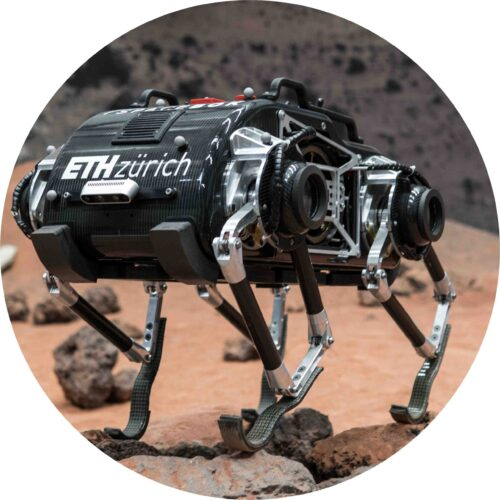
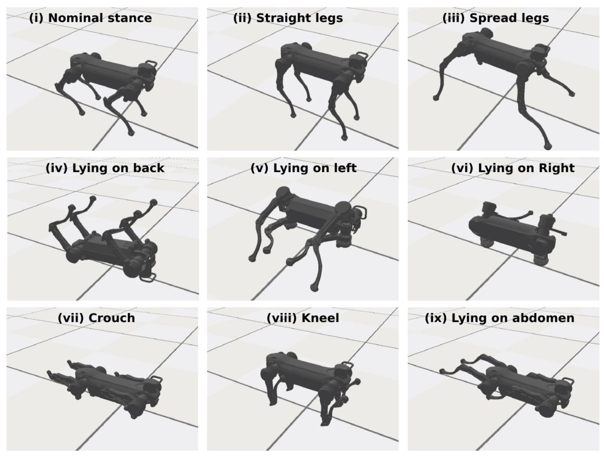
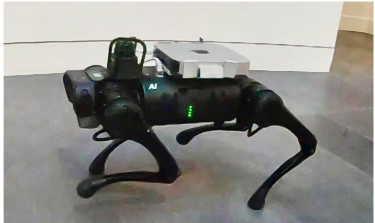

# 四足机器人仿真平台调研

## ETH Zurich

Robotic Systems Lab - Legged Robotics at Zurich 

官网网站：https://rsl.ethz.ch/

官方Github：https://github.com/leggedrobotics/

**论文：Robust Recovery Controller for a Quadrupedal Robot using Deep Reinforcement Learning**

时间：2019年1月22日

机器人：ANYmal B

RL算法：Trust Region Policy Optimization（TRPO）

环境：RaiSim

**论文：Learning agile and dynamic motor skills for legged robots**

时间：2019年1月24日

机器人：ANYmal B

RL算法：TRPO

环境：RaiSim

Github地址：https://github.com/junja94/anymal_science_robotics_supplementary

**论文：DeepGait: Planning and Control of Quadrupedal Gaits using Deep Reinforcement Learning**

时间：2019年9月18日

机器人：ANYmal

环境：RaiSim

RL算法：TRPO、PPO

**论文：Learning Quadrupedal Locomotion over Challenging Terrain**

时间：2020年10月21日

机器人：ANYmal B/C

环境：RaiSim

RL算法：TRPO

Github源码： https://github.com/leggedrobotics/learning_quadrupedal_locomotion_over_challenging_terrain_supplementary

==**论文：Learning to Walk in Minutes Using Massively Parallel Deep Reinforcement Learning**==

时间：2021年10月30日

机器人：ANYmal C、ANYmal B 、 A1（Unitree）、ANYmal C + arm 、 Cassie（Agility Robotics ；双足机器人）

环境：NVIDIA's Isaac Gym

实验室：ETH Zurich and NVIDIA

硬件设备：i9-11900k CPU, NVIDIA RTX A6000 GPU.

RL算法：PPO

论文：2021年10月30日初始提交，后续也一直在维护，最后修改时间：2022年5月4日。

Github：https://github.com/leggedrobotics/legged_gym.git

主要介绍：通过深度强化学习的方法（PPO），在单工作站GPU中同时训练成百上千个仿真机器人。其中这个环境包含了平坦的、倾斜的、随机粗糙的、离散障碍物的地形，训练好后的智能体，可以在各种复杂环境下，进行行走，最后在真实环境下进行了测试。

<video src="img/Learning to Walk in Minutes Using Massively Parallel Deep RL.mp4"></video>

**论文：Combining Learning-based Locomotion Policy with Model-based Manipulation for Legged Mobile Manipulators**

机器人：ALMA （ANYmal B/C + arm ）

时间：2022年1月11日

RL算法： PPO + MPC

环境：Raisim

**论文：Learning robust perceptive locomotion for quadrupedal robots in the wild**

机器人： ANYmal-C

时间：2022年1月20日

RL算法：TRPO

环境：RaiSim

**论文：Cat-like Jumping and Landing of Legged Robots in Low-gravity Using Deep Reinforcement Learning**

机器人：SpaceBok

环境：Mujoco

时间：2022年6月17日

RL算法：PPO

## 浙大

**论文：Multi-expert learning of adaptive legged locomotion**

时间：2020年12月9日

实验室：School of Informatics, University of Edinburgh, UK & 网络系统与控制研究所

机器人：Jueying quadruped robot；杭州云深处科技

RL算法：Soft Actor Critic (SAC) algorithm 

环境：PyBullet

**论文：Bound Controller for a Quadruped Robot using Pre-Fitting Deep Reinforcement Learning**

机器人： Jueying Mini quadruped robot

https://www.deeprobotics.cn/products_jy_1.html

实验室： 工业控制技术国家重点实验室、网络系统与控制研究所

时间：2021年11月1日

仿真环境：RaiSim

RL算法：PPO

**论文：Learning Free Gait Transition for Quadruped Robots via Phase-Guided Controller**

实验室：浙江大学交叉力学中心

时间：2022年1月1日

仿真环境：RaiSim

机器人：Black Panther robot （mini cheetah）

算法：PPO

github源码：https://github.com/ZJU-XMech/raisimGym （仿真环境的训练使用的是ANYmal机器人）

## 其他

**论文：Learning Active Spine Behaviors for Dynamic and Efficient Locomotion in Quadruped Robots**

实验室：印度科学理工学院（Stochastic Robotic Lab）

时间：2019年5月15日

仿真环境：PyBullet

机器人：Stoch 2

RL算法：Proximation Optimization (PPO)

**论文：Legged Robots that Keep on Learning: Fine-Tuning Locomotion Policies in the Real World**

实验室：Berkeley AI Research & Google Research

时间：2021 10月11日

机器人：A1（Unitree  宇树科技）

仿真平台：PyBullet

算法：REDQ（SAC； soft actor-critic）

**论文：Model-free Reinforcement Learning for Robust Locomotion using Demonstrations from Trajectory Optimization**

实验室：Max Planck Institute for Intelligent Systems（German） &  Machines in Motion Laboratory，New York University  

时间：2022年1月24日

机器人：Solo8（New York University；Open-Source）

仿真平台：PyBullet

RL算法：PPO

**论文：Fast and Efficient Locomotion via Learned Gait Transitions**

实验室：University of Washington & Google Research

时间：2021年4月9日

机器人：A1

仿真平台：PyBullet

RL算法：Augmented Random Search（ARS）

**论文：Synthesizing the optimal gait of a quadruped robot with soft actuators using deep reinforcement learning**

实验室：皇家理工学院 (KTH Royal Institute of Technology；瑞典)

时间：2022

RL算法：SAC算法

环境：MATLAB’s Simscape

机器人：soft quadruped robots

**论文：DayDreamer: World Models for Physical Robot Learning**

实验室：University of California, Berkeley （加州大学伯克利分校）

时间：2022年6月28日

机器人：A1

算法：Dreamer（Actot-Critic）

## ANYbotics

ETH Zurich 

ANYbotics 2009团队成立， 2016年成立了ANYbotics公司：

官网网站： https://www.anybotics.com/

官方Github：https://github.com/ANYbotics

ALoF采用的仿真环境是：SL simulation

论文：Walking and crawling with ALoF - a robot for autonomous locomotion on four legs

StarlETH

## SL simulation

 作者： Schaal, S.   University of Southern California ，2009

## NVIDIA's Isaac Gym

环境：NVIDIA's Isaac Gym + Pytorch  + cuda

NVIDIA Isaac是NVIDIA发布的一款专为机器人打造的系统 

> 类似于openai的Gym (强化学习常用的训练平台)，通常用CPU上运行仿真环境，NVIDIA Isaac不过把环境的模拟这个部分扔到了GPU上进行，这样可以提升RL训练的速度。
>
> 如果想要并行计算的话：
>
> **在CPU上，并行地开启多个物理引擎**对应多个子环境，然后把子环境的交互数据收集起来。它**在GPU上，只开启一个物理引擎**，在其中并行的运行多个子智能体。

Gym 是一个研究和开发强化学习相关算法的仿真平台

DayDreamer: World Models for Physical Robot Learning

## RaiSim

开发：RSL, ETH Zurich

开源：未开源

#### 使用该环境的论文：

论文：Learning quadrupedal locomotion over challenging terrain  2020

团队：ANYbotics AG. 

​																			**ANYmal B and C robots**, 

### REF

https://www.anybotics.com/company/#description

