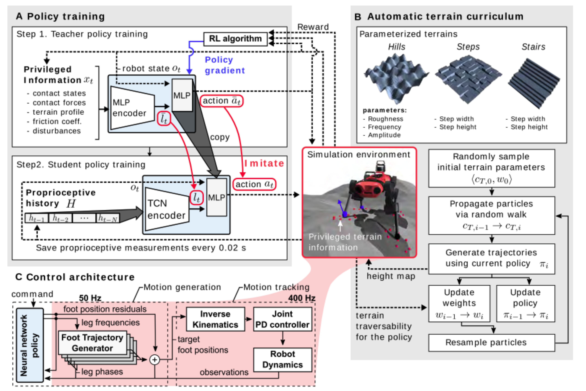

 
# 基于深度强化学习的四足机器人设计方案


# 1 前言


 

# 2 引用文献

[1] Lee J, Hwangbo J, Hutter M. Robust recovery controller for a quadrupedal robot using deep reinforcement learning[J]. arXiv preprint arXiv:1901.07517, 2019.

[2] Tsounis V, Alge M, Lee J, et al. Deepgait: Planning and control of quadrupedal gaits using deep reinforcement learning[J]. IEEE Robotics and Automation Letters, 2020, 5(2): 3699-3706.

[3]Bellegarda G, Nguyen Q. Robust high-speed running for quadruped robots via deep reinforcement learning[J]. arXiv preprint arXiv:2103.06484, 2021.

[4] Lee J, Hwangbo J, Wellhausen L, et al. Learning quadrupedal locomotion over challenging terrain[J]. Science robotics, 2020, 5(47): eabc5986.

[5] Kumar A, Fu Z, Pathak D, et al. Rma: Rapid motor adaptation for legged robots[J]. arXiv preprint arXiv:2107.04034, 2021.

[6] Rudin N, Hoeller D, Reist P, et al. Learning to walk in minutes using massively parallel deep reinforcement learning[C]//Conference on Robot Learning. PMLR, 2022: 91-100.

[7] Wu P, Escontrela A, Hafner D, et al. DayDreamer: World Models for Physical Robot Learning[J]. arXiv preprint arXiv: 2206.14176, 2022.

[8] Ruppert, F., Badri-Spröwitz, A. Learning plastic matching of robot dynamics in closed-loop central pattern generators. Nat Mach Intell 4, 652–660 

[9] 王立鹏, 王军政, 赵江波, 等. 基于零力矩点的四足机器人非平坦地形下步态规划与控制[J]. 北京理工大学学报, 2015, 35 (6): 602-606.


# 3 任务背景与概述


为什么使用强化学习的方法，而不是传统的方法？

传统的控制方法在现实世界机器人运动方面取得了重大进展。这种方法通常依赖于使用简化的动力学模型解决在线优化问题（MPC），这需要大量的领域知识，并且可能无法推广到开发过程中未明确考虑的新环境（即不平坦的湿滑地形）。由于（例如）预先确定的足部摆动轨迹以及基于线性倒立摆模型的 Raibert 启发式方法用于足部放置规划，因此产生的运动也存在相当大的偏差。因为为了使控制策略对外部干扰和未知环境更加稳健，深度强化学习成为一种新的解决方案。

在不平坦的地形上，常规腿式运动方法方法使得控制架构越来越复杂。许多情况都要依赖复杂的状态机来协调运动原语和反射控制器的执行。为了触发状态之间的转换或反射的执行，许多系统都明确地预估状态，例如地面接触和滑行移动。这种预估通常是基于经验设置的，并且在存在诸如泥土、雪地或植被等未建模因素的情况下可能会变得不稳定。还有一些在脚部使用接触式传感器的系统，在野外条件下也会变得不可靠。总而言之，随着考虑更多场景，用于在崎岖等特殊地形上进行腿式运动的常规系统的复杂性不断升级。在开发和维护方面变得非常困难，并且也容易出现控制器设计无法实现的情况（角落情况）


## 3.1项目背景
## 3.2国内外研究现状

论文1：Lee J, Hwangbo J, Hutter M. **Robust recovery controller for a quadrupedal robot using deep reinforcement learning**[J]. arXiv preprint arXiv:1901.07517, 2019.

 **Lee J, Hwangbo J 等来自苏黎世联邦理工大学团队，设计的控制结构包括一个基于行为的分层控制器和一个行为选择器，对于分层控制起，控制任务被分解成三个行为：自立、站立和行走，每个行为策略被单独训练。行为选择器根据最近的观测、命令、上一时刻选择的行为类型及其行为动作，为当前的情况选择最合适的行为。基于行为的分层控制器和行为选择器都通过TRPO算法+ GAE的方法在仿真环境中进行学习，仿真环境的使用机器人为ANYmal，最后在实体机器人上完成了测试。**

> 在每个时间步，所选行为的控制策略都会向执行器发送命令。高度估计器（height estimator）是一个神经网络回归模块，用于在实际系统部署期间估计基本高度。
>
> 分别学习三种行为可以简化 成本函数？的设计，方便在真实系统上分别对每个控制策略进行故障排除
>
> 使用Two State Implicit Filter (TSIF)来估计状态state。 —— from IMU；通过递归融合来自IMU的运动学和测量值来估计惯性框架中的基本旋转和基本位置
>
> 使用预训练行为集训练行为选择器和高度估计器
>
> 用于学习的模拟环境由数据驱动的执行器模型中提出的快速接触求解器组成，可有效生成高保真样本。使用(TRPO+GAE) 的信任区域策略优化算法 用于学习。尽管在训练过程中使用了随机策略，但在部署过程中方差会减少到 0，以确保行为更加一致。
>
> ANYmal的执行器是

**问题解决**：在平坦的地形上，自主地从跌倒中恢复并进行运动

**缺点**：仅在平坦的环境下完成了训练和测试。如果在复杂的环境下，仅有这三种行为是不够的。


**分层行为控制器**：

状态空间：


奖励空间：


在训练过程中，为了更加流畅的运动，对关节扭矩、速度、加速度和动作的差异进行惩罚。

每个行为的状态空间由上表所示。

每个行为动作空间：由12维度向量组成，每个动作表示相应低阻抗PD控制器（ low-impedance Proportional-Derivative；运行在关节执行器）的目标位置。

每个行为使用的训练算法：TRPO + GAE


自立：

- 目标：恢复坐姿状态
- 初始化：将ANYmal从距地面0.5m处随机放置关节位置
- 终止：时间限制
- 奖励：方向（重点）、关节位置、关节加速度（惩罚）、本体脉冲（惩罚）、本体打滑、自身碰撞、动作差异、最大关节速度、力矩

> 每个奖励前由一个衡量重要程度的系数构成，重点的奖励所占总奖励比重越大。

站立：

- 目标：由坐姿恢复到站姿（目标关节的形态为站立形态）
- 初始化：类似自立，不过具有近似直立的状态
- 终止：时间限制
- 奖励：关节位置（重点）、方向、高度、关节加速度（惩罚）、动作差异、最大关节速度、力矩

行走：

- 目标：遵循给定的速度命令（前向速度、横向速度、偏航速度）。——— 由现有控制器的功能定义的
- 初始化：从站立形态为中心的多元高斯分布中采样。
- 终止：机器人下降、违反关节限制
- 奖励：角速度（惩罚；重要）、线速度（惩罚；重要）、方向、脚步间隙、角度打滑、动作差异、最大关节速度、力矩


**行为选择器**：

目标：选择合适的行为，使ANYmal每次失去平衡时都返回到可以移动的运行状态

算法：TRPO + GAE

初始状态：从随机选择的行为的初始状态中采样

终止状态：时间限制


状态空间：历史行为选择、三种行为状态集合的并集

动作空间：选择每个行为的概率

奖励：角速度（惩罚；重要）、线速度（惩罚；重要）、方向、高度、动力（为了节能）、动作差异（为了保持流畅）、最大关节速度、力矩（流畅）


**2** —— 论文2： Tsounis V, Alge M, Lee J, et al. **Deepgait: Planning and control of quadrupedal gaits using deep reinforcement learning**[J]. IEEE Robotics and Automation Letters, 2020, 5(2): 3699-3706.

Tsounis V, Alge M等来自苏黎世联邦理工大学团队，提出了一个两级层次结构，在不同时间尺度上运行的高级步态规划器和低级步态控制器，步态规划器利用外部感知信息和本体感知测量来生成一个参考相位，步态控制器通过将本体感知的观测信息与参考相位相结合，将关节参考位置作为动作进行输出，最后通过关节空间的PD控制器通过关节参考位置来计算关节扭矩，并将他们应用于系统的动力学。

>  将运动分解为两个独立部分：立足点规划和跟踪控制。通过地形感知规划策略，生成一系列立足点和基础运动，一个立足点和基本运动控制器策略，执行上述序列，同时保持平衡以及处理外部干扰。
>
> 对于立足点的规划，采用了一种来自TO（Trajectory OPtimization）的技术，使用机器人动力学的，这种机制可以在不需要与控制器交互的情况下，去训练高层规划策略，
>
> 轨迹优化技术（TO）

**Gait Planning：**

状态：目标位置、面向目标向量姿态的旋转矩阵、

奖励：

- 使平均立足点的更接近目标，若离的较远将获得惩罚
- 惩罚机器人不面向目标位置

终止条件：

- 相位转换不可行
- 本体和地形环境发生碰撞
- 所选的落地点太接近障碍物

动作：相位序列


**问题解决**：在非平坦的c地形中进行移动


**3** —— 论文3: Bellegarda G, Nguyen Q. **Robust high-speed running for quadruped robots via deep reinforcement learning**[J]. arXiv preprint arXiv:2103.06484, 2021.

在笛卡尔空间学习控制策略，该控制策略为每条腿选择末端执行器的位置，通过雅可比矩阵，然后使用笛卡尔空间PD控制器计算关节扭矩。

> 只有通过**逆运动学**把空间位姿转换为关节变量，才能实现对机械臂末端执行器的控制
>
> 常用的方法主要集中在通过位置控制直接在关节空间中学习策略。或通过更高级别的轨迹生成器映射到关节位置。

优点是：减少奖励函数的设计，提高采样的效率，可以在正常环境、负重环境的快速奔跑，以及在有障碍和脚受限的环境下行走

RL算法：PPO（Proximal Policy Optimization）


**观测空间（64 dim）**：本体状态（高度、方向四元数、线速度、角速度）、关节状态（位置、速度）、足部状态（位置、速度）、足部接触的布尔值。

> 这些参数中的每一个都可以通过 机器人 的板载传感器直接测量或估计（本体感知信息）。训练前需要对这些参数进行归一化 

**动作空间（12）**：每个腿相对髋关节（臀部）位置在x、y、z轴的相对位置。因为每个位置限制不同，所以每个policy网络输出为[-1,1]，在根据每个轴上的限制进行映射。

> 之所以使用相对位置而不是绝对位置，是方便把整体数值控制在一定的范围，方便学习。

**奖励空间**：在x方向的前进速度、每个时间间隔的能量消耗（电机力矩、电机速度）、固定的生存奖励（一个回合运行时间越久奖励越大）


可改进的：增加视觉等外部传感器。


**4** ———论文4:Lee J, Hwangbo J, Wellhausen L, et al. **Learning quadrupedal locomotion over challenging terrain**[J]. Science robotics, 2020, 5(47): eabc5986.

Lee J, Hwangbo J 等来自苏黎世联邦理工大学团队。设计了一种基于 Teacher-Student 的训练策略和自动地形生成方法，对于 Teacher-Student 方法，利用特权学习的思想，教师策略利用特权信息结合本体观测信息，通过强化学习 PPO 的算法进行训练学习，然后学生策略仅利用本体感知信息，通过时序卷积网络（TCN）集合历史观测和当前时刻，通过模仿教师策略去学习（历史观测信息的潜在特征和动作），通过训练好的学生策略可以与真实环境进行交互。因为动作产生的是每个落脚点的相对位置（相对于髋关节），因此需要动作生成模块，生成基坐标系下的每条腿的目标位置，然后交由动作跟踪模块，通过逆转运动学转换成关节位置，交由 PD 控制器计算各个关节力矩。对于自动地形生成方法，利用课程学习的思想，根据控制器在训练过程不同阶段的表现自适应的合成地形，帮助四足机器人去学习各种环境下的控制策略。

> 创新点：
>
> 使用序列模型（Temporal convolutional network （TCN））替代传统的MLP；（学生策略使用TCN、教师策略使用MLP）
>
> 特权学习（privileged learning）；将训练过程分成两个阶段，首先训练一个可以访问特权信息的教师策略，即他可以获取地形的真实信息，以及机器人与它接触的信息，去实现高性能的学习（仅在模拟环境）。然后利用学习好的？的教师策略去指导仅使用本体感知学生策略。
>
> 自动课程学习（automated curriculum）：根据控制器在训练过程不同阶段的表现自适应的合成地形。使用粒子滤波分布来维持中等难度地形的参数分布。

命令向量被定义为：$\left\langle\left({ }_{I B}^{B} \hat{v}_{T}\right)_{x y},\left(\hat{\omega}_{T}\right)_{z}\right\rangle$，有点类似线速度和角速度，不过这里大小仅代表方向不代表速度的大小。

- 第一部分表示相对于基坐标的目标水平方向：$\left({ }_{I B}^{B} \hat{v}_{T}\right)_{x y}:= \left\langle\cos \left(\psi_{T}\right), \sin \left(\psi_{T}\right)\right\rangle$。其中$\psi_{T}$表示相对于基坐标系的偏航角
- 第二部分表示绕z轴旋转方向：$\left(\hat{\omega}_{T}\right)_{z} \in\{-1,0,1\}$，其中1表示绕z轴进行逆时针旋转，-1表示绕z轴进行顺时针旋转。

其中停止命令为： $\langle 0.0,0.0\rangle$

> 本文控制器只控制方向，不控制整体速度。 因为在具有挑战挑战的地形上，比如上下坡时，目标的速度的可行范围往往不同。


**Teacher Policy**

教师策略利用特权信息结合本体观测信息，通过强化学习PPO的算法进行训练学习，

观测空间：$s_t : =o_t,x_t$

- $o_t$：智能体的本体观测信息（measurement vector）

- $x_t$：特权信息；智能体与地形的接触信息（感知接触的状态信息、接触力）。地形属性 （剖面、摩擦系数、干扰因素 ）。

  > 对于特权信息在现实中是无法得到的，所以教师网络是在一种理想的情况下进行训练的。通过给定越多有用的信息，训练出来的策略才有可能会更好，


动作空间：腿部频率（4dim） + 脚步落脚点的相对位置 （12dim）

奖励空间（7）：线速度奖励、角速度奖励、基础运动奖励（在运动中保持稳定；惩罚）、脚无碰撞奖励（处于摆动过程中时，脚抬高）、身体碰撞惩罚、目标脚位置奖励（使生成的落脚点轨迹进行平滑）、关节力矩惩罚（保护关节执行器、降低消耗）。


**Student Policy**

对教师网络进行模仿，教师网络的$\bar{l}_{t}$和$\bar{a}_{t}$用于指导学生网络$l_t$和$a_t$的学习（监督；均方误差）。学生控制器学习仅依赖本身可用的传感器信息（本体感知）。

通过TCN 网络对处理历史本体观测信息进行编码的到$l_t$，被教室网络中特权信息被编码后的信息$\bar{l}_{t}$进行指导学习，然后将$l_t$结合当前时刻的本体观测信息，输入到教室策略中进行学习，输出相应的动作$a_t$，同理该动作的好坏，由教室策略输出的动作$\bar{a}_{t}$进行指导。

输入：只有智能体的本体观测信息 + 上一时刻落足点

输出：腿部频率 + 落脚点相对位置

损失函数：均方误差
$$
\mathcal{L}:=\left(\bar{a}_{t}\left(o_{t}, x_{t}\right)-a_{t}\left(o_{t}, H\right)\right)^{2}+\left(\bar{l}_{t}\left(o_{t}, x_{t}\right)-l_{t}(H)\right)^{2} .
$$


**运动合成**

分为运动生成和运动跟踪两个模块：

运动生成：根据周期腿部相位，通过足部轨迹生成器（Foot Trajectory Generator ）结合落脚点的相对位置，生成每条腿的目标腿部位置（机器人的基坐标系的）。

运动跟踪：首先根据逆运动学解析成目标关节位置，使用关节位置的PD控制器跟踪该目标关节位置（使用PD控制器将其转换为扭矩）。

> 有些工作是利用预定义的足部接触时间表。

**评价**：

- 相比于自然界中四足动作，本次试验仅表现出快步走这一特征。
- 仅使用本体感知信息，即使在外部感知受损情况下，也可以依靠本体感知做出决策。因为仅使用本体感知信息，所以在面临一些极端环境时，可能动作会比较偏保守一些，因此将外部感知与本体感知相结合，受损下在面临一些致命条件（悬崖），也可以很好的穿过，在保证安全的条件下，提高行走速度和能量效率。


**5** —— Kumar A, Fu Z, Pathak D, et al. **Rma: Rapid motor adaptation for legged robots**[J]. arXiv preprint arXiv:2107.04034, 2021.

 Kumar A, Fu Z等来自南加州大学伯克利分校，提出一种快速电机适应算法（Rapid Motor Adaptation），分成两个阶段来实现，包括一个基策略（Base Policy）和自适应模块，在不同的环境中实现在线实时自适应。首先由环境编码器对由不同外部环境组成的特权信息进行编码，编码后的特权信息交由基策略进行训练，从而适应给定的环境，自适应模块来通过历史观测、动作信息去预测（估计）这些外部向量（外部地形环境），通过阶段1中的环境编码器去自适应模块的学习，最后将外部向量交由阶段1训练好的网络去输出动作。最后通过每段2训练好的模型去与真实环境进行交互。

**阶段1：** 

首先特权信息被输入到环境编码器中，输出一个潜在特征空间$z_t$（extrinsics；外在因素），然后该外在因素结合当前时刻的观测信息、上一步的动作被输入到基策略中，生成机器人所需的关节位置（动作）。其中环境向量编码器和基策略都通过强化学习（PPO）的方法进行训练。 

> 如果不对原始的特权信息进行编码直接预测是比较困难，而且没有必要，类似于图像处理一样，通常需要将其转换为低维潜在特征。

状态空间：智能体的本体状态（30 dim）、上一时刻的动作（12 dim）、外部向量（8 dim）

> 其中外在向量的维度为17 dim

动作空间：

- 关节目标位置（使用 PD 控制器可以将其转换为扭矩）

奖励空间（10）：

线速度奖励（在最高速度的限制下，尽可能运动的快一些）、能量消耗惩罚、地面作用力惩罚（两个时刻对地面的作用力差距不宜过大）、关节力矩（尽量保持顺滑、两个时刻力矩差距小一点）、动作幅度（动作幅度差异不要过大）、关节速度（关节变换速度不宜过大）、横向运动和旋转惩罚（尽量避免横向、旋转（z）运动）、方向惩罚（俯仰角旋转）、Z轴加速（沿Z轴方向的变化不宜过大，尽可能不要让四足机器人高度变化过快）、打滑惩罚（尽可能避免脚部不打滑）

> 设计的奖励过于复杂、惩罚项比较多时，智能体可能会避免各种惩罚，而在原地不动、为了避免这样的情况发生，可以通过课程学习的方法，对那些惩罚项，逐渐增加。当智能体表现出一定智能行为后，在逐渐增加训练难度，如改变地形的难度，增加其他因素的干扰（摩擦力等、运动强度）

**阶段2**

因为在现实中无法直接获取这些特权信息，因此我们需要一个自适应模块来通过历史观测、动作信息去预测（估计）这些特权信息（外部地形环境），通过阶段1中的环境编码器去监督这个外部向量。

> 自适应模块训练完成后，可以与之前阶段1已经训练好的基策略拼接在一起，最终预测各关节位置。
>
> 不同于论文4的是，在阶段2仅学习外部向量，不去学习动作。

阶段1和阶段2可以同时异步并行，没有中央时钟进行对齐，不过一般阶段1的运行速度（100HZ）要快于阶段2自适应模块的学习。


论文4、5对比

4、5这两种方法，都通过相应的网络去反推环境，之所以要去反推环境，因为机器人关节在运动时不仅与自身状态有关系，还需要根据当前环境的变化，及时做出动作的改变。

> 4、5都通过历史观测信息去推理外部环境的依据：通过监督学习，神经网络本身就可以完成这样的非线性映射，因为这些编译后特权信息是低维非线性的，其次这样的映射不一定需要与编码后的特权信息非常贴合，而且会随着观测信息的变化而变化，而且不是一定非常准确的，仿真环境与真实环境势必也会存在一定的噪声和误差。
>
> 之所以这样做的原因就是，仅依靠本体传感器的观测信息，没有外部环境地形信息，做出的动作是很不准确的，因此通过历史的观测、动作这样的外部向量去尽可能的去预测这样的环境（卡尔曼滤波器的思想），尽可能的去降低误差、作为改进的话就是通过增加外部传感器的方法，进一步提高对环境的预测，比如腿被缠住或者陷入时，现有的方法是在这样的情况下怎么学着去解决，而有了更丰富的环境信息后，就可以学者去避免这样的情况

4方法的动作是输出每个腿部落足点的相对位置，然后需要将其转换为相对于基坐标的目标位置后，通过逆运动学转换成关节位置、5方法输出的是各个关节的位置。对于方法4来说，这样做可以尽可能的降低奖励函数的复杂性，增加采样的效率，分层控制也更加的清晰，而5方法直接输出各个关节的位置，省去了中间环节，但是需要设计更加复杂的奖励函数，和更长的训练时间。


**6** —— Rudin N, Hoeller D, Reist P, et al. **Learning to walk in minutes using massively parallel deep reinforcement learning**[C]//Conference on Robot Learning. PMLR, 2022: 91-100

Rudin N, Hoeller D等来自Nvidia和苏黎世联邦理工大学团队，在基于GPU的物理引擎中，同时对4000个智能体进行训练，机器人可以在平坦、倾斜、随机粗糙、离散障碍物和楼梯的仿真环境中训练，利用自动课程学习的方法，机器人行走的越远，地形会变得越复杂。为了更好的从模拟环境到真实环境，可以将地面的摩擦力随机化、在观察中加入噪音随机推送到机器人的训练过程中，从而获得更稳定的姿态。机器人可以在仿真环境中快速学会行走，但用于真实环境中时，决策可能会失效。

**状态空间**：

- 本体感知：基体的线速度、角速度、重力矢量的测量、各关节的位置和速度、之前的动作
- 机器人周围的地形信息：从机器人基坐周围采样108个地形测量（地形表面到机器人基坐的高度）

**奖励空间**：

鼓励机器人遵循的指令速度、惩罚沿其他轴速度、为了更平滑自然的运动对关节扭力、关节加速度、关节目标变化和碰撞进行惩罚，其中碰撞包括：与膝盖、小腿或脚与垂直表面之间的接触，而与本体进行接触被认为是猛撞，需要重新进行重置操作。增加了一个额外的奖励去机器人执行更长的步长（估计机器人运行的更久不去重置）。

**动作空间**：

输出各个关节的位置（使用PD控制器可以将其转换为扭矩））

补：

为了更好的从模拟环境到真实环境，可以：将地面的摩擦力随机化、在观察中加入噪音随机推送到机器人的训练过程中，从而获得更稳定的姿态。

缺点：虽然在仿真环境中达到很好的效果，但是在用于真实环境时，不能对复杂的地形快速适应，单采用强化学习的策略，当激光雷达获取的高度信息不是很准确时，效果不是很好。


**7** —— Wu P, Escontrela A, Hafner D, et al. DayDreamer: World Models for Physical Robot Learning[J]. arXiv preprint arXiv:2206.14176, 2022.

 Wu P, Escontrela A等是来自南加州大学伯克利分校的团队，不需要利用仿真环境来进行训练，每个回合也不需要重置机器人的状态。机器人与真实环境直接进行交互，当机器人到达可用训练区域的末端时，会进行手动干预，而不修改机器人所处的关节配置或方向，将交互数据存入经验回放池中，然后根据现实已有经验学习一个World Model 来表征状态。然后利用学习到的World Model 生成的环境观测信息结合，来学习actor-critic 网络，训练一小时，能学会全部动作，训练前五分钟，机器人用背部着地翻滚，尝试用脚着地，25分钟，学会站立，一小时学会向前以特定速度行走，10分钟额外训练后学会被棒子击倒后起身。当前存在的问题是需要必要的人为干预、直接在机器上训练会损害机器，目前没办法完成一些复杂环境的探索。

>  对于World Model的学习：首先根据当前环境的编码信息以及历史编码信息去推测下一时刻的编码信息，通过对编码信息进行解码，判断该预测的编码信息与实际环境信息是否匹配。

**任务**：能翻转，站立，最后向前以特定速度行走

效果：训练一小时，能学会全部动作。训练前五分钟，机器人用背部着地翻滚，尝试用脚着地，25分钟，学会站立，一小时学会向前以特定速度行走。10分钟额外训练后学会被棒子击倒后起身。

**状态**：各电机的角度、方向、角速度

**奖励**：

- 直立奖励（匹配站立姿势的项是由臀部、肩部和膝部的关节角计算出来的）

- 前向速度 & 总速度

**动作**： 电机的角度

人为干预：由于空间限制：当机器人到达可用训练区域的末端时，我们会进行手动干预，而不修改机器人所处的关节配置或方向。


缺点：需要必要的人为干预、直接在机器上训练会损害机器。目前没办法完成一些复杂环境的探索


**8** - Ruppert, F., Badri-Spröwitz, A. Learning plastic matching of robot dynamics in closed-loop central pattern generators. Nat Mach Intell 4, 652–660 (2022).

Ruppert, F., Badri-Spröwitz来自德国斯图加特的马克斯普朗克智能系统研究所，为了去了解生物运动控制器是如何学会利用其腿部力学体现的智能，设计了一个约半米高具有被动弹性的机器人 Morti，在机器人中建立一个CPG模型，去学习一个步态策略。该CPG模型主要利用脚上接触传感器的稀疏反馈，输出各个关节的运动轨迹，在行走过程中，足底传感数据不断与它自身CPG 预测的预期触地进行比较，运行反射回路和调整运动轨迹来学习一个步态策略。


通过改进的 Hopf 非线形振荡器构建 CPG 模型，重点关注了被动机械结构（自然动力学）和 CPG 控制器的协同作用，并按时间范围划分反馈活动，在短期内通过短期弹性反馈（反射回路）实现了扰动缓解，这种短期弹性反馈是预先定义的，只有在特定扰动下才会触发，类似于动物的反射功能；与此同时量化了 CPG 控制器和自身机械结构的不匹配，通过贝叶斯优化器可塑性的将 CPG 控制器与自身机械结构相匹配，利用成本函数优化了 CPG 的参数，使 CPG 生成的运动轨迹更适合 Morti 机器人。

•Morti学习的步态策略因为与自身的机械结构更加匹配，可以降低能量消耗，1个小时的学习过程结束时，Morti走路消耗的能量比刚开始学习时减少了42%。

•有效的利用腿部力学中短期弹性反馈，对于一些特定情况的扰动，可以直接进行纠正，减少了学习的过程。

•因为短期弹性反馈需要预先设定，目前只是针对平坦环境下设定的，如果环境变得复杂，需要设计更加复杂的反射回路，而且通过贝叶斯优化后的运动轨迹是固定的，对单一运动场景表现较好，无法针对不同的环境进行自适应调整。

•我们可以借鉴它利用预先设定好的几种扰动的处理方式，对特定的扰动直接进行纠正，这样可以加快前期的学习效率；同时利用这里的成本函数作为我们的强化学习算法的内在奖励，使运动控制器匹配自身机械结构，更好的指导智能体进行学习，在面对不同地形时可以自适应切换步态策略。

>该研究团队利用腿部力学体现的智能去学习一个步行系统，设计了一个约半米高具有被动弹性的机器人 Morti，基于短期弹性和长期塑性的概念，提出了一个匹配控制模式和自然动力学的框架，Morti 可以自主的从失败中进行学习，最终能够在一小时内学会以 0.3m/s 的速度进行快步走，利用该机制的优势，Morti 将其能源效率提高了 42%。

>该框架主要包含两个部分，短期弹性反馈和长期塑性匹配，我们最终的目标是实现一个长期稳定运行的步态结果，但是在这个步态运行过程中，可能会出现CPG预测结果（CPG作为运动控制器生成关节运动轨迹）与自然动力学或机械限制不匹配的结果，产生一些短期的干扰，对于这些干扰，通过短期弹性反馈机制，尽量减缓这样的扰动。而对于长期塑形匹配，为了尽可能与自然动力学相匹配，我们通过贝叶斯优化的方法优化CPG的参数，将成本函数作为黑盒函数，CPG的超参数的取值范围作为自变量，尽可能找到使成本函数值达到期望最小的CPG参数。
> 因为成本函数中包含CPG与自然动力学匹配的成本信号，所以成本函数越低，说明CPG参数表现越好。


## 3.3常用仿真平台

在机器人强化学习领域所面临的各种问题里面，收集训练数据的成本过于高昂是每个人都要迟早都要面对的。毕竟不像游戏领域，我们需要的不仅仅是在一个虚拟的世界里面取得成功，机器人始终是要在现实世界里工作的。然而对于需要大量训练数据支持的深度强化学习算法，价格高昂的机器人设备、缓慢的环境交互过程、以及强化学习算法在探索过程中损坏设备、环境甚至伤害到人类的高风险，使得在现实机器人上直接采集大量训练数据这件事变得不切实际。于是一个可靠和方便使用的模拟环境在这个领域里成了刚需。

**Gazebo：**

Gazebo最早在2004年由USC Robotics Research Lab（南加州大学机器人实验室）开发。Gazebo可在Linux，Windows和Mac上运行，并且内置了对ROS（机器人操作系统）的支持。Gazebo支持多种高性能物理引擎，例如ODE，Bullet，Simbody和DART。Gazebo的功能包括：动力学仿真、传感器仿真、三维环境仿真、训练AI系统，同时支持多种机器人模型。可以利用 digital elevation model (DEM), SDF meshes, and OpenStreetMap (OSM) 导入各种环境，也可以利用URDF（Universal Robot Description Format）文件导入机器人模型，Gazebo是一个刚体模拟器（rigid-body simulator），可以实时模拟多个机器人，虽然Gazebo本身不提供运动规划功能， 但是它与ROS紧密集成，它可以使用ROS的路径规划器。


Gazebo是目前最广泛使用的仿真环境，提供了ROS接口，简化了在模拟中测试控制软件和将其转移到物理系统中的过程，为许多常用的传感器提供了模型库（GPS、camera、IMU）。可以利用 digital elevation models, SDF meshes, and OpenStreetMap 导入各种环境，也可以利用URDF（Universal Robot Description Format）文件导入机器人模型，Gazebo是一个刚体模拟器（rigid-body simulator），可以实时模拟多个机器人，虽然Gazebo本身不提供运动规划功能， 但是它与ROS紧密集成，它可以使用ROS的路径规划器。


特殊传感器：GPS、Barometer、Sonar、Radar、PX4、Ardupilot、HITL、RGBD、Lidar

**CoppeliaSim**

以前称为V-REP，与Gazebo相似也是一个刚体模拟器，可以实时模拟多个机器人，同时也提供了常见的移动机器人平台和传感器的模型库（2D/3D laser, accelerometer, stereo- camera, camera, event camera, GPS, and gyro（gyroscope陀螺仪、又叫角速度传感器）），CoppeliaSim 通过常用的OMPL库（运动规划库）来提供路径规划功能，并支持高度域的地形规范（height-fields for terrain specification.）。支持多物理引擎：持Bullet 2.78、Bullet2.83、ODE、Vortex和Newton。默认引擎为Bullet 2.78

> OMPL是MoveIt默认调用的用于实现运动规划的开源库


**Webots**

开源模拟器，常用于研究：追踪非人体工程学机器人轨迹的性能和进化双足机器人的步态，提供了许多关于移动机器人、环境和传感器的模型数据库，其中传感器包括：accelerometer, camera, compass, GPS, inertial measurement unit, LIDAR, and radar，支持openDriver文件格式导入地图。

特殊传感器：GPS、Sonar、Radar、Ardupilot、RGBD、Lidar

**Raisim**

苏黎世理工大学开发的一个刚体物理模拟器，常用于研究腿部平台的动态策略。。

Raisim 是ETH Robotic Systems Lab开发的物理引擎，是未开源的，如果使用该平台需要进行申请，如果用于学术申请是免费的。RaiSim更适合于模拟脚和地面之间的硬性接触，而且速度大为提高，允许使用高度地图图像（height-map images）来导入不平整地图，支持URDF文件导入机器人的模型，提供了相应的Python库raisimpy。在自我定位中，需要一个精确的积分方法，Raisim只使用欧拉方法，它不能处理我们问题中复杂的非线性因素。由于Raisim未开源，可供参考的资料较少，Raisim环境支持的传感器也比较少，目前支持的传感器有： IMU、Lidar、RGBD。

> ‡The same training algorithm can run up to 10x faster using RaiSim. However, the simulation throughput depends more on interfacing than the actual simulator. Our training algorithms use Python libraries, while both simulators are written in C++. RaiSim comes with the RaiSimGym library, which allows the entire environment to be written in C++ and requires much less data copying.

目前可支持的传感器较少：目前支持 IMU、Lidar、RGBD

不包括力传感器、


**Pybullet**

Pybullet 全称Bullet Real-Time Physics Simulatio，是基于Bullet引擎的面向Python用户的机器人模拟环境，Bullet引擎由谷歌在维护，支持加载URDF，SDF，Mujoco的MJCF等文件格式。它支持导入高度场（height-fields），用于地形几何规范。PyBullet提供正、逆动力学计算、正、逆运动学、碰撞检测和射线相交查询。 除了物理模拟之外，还具有渲染绑定，包括CPU渲染器（TinyRenderer）和OpenGL可视化，并支持HTC Vive和Oculus Rift等虚拟现实； PyBullet具有跨平台的内置客户端服务器，支持共享内存，UDP和TCP网络，可以在连接到Windows VR服务器的Linux上运行PyBullet； PyBullet包装了新的Bullet C-API，它独立于底层的物理引擎和渲染引擎，因此我们可以轻松地迁移到Bullet的较新版本，或者使用不同的物理引擎或渲染引擎。Pybullet Gym则是在Pybullet之上构建的，对OpenAI Gym各种机器人强化学习任务的移植。缺点是传感器较少，目前可用传感器有力矩传感器、LiDAR、RGBD，有陀螺仪获取速度信息，通过提供的API可以获取关节位置和速度信息，但是没有加速度计，没办法获取加速度信息。


> Pybullet 全称Bullet Real-Time Physics Simulatio，是基于Bullet引擎的面向Python用户的机器人模拟环境，Bullet引擎由谷歌在维护，支持加载URDF，SDF，Mujoco的MJCF等文件格式。PyBullet提供正、逆动力学计算、正、逆运动学、碰撞检测和射线相交查询。Pybullet Gym则是在Pybullet之上构建的，对OpenAI Gym各种机器人强化学习任务的移植。缺点是传感器较少，目前可用的有力矩传感器、Lidar、RGBD、接触传感器，通过提供的API可以获取关节位置和速度信息，没办法获取加速度信息。
>
> 有陀螺仪获取速度信息，但是没有加速度计来获取加速度信息
>
> 适用于大多数移动机器人的应用，支持刚体仿真，可能比实时模拟多个机器人更快。，常用与模拟四足机器人的运动策略，并将其从模拟环境转移到现实平台。它支持导入高度场（height-fields），用于地形几何规范，
>
> 
>
> 可以对其施加力/力矩，但是没有力传感器。
>
> 缺点：不过支持的传感器较少，只支持camera和几个较少使用的传感器。
>
> 
>
> 参考：
>
> https://docs.google.com/document/d/10sXEhzFRSnvFcl3XxNGhnD4N2SedqwdAvK3dsihxVUA/edit#heading=h.wt1r3kfuctym
>
> 
>
> 特点：具有以下特征：
>
>  PyBullet是一个快速且易于使用的Python模块，用于机器人仿真和机器学习，重点是Sim到Real的转换； 使用PyBullet，可以从URDF、SDF、MJCF和其他文件格式加载铰接体；PyBullet提供正向动力学仿真、反向动力学计算、正向和反向运动学、碰撞检测和射线相交查询； Bullet Physics SDK包括PyBullet机器人示例，例如模拟的四足机器人Minitaur，使用tensorflow进行决策的模拟人类跑步，以及KUKA抓取物体； 简化的坐标多体、刚体和变形体由统一的LCP约束求解器处理，类似于本文； 除了物理模拟之外，还具有渲染绑定，包括CPU渲染器（TinyRenderer）和OpenGL可视化，并支持HTC Vive和Oculus Rift等虚拟现实； PyBullet还具有执行碰撞检测查询（最近的点，重叠对，射线相交测试等）并添加调试渲染（调试行和文本）的功能； PyBullet具有跨平台的内置客户端服务器，支持共享内存，UDP和TCP网络，可以在连接到Windows VR服务器的Linux上运行PyBullet； PyBullet包装了新的Bullet C-API，它独立于底层的物理引擎和渲染引擎，因此我们可以轻松地迁移到Bullet的较新版本，或者使用不同的物理引擎或渲染引擎。
>
> 


**MuJoco**

MuJoCo ，全称Multi-Joint dynamics with Contact，2021年10月18日DeepMind收购并开源了MuJoCo软件（之前都是收费的，最早由Roboti LLC开发）。Mujoco 由C语言编写，因此可以轻松移植到各种架构。MuJoCo可用于实现基于模型的计算，如控制综合、状态估计、系统辨识、机构设计、通过逆动力学进行数据分析，以及用于机器学习应用的并行采样。在广义坐标系中进行仿真，避免出现关节冲突； 即使存在接触也可以很好地定义逆动力学； 通过凸优化对约束进行统一的连续时间表述； 约束包括软接触，极限，干摩擦，等式约束； 能模拟粒子系统，布料，绳索和软物体； 包括马达，圆柱体，肌肉，腱，滑块曲柄的执行器； 可选择牛顿，共轭梯度或投影高斯-赛德尔求解器； 可选择金字塔形或椭圆形的摩擦锥，密集或稀疏的雅可比方程式； 可选择Euler或Runge-Kutta数值积分器； 多线程采样和有限差分近似； 直观的XML模型格式（称为MJCF）和内置的模型编译器； 跨平台GUI在OpenGL中具有交互式3D可视化； 用ANSI C编写并针对性能进行手工调整的运行时模块。OpenAI 宣布开源mujoco-py一个高性能的 Python 库，它可用于使用 MuJoCo 引擎的机器人模拟。由于Mujoco本身就是针对强化学习训练的，所以在运行效率方面优化得比较不错。MuJoCo 可以加载其原生MJCF格式的 XML 模型文件，以及URDF 文件格式，URDF的mesh文件通常有两类：包含材质颜色等信息的dae文件（非必须）与用于碰撞的stl文件。由于MuJoCo并不支持dae文件，只支持stl文件，因此，如果URDF模型中有dae文件，需要全部转换为stl文件

常用的传感器都能包括：IMU、LiDAR、RGBD、力/力矩传感器，官方文档中没有提到GPS的相关信息，GPS的用户文档中提到了为Mujoco提供了接口。


> 特点：支持以下特性： 
>
> 在广义坐标系中进行仿真，避免出现关节冲突； 即使存在接触也可以很好地定义逆动力学； 通过凸优化对约束进行统一的连续时间表述； 约束包括软接触，极限，干摩擦，等式约束； 能模拟粒子系统，布料，绳索和软物体； 包括马达，圆柱体，肌肉，腱，滑块曲柄的执行器； 可选择牛顿，共轭梯度或投影高斯-赛德尔求解器； 可选择金字塔形或椭圆形的摩擦锥，密集或稀疏的雅可比方程式； 可选择Euler或Runge-Kutta数值积分器； 多线程采样和有限差分近似； 直观的XML模型格式（称为MJCF）和内置的模型编译器； 跨平台GUI在OpenGL中具有交互式3D可视化； 用ANSI C编写并针对性能进行手工调整的运行时模块。


支持软体接触、多体导入、Linear +cable 执行器


**Nvidia Isaac** 

NVIDIA Omniverse Isaac Sim 是一款基于 NVIDIA Omniverse™ 平台构建的可扩展的机器人模拟应用程序和合成数据生成工具。利用 Omniverse Kit 强大的仿真技术，包括使用 PhysX 5 进行的支持 GPU 的高级物理模拟、具有实时光线和路径追踪的真实感以及对基于物理的渲染的 MDL 材质定义支持。也可以在AWS，Google Cloud或Azure上的云中运行。它还支持Jetson AGX Xavier,、Jetson Xavier NX 、Jetson TX2、Jetson Nano。由于ISAAC机器人技术平台是由NVIDIA制造的，因此它提供了所有机器人模拟仿真器中最好的图形。使用Nvidia PhysX（基于GPU的物理引擎）作为物理引擎，Nvidia对该物理引擎进行了开源。在Linux 下可能很好的与Gazebo进行交互，支持CAD、URDF、SDF、USD、MJCF等文件的导入。ISAAC Sim 能够精确地模拟几种基于光的传感器的物理特性，包括 RGB 相机、深度相机和激光雷达，其他可用的传感器包括IMU和力传感器（Contact force Sensor;可以读出力的大小）。


Jacobian / inverse kinematics support


> *NVIDIA Omniverse 是*从头开始构建的首款设计协作平台，旨在利用现代*GPU* 强大功能来可视化构建环境。


**各平台对比分析**

通过对各个平台进行对比分析，Gazebo具有丰富的传感器模块和机器人模型，几乎可以适配各种仿真任务，因为与ROS紧密联系，当与环境中的智能进行交互时，得需要经过ROS这个“中介”来完成，需要通过话题来完成数据的发布和订阅，因此效率相对较低，Raisim 未进行开源，用于学术研究的可以免费申请，目前参考资料较少、支持的传感器较少。Pybullet和Mujoco两个仿真器比较接近，对强化学习的API易用性较好，因为Mujoco在2021年10月18日由DeepMind收购并开源了MuJoCo软件，使用量相对较少，通过查阅Pybullet和Mujoco最新的用户开发文档，Mujoco相较于Pybullet提供了更加丰富的传感器信息，因为其物理引擎由C语言编写，运行效率更高。不过上述几个方针环境都是通过的物理引擎去完成计算，当进行并行训练时，效果不是很好，而Isaac Gym 把这些计算搬到了GPU上，更加适用于并行训练，可以在一个环境中同时训练几百上千个智能体，同时ISaacGym 也提供了较为丰富的传感器，提供了对ROS1和ROS2的支持，

| **仿真器**       | Gazebo                            | RaiSim                             | MuJoCo                                      | Pybullet                                          | Nividia Isaac sim                                     |
| ---------------- | --------------------------------- | ---------------------------------- | ------------------------------------------- | ------------------------------------------------- | ----------------------------------------------------- |
| **开源**         | 开源                              | 未开源                             | 开源                                        | 开源                                              | 部分开源                                              |
| **系统支持**     | Linux/Mac OS/ Windows             | Linux/Mac OS/ Windows              | Linux/Mac OS/ Windows                       | Linux/Mac OS/ Windows                             | Linux                                                 |
| **物理引擎支持** | ODE/Bullet/Simbody/DART           | RaiSim                             | Mujoco                                      | Bullet                                            | PhysX                                                 |
| **ROS支持**      | 支持                              | 不支持                             | 不支持                                      | 不支持                                            | 支持                                                  |
| **Python库**     | rospy                             | raisimpy                           | mujoco-py                                   | Pypi                                              | Isaac SDK                                             |
| **LiDAR+RGBD**   | 支持                              | 支持                               | 支持                                        | 支持                                              | 不支持激光雷达                                                  |
| **Force/Torque** | 支持                              | 不支持                             | 支持                                        | 支持                                              | 支持                                                  |
| **IMU**          | 支持                              | 支持                               | 支持                                        | 无加速度计                                        | 支持                                                  |
| **GPS**          | 支持                              | 不支持                             | 支持                                        | 不支持                                            | 支持                                                  |
| **外部随机力**   | 支持                              | 支持                               | 支持                                        | 支持                                              | 支持                                                  |
| **评价**         | 传感器丰富、与ROS嵌合度高、效率低 | 图形表现好、未开源、传感器支持较少 | 强化学习API易用性好、效率高、文件导入受限制 | 强化学习API易用性好、文件导入方便、支持传感器较少 | 图形表现好、基于GPU物理引擎训练速度快、部分源码未开放 |


**综合：**

重力设置：Pybullet、Mujoco

Raisim、Gazebo、Nvidia Isaac、Mujoco、Pybullet 都可以支持随机增加一个外部力。

Pybullet和Mujoco都支持软体接触

在 Gazebo、V-Rep 和 Webots 中运行类似人形机器人的模拟表明，Gazebo 比其他两个模拟器更占用 CPU 资源，而 Webots 是这三个模拟器中占用最少的。

模拟器精度的进步是模拟器技术进步的重要一步，建立良好模型的最多的现象是接触（contact），随着碰撞检测和解决方法的改进，可能会出现很大的改进。


webots若想进行并行仿真，需要开启多个实例，与GUI绑定，需要占用更多的内存。


> Collins J, Chand S, Vanderkop A, et al. A review of physics simulators for robotic applications[J]. IEEE Access, 2021, 9: 51416-51431

REF：

Collins J, Chand S, Vanderkop A, et al. A review of physics simulators for robotic applications[J]. IEEE Access, 2021, 9: 51416-51431； 综述

 

## 3.4强化学习加速训练

相较于使用已有数据去训练神经网络，强化学习需要不断与环境交互来采集相关数据，仿真环境的采样速度慢，是强化学习的一个瓶颈。通常来说强化学习的训练流程如下图所示，其中红色框Env就是仿真环境，蓝色框actor代表智能体的策略：
 

1. 在Worker里，代表智能体agent 的策略网络actor 与环境交互

2. 产生的数据存放在 ReplayBuffer 的这个数据集里

3. 在Learner里，强化学习算法使用ReplayBuffer中的数据	

对于一般的加速方法，从第2步开始，ReplayBuffer数据就被存放在GPU的显存里，从而在第三步，Learner可以用GPU进行高效训练，因为我们需要着重解决第一步的Worker成为性能瓶颈。对于加快仿真环境的采样速度，通常有以下方法：


### 3.4.1增加并行的进程数

因为python底层是基于C的伪多线程，说是多线程实际上是挂了一个全局锁的单线程。加了一些线程切换反而会变慢，这时候需要用多进程去加速。可以用多进程开多个worker ，使CPU资源在单台、多台服务器得到充分利用的利用。


### 3.4.2增加并行的环境

增加并行的Env数目前包含两种方法：

**1. 增加worker内的并行度**

在一些简单样例中，actor网络比较简单，在这种条件下，在Worker里，既然仿真环境Env运行在CPU上，那么策略网络actor也用CPU去运行反而更快，因为如果actor在GPU则数据需要在内存和显存之间来回转换，而且Actor经常是一个小网络，且推理时并行数等于1，因此GPU加速效果有限。

随着actor网络不断复杂，GPU开始成为加速强化学习研究必的重要设备。所以我们想让Actor网络运行在GPU上，然后设计一个矢量化环境（一种将多个独立环境堆叠到单个环境中的方法），使actor推理时并行数大于1。这样actor网络可以在GPU中一次性将N个状态state映射为N个Action。相对于开启多个worker，内存使用会相对降低，计算速度、效率大大提高。不过这样的话需要CPU具有较多的核心数，如果核心数较少没有必要将actor 网络放入GPU中。

> 矢量化环境是一种将多个独立环境堆叠到单个环境中的方法。


**2. 用一个物理引擎跑并行仿真环境**

对于并行仿真需要为N个子环境开启N个物理引擎，这造成资源的极大浪费。对于MuJoCo、Pybullet等环境用CPU去支持物理引擎的计算，由于CPU计算有限，一个物理引擎里放上一个智能体让其与环境进行交互比较消耗时间，而Isaac Gym 把这些计算搬到了GPU上，需要数千个CPU核的任务现在可以使用单个GPU进行训练。利用GPU的并行计算优势，往物理引擎里放上上千个智能体，只需要一个GPU。


 

# 4 设计方案

## 4.1 系统总体设计
对于仿真环境的选择，因为我们电脑的 CPU Inter Core i9-10900K，核心数 10，超线程数为 2，逻辑 CPU 核心数为 20，在每个核心上开启一个线程来完成一个智能体的训练，大概可以 10 个智能体同时训练。训练效率还是比较低的，因此选用 Nvidia Isaac gym 作为我们的训练环境，因为有几篇文章通过 Pybullet 上进行训练并开源，可以把 Pybullet 环境作为整体框架学习的参考。

RTX 2080 Ti 理论上可同时执行的最大线程数是: Maximum number of threads per block * SM（流多处理器） = 1024 * 68 = 69632，实际上系统的最大线程数还和程序对资源的占用数有关，SM 和 Bolock 都对寄存器数和共享内存有限制。我们可以同时开多个线程同时进行训练，随着并行的智能体越来越多，因为共享内存的的限制，每个块中或 SM 中可能得需要依次排队执行各个线程，那么每个线程在一秒中采样的数量也会下降。
其中流多处理器、块的共享内存大小分别是64M、48M
Maximum number of threads per block：1024


![[四足机器人/img/GPU.png]]


对于强化学习规划设计，主要通过状态空间、动作空间、奖励空间来完成。对于状态和奖励空间的设计通常需要不断的调参数修改。

1. 观测空间，可以先采用本体感知信息（关节位置、速度、加速度），后期可加入外部的感知信息（激光雷达、相机）。

2. 动作空间，共有两种方案：

- 动作是输出每个腿部落足点的相对位置，然后需要将其转换为相对于基坐标的目标位置后，通过逆运动学转换成关节位置，通过PD控制器转换成力矩

  > 之所以使用相对位置而不是绝对位置，是方便把整体数值控制在一定的范围，方便学习。
  >
  > 对于目标位置的转换：根据周期腿部相位，通过足部轨迹生成器（Foot Trajectory Generator ）结合落脚点的相对位置，生成每条腿的目标腿部位置（机器人的基坐标系的）

- 方法输出的是各个关节的位置//速度//力矩，通过PD控制器转换成力矩。

对于第一种方案，分层规划更加的清晰，方便发现各个模块可能存在的错误，这样做可以尽可能的降低奖励函数的复杂性，增加采样的效率，对于第二种方案直接输出各个关节的位置，中间环节直接交由神经网络去解决，方便简洁，但是需要设计更加复杂的奖励函数和更长的训练时间。

3. 奖励空间：主要分为两类
   - 鼓励机器人遵循的指令速度、惩罚沿其他轴速度、
   - 为了更平滑自然的运动对关节扭力、关节加速度、关节目标变化和碰撞进行惩罚

## 4.3 四足机器人仿真环境

### 4.3.1仿真平台搭建

服务器环境配置
- Nvidia 显卡的读取
- 无线网卡驱动安装
- CPU降核与切换（5.4.0-100-generic；x86_64）
- Cuda（11.6）
- Cudnn（v8.4.0；11.6）
- NVIDIA GPU Driver （510.73.05）
- 下载安装 Nvidia Omniverse 
- 在Nvidia Omniverse中下载安装 Isaac Sim （2022.1.0 Beta）
- 在Nvidia Omniverse中下载安装 Nucleus Service （数据存储）
- 在Nvidia Omniverse中下载安装 Cache
- Anaconda 2020.02（4.8.2）
- Conda Enviroments：
	- python 3.8
	- pytorch（1.12)
	- torchvision （0.13.0）
	- torchaudio（0.11.0）
- 下载安装Isaac Gym
	-   Isaac Gym适配python版本： Python 3.6, 3.7, or 3.8

>At the high-level, [Isaac Sim 23](https://developer.nvidia.com/isaac-sim) is a simulation environment for robotics development based on Omniverse. [Isaac Gym 23](https://developer.nvidia.com/isaac-gym) is also a simulation environment based on Omniverse but geared towards reinforcement learning research. [Isaac SDK 7](https://docs.nvidia.com/isaac/isaac/doc/index.html) is a robotics autonomy framework with GEMs (packages of useful work) running within a custom compute graph engine with associated debug tooling.

Isaac sim所需依赖
- omni
- omni isaac
- matplotlib(3.5.2)
- tensorboard(2.9.1)
Install rsl_rl (PPO implementation)
-   Clone [https://github.com/leggedrobotics/rsl_rl](https://github.com/leggedrobotics/rsl_rl)
-   `cd rsl_rl && pip install -e .`

Install legged_gym
-   Clone https://github.com/leggedrobotics/legged_gym.git
-  `cd legged_gym && pip install -e .`


REF：
Isaac 参考文档
https://docs.omniverse.nvidia.com/


无线网卡驱动安装：
https://blog.csdn.net/lk040384/article/details/119848473
CPU核心安装与切换：
https://blog.csdn.net/dongshibo12/article/details/116157797 
https://blog.csdn.net/weixin_48395629/article/details/116055423
Nvidia-driver510 + Cuda11.6 + Cudnn 11.3
https://blog.csdn.net/weixin_54424184/article/details/122654844
https://blog.csdn.net/weixin_39275295/article/details/108158498
https://blog.csdn.net/qq_33200967/article/details/80689543
Isaac 环境安装与配置：
https://www.bilibili.com/read/cv15416944/
Anaconda下载安装与配置：
https://blog.csdn.net/wyf2017/article/details/118676765
pytorch：
https://pytorch.org/
> conda install pytorch torchvision torchaudio cudatoolkit=11.6 -c pytorch -c conda-forge
> https://mirrors.tuna.tsinghua.edu.cn/anaconda/cloud/pytorch/linux-64/
 解决conda安装pytorch总是下载失败 
>  https://zhuanlan.zhihu.com/p/126475646
>  https://blog.csdn.net/yunken28/article/details/105035577 )

Isaac 容器安装：
https://catalog.ngc.nvidia.com/orgs/nvidia/containers/isaac-sim

Isaac Sim平台模型导入
![[四足机器人/img/1.png]]

![[四足机器人/img/Capture4.png]]


### 4.3.2四足机器人建模

> [8]王立鹏,王军政,赵江波,等.基于零力矩点的四足机器人非平坦地形下步态规划与控制[J].北京理工大学学报,2015,35(6):602-606.
> 
> 零力矩点理论由 Vukobratovi'c 等在 1972 年首 先提出，ZMP 是指地面上的一点，作用于机器人的 重力和惯性力所产生的合力矩在该点水平分量为 0 . 研究表明 : 在机器人运动时，若 ZMP 位于机器人足底与地面形成的支撑多边形内，将保证机器人运 动过程的稳定性. 零力矩点 (zero moment point，ZMP) 理 论 ，该理论已被众多学者用作机器人的稳定性判据.


#### 建模信息描述
以躯干形心为原点定义机器人坐标系{B}，规定 x 轴指向机器人前进方向，z 轴向上，y 轴由右手定则确 定 ; 由 {B }向支撑面投影得到全局参考坐标系 {W }。定 义 4 条 腿 以 左 前 (left fore，LF)、右 前 (right fore，RF )、右 后 (right hide ， RH ) 和 左 后 (left hide ， LH ) 顺 序 编 号 为 1~4，坐 标 系 分 别 为 {LF}、{RF}、 {R H }、{L H }。

四足机器人的**位姿**由位置和姿态组成：
**位置**（position）：三维空间中用笛卡尔坐标系位置坐标 X Y Z 表示。
**姿态**（Orientation）：三维空间中用 R（roll 翻滚角）P（pitch  俯仰角）Y（yaw 偏航角度）来表示关节点按 X 轴、Y 轴、Z 轴旋转。

通过 `_create_envs` 函数，来加载 URDF 文件，创建初始的环境。

四足机器人的状态（state）、各部件（link）、关节（joint）主要包含以下几个部分

**机器人状态（13dim）**
`root_states`
- 本体位置（3dim）
- 本体方向（4dim）
- 本体线速度（3dim）
- 本体角速度（3dim）

**joint：（16dim）**
- 髋关节侧摆（连接本体和臀部；1x4）—— （- 1.13f ～1.13f；- 65～65）
- 髋关节前摆（连接臀部和大腿；1x4）—— （- 2.70f ～ 0.698f；40～ - 155）
- 膝关节前摆（连接大腿和小腿；1x4）—— （0.262f～2.90f；15～158）
- 踝关节固定（连接小腿和脚；1x4）
> 因为踝关节固定， 所以共有 12 自由度

每个关节最大力矩为135mn
转换成适配于右手法则的方向：
|        | 髋关节侧摆     | 髋关节前摆        | 膝关节前摆 |
| ------ | ---------- | ----------------- | ---------- |
| 左前腿 |- 1.13f ～1.13f；- 65～65 | - 0.698f ～ 2.70f；-40～155 | -2.90f ～ -0.262f～；-158～-15  |
| 左后腿 | - 1.13f ～1.13f；- 65～65 | - 0.698f ～ 2.70f；-40～155 | -2.90f ～ -0.262f～；-158～-15   |
| 右前腿 | - 1.13f ～1.13f；- 65～65 | - 0.698f ～ 2.70f；-40～155 |-2.90f ～ -0.262f～；-158～-15|
| 右后腿 | - 1.13f ～1.13f；- 65～65 | - 0.698f ～ 2.70f；-40～155 | -2.90f ～ -0.262f～；-158～-15 |

**link:（17dim）**
- 本体 base（1）
- 髋部（1x4）
- 大腿（1x4）
- 小腿（1x4）
- 脚（1x4）

**机器人控制：**
修改URDF后，修改`<joint axis xyz=""/>`  修改xy中-1的值为1 
|        | 髋关节侧摆       | 髋关节前摆     | 膝关节前摆     |
| ------ | ---------------- | -------------- | -------------- |
| 左前腿 | +：外展  -：内收 | +：向后-：向前 | +：向后-：向前 |
| 左后腿 | +：外展  -：内收 | +：向后-：向前 | +：向后-：向前 |
| 右前腿 | +：内收  -：外展 | +：向后-：向前 | +：向后-：向前 |
| 右后腿 | +：内收  -：外展 | +：向后-：向前 | +：向后-：向前 |
> 将原 URDF 文件中 joint 标签下 <axis xyz=""/>  某一维度中如果存在-1，则修改为1


接触传感器用于检测碰撞、和脚在空中停留时间/


>-  四足机器人的 URDF/SDF 文件
>-  四足机器人的具体参数
>- 机器人总质量
>- 髋关节/大腿/小腿的连杆长度、连杆质量
>- 前后/左右髋关节的距离
>- 每个关节的活动范围 （需要更详细信息）
>- 步态分析


|        | 髋关节侧摆     | 髋关节前摆        | 膝关节前摆 |
| ------ | ---------- | ----------------- | ---------- |
| 左前腿 |- 1.13f ～1.13f；- 65～65 | - 2.70f ～ 0.698f； - 155～40 | 0.262f～2.90f；15～158  |
| 左后腿 | - 1.13f ～1.13f；- 65～65 | - 2.70f ～ 0.698f； - 155～40  | 0.262f～2.90f；15～158    |
| 右前腿 | - 1.13f ～1.13f；- 65～65 | - 2.70f ～ 0.698f；- 155～40 | 0.262f～2.90f；15～158|
| 右后腿 | - 1.13f ～1.13f；- 65～65 | - 2.70f ～ 0.698f； - 155～40 | 0.262f～2.90f；15～158  |

|        | 髋关节侧摆     | 髋关节前摆        | 膝关节前摆 |
| ------ | ---------- | ----------------- | ---------- |
| 左前腿 | +：内收  -：外展 | +：向前-：向后 | +：向后-：向前  |
| 左后腿 | +：外展  -：内收 | +：向前-：向后  | +：向后-：向前    |
| 右前腿 | +：外展  -：内收 | +：向后-：向前 | +：向前-：向后|
| 右后腿 | +：内收  -：外展 | +：向后-：向前 | +：向前-：向后  |
> 依据原 URDF 的设置总结，其中+、- 代表正值和负值


### 4.3.3四足机器人控制

#### 1. 运动学（ Dynamics）
研究的是运动本身，主要是表述物体的速度、加速度和空间位置这几个量之间的大小和方向关系。单纯的运动学研究不涉及物体的质量，也就不涉及到力；经常将物体抽象为质点或某个几何形状，研究特征点之间的速度、加速度、相对位置关系。

**正运动学**：指的是已知关节空间变量关节角或角速度，求取操作空间的位置或速度；
**逆运动学**：是指已知操作空间的位姿或速度，求取关节空间的关节角或关节速度。

#### 2. 动力学（Kinematics）
考虑了物体的质量，引入了力和能量，也就是研究物体运动及运动的原因。那么什么时候用运动学，什么时候用动力学。个人总结，当我们设计某个机器初期，研究其关键零部件的运动轨迹、速度使其满足相应要求时，可以用运动学就可以；当研究如何使机器按照相应速度、加速度平稳的运行起来，涉及到控制时，就需要动力学分析。

**正动力学**：已知机器人的关节驱动力矩和上一时刻的运动状态（角度和角速度），计算得到机器人下一时刻的运动加速度，再积分得到速度和角度；

**逆动力学**：已知某一时刻机器人各关节的位置 、关节速度以及关节加速度，求此时施加在机器人各杆件上的驱动力（力矩）

> 逆动力学可以利用牛顿欧拉(Newton-Euler)方程来求解，也可以利用拉格朗日(Lagrange)方程来求解

#### 3. PD控制器
PD调节器，调节偏差快速变化时使调解量在最短的时间内得到强化调节，有调节静差，适用于大滞后环节。
$K_p$：是比例调节系数，在PD调节器中起到加快系统的响应速度，提高系统的调节精度，快速调节误差的作用。
$K_d$：是微分调节系数，在PD调节器中起到改善系统的动态性能，预测误差趋势，提前修正误差的作用。
>PID控制器是一个在工业控制应用中常见的反馈回路部件。 这个控制器**把收集到的数据和一个参考值进行比较，然后把这个差别用于计算新的输入值，这个新的输入值的目的是可以让系统的数据达到或者保持在参考值**。 PID控制器可以根据历史数据和差别的出现率来调整输入值，使系统更加准确而稳定

在六个维度上采用PD控制器，维持期望的 位置//速度 获得一个期望的加速度。然后将期望的加速度输入到 `gymapi.set_dof_actuation_force_tensor()` 到达期望的目标位置。

- stiffness：135
- damping：3.3
> 一般来说 stiffnes/damping比例为40


#### 4. 时间计算
完成一次动作执行所消耗的时间主要包括 4 个部分：神经网络策略计算、控制器力矩计算、执行器、仿真。
在训练时，设置的仿真步长为0.005 （200hz），策略控制频率是 0.02 (50hz)。由于GPU限制，同时并行训练的限制，控制器、执行期、仿真的运算、网络更新等仿真都需要消耗时间,设置的50hz，基本就是综合整个计算资源设置的。

涉及函数：
`torque = _compute_torques(actions)`：PD控制器力矩计算
`set_dof_actuation_force_tensor(sim,torque)` ：Sets DOF actuation forces to values provided for all DOFs in simulation. Force is in Newton for linear DOF. For revolute DOF, force is torque in Nm. 
`simulate(sim)`：Steps the simulation by one time-step of dt, in seconds, divided in n substeps
`refresh_dof_state_tensor(sim)`：Updates DOF state buffer

仿真环境中通常设定的频率要慢一些，如果仿真环境中频率要比真实环境中快的话，真实环境达不到这样的效果，因为如果频率越低，在极限位置进行切换时，可能会忽略掉某些动作，导致失败，因此频率尽可能的高一些。


`isaacgym.gymapi.SimParams.dt` = 0.005
`decimation（controlFrequencyInv）` = 4
`substeps = 1`


> -   `dt` : The simulation time difference between each simulation step.
> -   `substeps` : The number of physics steps within one simulation step. _i. e._ if `dt: 1/60` and `substeps: 4`, physics is simulated at 240 hz.
> - `controlFrequencyInv`: The control decimation of the RL policy, which is the number of simulation steps between RL actions. _i.e._ if `dt: 1/60` and `controlFrequencyInv: 2`, RL policy is running at 30 hz.

https://github.com/NVIDIA-Omniverse/OmniIsaacGymEnvs/blob/d0eaf2e7f1e1e901d62e780392ca77843c08eb2c/docs/transfering_policies_from_isaac_gym.md


所有的时间计算大概包括四部分：神经网络策略计算、控制器时间、模拟仿真时间、观测/奖励计算时间，如果训练时还需要包括神经网络的学习时间。
对于神经网路策略和控制器执行的时间都是固定的，模拟是最耗时的步骤，其时间随着机器人数量的增加而缓慢增加。计算观察和奖励所花费的时间是第二慢的步骤，并且随着机器人数量的增加而缓慢增加，


**测试时**：
若是训练还需要在考虑
**平坦环境：**  ms
神经网络策略计算：0.18
PD 控制器计算时间：0.15
仿真执行：1.7
计算状态、奖励：1.4
若一个动作执行一次，执行一次闭环，平坦环境平均消耗时间为：3.5ms
若一个动作执行四次，执行一次闭环，平坦环境平均消耗时间为：10.45 ms

**复杂环境：**  ms
神经网络策略计算：0.21
PD 控制器计算时间：0.15
仿真执行：2.6
计算状态、奖励：2.0

若一个动作执行一次，执行一次闭环，平坦环境平均消耗时间为：5.2 ms
若一个动作执行四次，执行一次闭环，平坦环境平均消耗时间为：14.5 ms


0.


```
在当前服务器上，复杂环境中，一个智能体，控制器只重复一次时，一秒钟运行大概 125 步，即一次完整计算（神经网络计算+ PD 控制器）需要 0.008s，神经网络计算所需大概 0.006s。
仿真环境下，神经网络处理单智能体所花时间大概为 0.006s，同时处理 512 个智能体，所花时间大概在 0.01s 左右。
在这里训练时，我设定的运行一个完整周期大概是0.02s，即神经网络每0.02s处理一批数据，因此我设定并行的智能体数量，就尽量满足1s钟大概执行50步左右，所以此时服务器神经网络的计算性能大概是计算512个智能体所需0.012s左右，所以在实际运行时，要求我们的计算机计算单个智能体时满足小于小于0.012s即可。我们控制器频率是3.3ms，如果想要满足最低的1s钟执行50步左右，若一个动作执行4次，则需要我们的计算神经网络时间为0.008s

而在实际测试单个智能体时，整个控制周期大概在0.0125s左右，单个智能体神经网络计算时间为0.006s左右，1s钟大概执行80步左右。


平坦环境下，计算2048个智能体，神经网络计算大概需要0.019s左右，重复计算4次，控制器所需0.008s左右，一个周期消耗大概0.027s左右，一秒钟大概执行36步左右。因此对于实际环境，控制器执行时间为0.013s左右（重复三次3.3\*4），神经网络计算一个智能体则需要至少需要小于0.014s左右。

平坦环境训练时下，计算2048个智能体，神经网络计算大概需要0.015s左右，重复计算3次，控制器所需0.006s左右，一个周期消耗大概0.021s左右，一秒钟大概执行47步左右。因此对于实际环境，控制器执行时间为0.01s左右（重复三次3.3\*3），神经网络计算一个智能体则需要至少需要小于0.011s左右。

如果将训练好的模型，修改一次动作的执行次数`decimation`，首先，一次动作，执行的次数发生了改变，如果`decimation`增大，那么1s内，总共执行的动作步数就增大，因为控制器的计算时间是要大于网络执行时间的。所以执行的步数就增大了，想要保持原速度运行，那么关节活动范围也会增大，产生的步态也会略有不同。
```

### 4.3.4 地形的仿真
#### 1. 平坦地形
我们先在平坦环境中学会走路，对奖励函数等超参数有一个基本的掌握，然后在扩展到复杂的环境中，对于平坦环境，可以直接调用 `gymapi.add_ground` 来创建平坦环境，可以通过 `gymapi.PlaneParams` 来对平坦环境进行设定。

#### 2. 复杂地形
在这里使用的是三维网格地形图，通常需要调用`terrain.utils.convert_heightfield_to_trimesh`函数将高度场图转换为三角形网格并校正垂直表面。

在Issac Gym 可以完成的地形包括，粗糙地形、斜坡地形、楼梯、障碍物。
在 Isaac Gym 中提供了 `terrain_utils` 的功能包，目前对这个功能包进行了开源，因此我们可以自定义上述的地形，例如设定斜坡、障碍物高度，楼梯的高度、层数。而且也可以进行拼接，例如粗糙的地形可以和斜坡地形拼接在一起。

 `terrain_utils` 功能包 ：提供了几种不同的地形构建函数：
`pyramid_sloped_terrain` : 用于生成金字塔式斜坡地形，可以自己设定斜坡的角度和高度
`random_uniform_terrain` ：用于生成粗糙地形，可以自己设定粗糙地形最大、最小高度和密集度
`pyramid_stairs_terrain` ：用于生成金字塔式楼梯地形，可以自己设定每层楼梯高度，以及楼梯层数
`discrete_obstacles_terrain` ：用于生成离散障碍物地形，可以自己设定每个子环境中长方体障碍物的大小、数量
![[四足机器人/img/detail_terrain.png]]
水平尺度：0.1 （10x10； 1m）
垂直尺度：0.005 （200x200; 1m）

整张地图分辨率：1300 x 2100


**训练地图**
![[四足机器人/img/train_terrain.png]]


我们在一个环境中创建了 5 种类型的子环境：
- 倒金字塔式斜坡地形： **坡度范围: \[0,0.4] rad**
- 粗糙地形+ 正金字塔式斜坡地形：**坡度范围: \[0, 0.4] rad**
	- 粗糙地形：最低高度-0.05 m，最高高度0.05 m，
- 正金字塔式楼梯地形: 楼梯宽度0.31m、楼梯层数9、**楼梯高度:\[0.05，0.23] m**
- 倒金字塔式楼梯地形：楼梯宽度0.31m、楼梯层数9、**楼梯高度:\[0.05，0.23] m**
- 离散障碍物地形：离散障碍物长度、宽度\[1,2]、一个子环境中障碍物个数: 20、**离散障碍物高度:\[0.05,0.25] m**

| 环境描述                     | 参数                                                                                                            |
| ---------------------------- | --------------------------------------------------------------------------------------------------------------- |
| 环境大小                     | 210m x 130m                                                                                                     |
| 单个子环境大小               | 8m x 8m                                                                                                         |
| 子环境数量                   | 10 （难度等级）x 20 （地形类型）                                                                                                                |
| 边界大小                     | 25m                                                                                                             |
| 倒金字塔式斜坡地形           | **坡度范围: \[0，0.36] rad**                                                                                       |
| 粗糙地形+ 正金字塔式斜坡地形 | 粗糙地形：高度范围\[-0.05,0.05] 、**坡度范围: \[0, 0.36] rad**                                             |
| 正金字塔式楼梯地形           | 楼梯宽度：0.31m、楼梯层数：9、**楼梯高度:\[0.05，0.21] m**                                                      |
| 倒金字塔式楼梯地形           | 楼梯宽度：0.31m、楼梯层数：9、**楼梯高度:\[0.05，0.21] m**                                                      |
| 离散障碍物地形               | 离散障碍物长度：\[1,2] m、离散障碍物宽度：\[1,2] m、一个子环境中障碍物个数: 20、**离散障碍物高度:\[0.05,0.23] m** |

该环境中共有 200（10x20）个子环境组成；每种类型的子环境有10个难度等级，每种类型环境的组成为： 2x10 + 2x10 + 7x10 +5x10+4x10 = 200 

**测试地图**
![[四足机器人/img/test_terrain.png]]

| 环境描述                     | 参数                                                                                                            |
| ---------------------------- | --------------------------------------------------------------------------------------------------------------- |
| 环境大小                     | 90 m x 90 m                                                                                                     |
| 单个子环境大小               | 8m x 8m                                                                                                         |
| 子环境数量                   | 5 （难度等级）x 5 （地形类型）                                                                                                                |
| 边界大小                     | 25m                                                                                                             |
| 倒金字塔式斜坡地形           | **坡度范围: \[0.16,0.48] rad**                                                                                       |
| 粗糙地形+ 正金字塔式斜坡地形 | **粗糙地形：高度范围\[-0.06,0.06]m** 、**坡度范围: \[0.16, 0.48] rad**                                             |
| 正金字塔式楼梯地形           | **楼梯宽度：\[0.356,0.308]m**、**楼梯高度:\[0.072，0.216] m**                                                      |
| 倒金字塔式楼梯地形           | **楼梯宽度：\[0.356,0.308]m**：、**楼梯高度:\[0.072，0.216] m**                                                      |
| 离散障碍物地形               | 离散障碍物长度：\[1,2] m、离散障碍物宽度：\[1,2] m、**一个子环境中障碍物个数: \[10,30]**、**离散障碍物高度:\[0.072,0.216] m** |


## 4.4强化学习规划设计
### 4.4.1状态空间设计
对于状态空间的设计，主要是获取本体感知信息
#### 1. 平坦环境
**状态空间1（48dim）**
- 基体的线速度（3 dim；xyz）—— 进行缩放（* 2）
- 基体的角速度（3 dim；xyz）—— 进行转换 （* 0.25）
- 基体重力向量（projected_gravity) （3 dim；xyz） 
> x 坐标值不等于0 ，说明基体绕y轴方向运动；y坐标值不等于0，说明基体绕x轴方向运动；因此可以替代基体方向。
- 基体指令速度 （3 dim ；x方向速度；y方向速度；偏航角（绕z轴旋转）速度）—— 进行缩放（* 2、 * 2、 * 0.25）
- 关节位置差值（当前关节位置-默认关节位置）（12dim）—— 进行转换 （* 1）
> 之所以设定的是关节位置差值，首先因为我们输出也是关节目标位置（这个目标位置也是相对于初始关节位置来的），其次绝对的关节位置没有相对坐标位置有价值。
- 关节速度（12 dim）—— 进行转换 （* 0.05）
- 上一时刻动作（12 dim）


状态空间相关超参数
| 状态         | 维度 | 缩放       |
| ------------ | ---- | ---------- |
| 基体的线速度 | 3    | 2          |
| 基体的角速度 | 3    | 0.25       |
| 基体重力向量 | 3    | 1          |
| 基体指令速度 | 3    | 2、2、0.25 |
| 关节位置差值 | 12   | 1          |
| 关节速度     | 12   | 0.05       |
| 上一时刻动作 | 12   | 1           |

**基体状态**
0-3: 基体位置 x、y、z
3-7: 基体方向 x、y、z、w
7-10: 基体线速度 x、y、z
10-13:基体角速度x、y、z

**初始状态**：

|        | 髋关节侧摆     | 髋关节前摆        | 膝关节前摆 |
| ------ | ---------- | ----------------- | ---------- |
| 左前腿 |0.2| 0.35 | -0.4  |
| 左后腿 | 0.2| 0.45  | -0.4    |
| 右前腿 | -0.2 | 0.35 | -0.4|
| 右后腿 | -0.2 | 0.45 | -0.4  |


**终止条件**：
- 本体 base 与地面接触 （通过接触力传感 `self.contact_forces`)
- 超时 (累计补偿)

**状态重置：**
每个智能体位置计算 `robot_states[:3]` = 基体位置初始位置 `base_init_state` + 智能体在环境中被分配的位置`self.env_origins` ;
每个关节的状态会随机化，即默认关节状态 * rand (0.5, 1.5);
基体的线速度、角速度也会随机初始化：即 rand (-0.5, 0.5)。

#### 2. 复杂环境
基于现在的状态空间，处理复杂地形是不够的，还得需要增加对周边的环境信息的感知，例如获取周边地形高度信息，由于在 Isaac Gym 中并未提供，因此在平坦环境的状态的基础上，增加了高度测量，用来模拟激光雷达测距。

**高度测量方法**：
- 首先设定测量点（相对基体的相对位置；x，y）
- 根据机器人方向四元组以及测量点计算，测量点在世界环境中的坐标，然后根据世界坐标，读取地图中该像素点设定的高度值`measured_heights`。（通常同时测量该像素点位置周围点的高度值，取最小）
- 根据机器人自身的高度与测量点处高度做差来求得测量点的高度值。
> 其中较为简单的公式是直接 ：robot_states[2] - measured_heights
> 第二种方法是：( robot_state[2] - 0.5 -measured_height ) * height_measuremnets_scale 


**状态空间 2（198dim）**
共有两个三维激光雷达，假设两个激光雷达的垂直测量范围都为\[-0.785, 0.785] ，上方的水平放置的激光雷达距离本体的相对坐标为\[0.45, 0, 0.165]，水平测量范围为\[-2.35, 2.35]，下方雷达距离本体的相对坐标为\[0.42, 0,-0.05]，水平测量范围为\[-1.57, 1.57]  

激光雷达信息
| 激光雷达         | 相对本体坐标    | 水平测量范围  | 垂直测量范围    |
| ---------------- | --------------- | ------------- | --------------- |
| 上方水平激光雷达 | \[0.45,0,0.165] | \[-2.35,2.35] | \[-0.785,0.785] |
| 下方垂直激光雷达 | \[0.42,0,-0.05] | \[-1.57,1.57] | \[-0.785,0.785] |
检测点设置：
x： \[0.1,0.2,0.3,0.4,0.5,0.6,0.7,0.8,0.9,1.0]
y：\[-0.7,-0.6,-0.5,-0.4,-0.3,-0.2,-0.1,0.0,0.1,0.2,0.3,0.4,0.5,0.6,0.7]
高度检测点共有：10 x 15 =150 


> 对于极限情况，智能体正对楼梯，脚恰好抵在两层楼梯夹缝，此时楼梯高度达到最高的 0.23m，楼梯宽度为 0.31m，此时基体质心距脚步长度大约 0.4m 左右, 激光雷达最远探测距离为 0.6m，综合来说，基体质心距其约 1.0m 左右，因此设定激光雷达 x 轴最远检测 1m。同理，y 轴最远检测大概在 0.7m 左右


状态空间相关超参数
| 状态         | 维度 | 缩放       |
| ------------ | ---- | ---------- |
| 基体的线速度 | 3    | 2          |
| 基体的角速度 | 3    | 0.25       |
| 基体重力向量 | 3    | 1          |
| 基体指令速度 | 3    | 2、2、0.25 |
| 关节位置差值 | 12   | 1          |
| 关节速度     | 12   | 0.05       |
| 上一时刻动作 | 12   | 1          |
| 高度测量     | 150   | 5           |

智能体的初始状态、终止状态与平坦环境保持一致。

**状态重置：**
首先计算：`robot_states[:3]` =  智能体位置初始位置 `base_init_state` + 智能体在环境中分配的位置`self.env_origins` ，然后智能体的位置（x，y）会进行一个初始化,即`robot_states[:2] += rand(-1,1)`。
每个关节的状态、基体角速度和线速度的初始化与平坦环境相同。

**初始位置设置：**
- 其中一种方式为：每个智能体被平均分配在各列（20）环境中，设定一个最大初始化等级 `max_init_level`，每列智能体被随机分布在各个等级的子环境中。
> 具体操作为：
> 	- 初始化一个记录智能体在世界环境中位置的变量 `self.env_origins` (dim: （env_nums，3）)
> 	- 对于每个智能体平均分配到各列（类型）子环境`terrain_types`中，对于平均分配到各列的智能体进行，在 `max_init_level` 约束下，随机分配到各个等级子环境 `terrain_levels`
> 	- 获取世界环境中各个子环境的坐标位置 `terrain.env_origins` (dim: (10,20,3))
> 	- 每个智能体根据被分配到子环境类型 `terrain_types` 和子环境等级 `terrain_levels` 与各个子环境坐标位置进行匹配 `terrain.env_origins[terrain_types,terrain_levels]` 从而得到每个智能体在世界中的位置，将位置存储到 `self.env_origins` 便于日后修改和调用
> 注：在这里每个智能体的初始位置会在 `self.env_origins` 的基础上进行随机扰动。

 在这里将 *max_init_level = 5* 


**位置重置**
当满足终止条件时，会重置每个智能体在世界环境中的位置，即修`self.env_origins` 
如果智能体运动的距离，大于4m（每个子环境大小为 8x8 m），


为了方便有效率的训练，通常根据观测空间的数据分布，将其进行归一化//缩放。
>本体观测信息：本体状态（高度、方向、线速度、角速度）、关节状态（位置、速度）、历史关节状态和速度差值、上一个动作信息、足部状态（位置、速度）、足部接触的布尔值。外部观测信息：LiDAR、相机。

### 4.4.2动作空间设计

**12dim**
顺序：左前腿（髋关节侧摆、髋关节前摆、膝关节前摆）、右前腿、左后腿、右后腿

与状态空间归一化相似，为了方便训练，同时，神经网络动作的输出大小通常为 \[-1，1]，然后在对真实的动作进行映射。通常为了使得力矩变化不会特别大，在这里可以对输出的动作进行适当的缩小，即输出的动作乘以`action_scale`，

我们需要根据动作空间的输出，通过[[#PD控制器]]计算动作力矩。

**动作空间1**
- 输出各个关节的相对目标位置
- 需要加上关节初始位置，作为目标位置（角度）$p_d$： target angle = actionscale * action + defaultAngle
$$
\tau = K_p*(p_d- p) - K_d* (v)
$$
**动作空间2**
- 输出各个关节的目标速度：$v_d$
$$
\tau = K_p*(v_d- v) - K_d* (v - v_{last})/ dt
$$

> 为了和状态空间输入相匹配的同时，每个关节可支持的活动范围不同，相对位置的各轴变化区间也不同，当整个动作空间数据变化范围比较小和比较大，都不方便学习，变化范围比较小，机器人学习过程中就会不稳定，很难进行学习，变化范围比较大，某些数据可能采集不到，就在在几个动作中来回徘徊，比较保守。

**动作空间3**
- 直接输出各个关节目标加速度：$\tau$

**动作空间4**
- 输出每个腿的落脚点
$$
\boldsymbol{\tau}=\boldsymbol{J}(\boldsymbol{q})^{\top}\left[\boldsymbol{K}_{p}\left(\boldsymbol{p}_{d}-\boldsymbol{p}\right)-\boldsymbol{K}_{d}(\boldsymbol{v})\right]
$$


### 4.4.3奖励函数设计
**奖励空间**
- 跟踪x、y 轴方向线速度行走的奖励（\_reward_tracking_ang_vel）
> 给定基体 x、y 轴方向线速度命令 `command[:2]` 和基体当前线速度进行匹配，匹配度越高奖励越高
- 跟踪 z 轴方向角速度的奖励 ( \_reward_tracking_ang_vel)：
> 给定基体 z 轴方向角速度命令`command[2]`和基体当前基体角速度进行匹配，匹配度越高奖励越高
- 对动作幅度进行惩罚（当前动作与上一时刻动作的差值；\_reward_action_rate）
- 对基体x、y轴方向角速度进行惩罚（ \_reward_ang_vel_xy）
- 对大腿、小腿、臀部的碰撞进行惩罚 ( \_reward_collision)
- 对各关节加速度进行惩罚（ \_reward_dof_acc）
- 对基体 z 轴方向线速度进行惩罚 ( \_reward_lin_vel_z)
- 对各关节力矩进行惩罚 ( \_reward_torques)
-  方向惩罚  （\_reward_orientation）
- 保持正常行走奖惩（\_reward_feet_air_time）
> 脚有保持行走的姿态，只有脚与地面“首次”接触才会获得奖励，这个“首次”接触主要满足三个条件：1. 脚与地面需要进行接触（只要是当前或者上一次脚与地面接触的力大于1），2.在之前脚在空中具有一定的时间（时间大于0）3. 在满足前面两个条件的基础上，只有之前脚在空中时间大于0.5才会获得奖励，当停留时间小于0.5时则认为其变化过快，不符合正常行走的姿态，这时要给予惩罚
> 脚在空中有一定时间（0.5）。如果脚持续与地面接触也会受到惩罚（接触时间）。


备用奖励函数：
- 超出关节位置限制惩罚 ( \_reward_dof_pos_limit)
- 对基体高度进行惩罚（当前基体高度与预先设定高度差值的平方）
- 对各关节速度进行惩罚
- 对关节加速度进行惩罚
- ？结束惩罚
- 超出关节速度限制惩罚（设置惩罚上限）
- 超出力矩限制惩罚
- ？ 跟踪线速度惩罚
- 绊脚惩罚（脚与地面垂直）
- ？保持不动惩罚 （没有指令控制）
- 超出最大接触力惩罚


\- 沿其他轴速度惩罚（横向运动、上下运动、旋转惩罚）

\- 关节力矩惩罚（尽量保持顺滑、两个时刻力矩差距小一点）

\- 动作幅度惩罚（动作幅度差异不要过大）

\- 关节速度惩罚（关节变换速度不宜过大）

\- 能量消耗惩罚

\- 碰撞惩罚（与膝盖、小腿、基体碰撞）


目前打印的单个奖励平均值（Mean episode rew_），是每24回合打印一次，而打印的总体的平均值（Mean reward）则是只统计终止状态的智能体的奖励求均值进行打印（每隔24步更新一次，计算的单位是单个智能体，而不是GAE中针对单个状态），所以将所有单个奖励均值都相加乘以24与总体奖励均值是不相等的，原因是不是所有智能体都能24步达到终止条件。


## 4.5 强化学习控制算法
**整体框架：**

```python
# 创建整个任务环境，并获取其相关的参数
# 1. get_args() 获取设定的相关超参数
# 2. get_task_class():获取整个任务的相关信息
# 3. get_cfgs():获取设定的智能体、环境、算法相关信息
make_env() 
# 创建PPO算法，并获取其相关的参数
make_alg_runner()
# 完成PPO算法与环境之间的交互
learn()
```

**参数设置**：
- nums_steps_per_env: 24
- episode_length:1000
> episode_lenght_s (20s; 一个回合运行的时间) / dt (0.005s，周期（一次运动的时间），取反即为频率，单位时间内执行的次数) 
 
 注意区分：
> - 智能体在运行过程中每24步就会更新一次神经网络，如果24步结束，智能体没有摔倒，则不会重置智能体的状态，而是继续运行，直到超时达到1001步，智能体状态重置，状态重置时累积的步数（`self.episode_length_buf`）也会清空，但是它仍需要完成一个属于24步中剩余的步数。将超时设置的时间更长的原因是，如果只学24步，智能体是没办法学会走路的姿态的，只有它持续运行1000步才认为他是合格的步态（虽然不一定能真的走的好），
> - `self.num_steps_per_env` (固定值 24；1dim)：每个回合 `self.current_learning_iteration` （变量；1dim）运行步数:；当一个回合步数到达`self.num_steps_per_env`，神经网络参数就会更新一次，相应的 `self.current_learning_iteration` 的值也会+1；如果在一个回合中（24步）运行过程中摔倒了，不会重新开启一个回合，而是仅重置，继续执行完剩下的步数。
> - `self.episode_length_buf`（变量；N dim）：记录每个环境下，当前的已经执行的步数；它的上限是超时次数 `max_episode_length` (固定值 1001；1dim)：超过上限次数会调用`reset_idx(env_ids)`对该环境进行重置。
> 也就是说，神经网络的参数一个回合会更新一次，而机器人的状态不会随之更新，机器人只有达到终止条件时，才会重置更新。
> - 之所以这样设置的原因是，因为重置智能体状态有两种方式：超时和摔倒；


### 4.5.1 PPO算法
#likelihood_ratio_policy_gradient

#### Actor 网络
PPO 算法采用的是非确定性策略的方法，最终输出的动作是在高斯分布 (Gaussian distribution、Normal distribution) 中采样获得的，高斯分布需要有两个参数来表示，一个是均值，用于确定分布的位置，一个是方差，用于确定分布的幅度。
![[四足机器人/img/Gaussian_distribution.png]]
actor 网络的输出高斯分布的均值，方差是事先指定的为 1.0。共有 12 个动作说明，有 12 个高斯分布，每个动作在相应的高斯分布中进行采样。

之所以采用非确定性策略，是因为可以增加采样的随机性，在确定性策略中，相同状态下对应的动作是确定的，而非确定性策略，对于相同状态的下，因为是在高斯分布中采样，最终采取的动作是不确定的，增加智能体的探索，丰富样本空间。

#### Critic 网络

与Reward-to-go 做差通过最小化损失函数的方法，指导 Critic 网络（value function）的更新，使得 Critic 网络更好的预测每个状态的回报值。


#### PPO 网络参数
- env_num：2048 ；即 $n_{robots}$ 表示并行运行的智能体数量
> 根据Nvidia显卡的性能进行设定；当前资源下，最多执行11w/s，即每秒钟策略与环境交互采样11w。当并行数量分别为4096、6144、8192、10240 分别策略的采样频率分别对应20hz、17hz、13hz、10hz，；最终选择2048作为我们并行计算的数量，采样频率为40hz左右，每秒执行步数：8w/s 左右。

- num_steps_per_env：24；单个智能体的每回合运行次数
- episode_lenght_s ：20s；智能体若没有摔倒，最长运行时间，即超时时间，超过该时间进行重置
- max_episode_length:1000；最长运行步数
> episode_lenght_s  / dt (0.005s*4，周期（一次运动的时间），取反即为频率，单位时间内执行的次数) 

- num_learning_epochs： 5 ；对一批 Batch Size 大小的数据学习的次数；
> 通过重要性采样，PPO可以利用一批数据进行多次更新。

- Bacth Size = 49152（2048 * 24） ; 一个回合数据采集的数量用于
- num_mini Size = 4 ； 把一批 Batch Size 大小数据切分成几份
- Mini-batch Size = 12288（2048 * 6） ；从Batch size大小的数据集中采取一部分来进行
> Mini-batch Size =  batch size // num_mini_batches

- 网络更新次数：20； 
> num_mini_batches  * num_learning_epoches
> 这里创建一个用于返回 mini-batch 数据集的生成器函数 `generator` ，通过 yield 来创建可迭代对象（obs_batch, action_batch...），通过 for 循环不断遍历生成器里的可迭代对象。
> 使用生成器的好处是，在我们提取每一批数据的时候，相较于 `return`，  `yield` 会保存函数的状态，在函数下一次被调用时，将会从其离开的地方继续执行，并且变量值也与它之前执行 `yield` 操作前相同。允许惰性求值，只有在请求下一个元素时迭代器对象才会去生成它。这对于非常大的数据集是很有用的。

- num_learning_epoches: 更新时，每个
- decimation = 4 ；控制动作更新的频次，即对于神经网络的一次动作输出 aciton，执行次数，主要用于
- 高斯分布 std：1


PPO算法相关超参数
| 超参数              | 数值/类型         | 解释                                                              |
|:------------------- | ----------------- | ----------------------------------------------------------------- |
| num robots          | 2048              | 并行运行的智能体数量                                              |
| num_steps_per_env   | 24                | 单个智能体的每回合运行次数                                        |
| batch size          | 49152 (2048 * 24) | 批处理数量， 一个回合（一次迭代）采集的数据量                     |
| mini-batch size     | 12288（2048 * 6） | 从batch size大小的数据集提取出一部分（mini-batch size）来进行更新 |
| num_learning_epochs | 5                 | 一批数据更新的次数                                                |
| num_steps_per_env   | 24                | 单个智能体的每回合运行次数                                        |
| max_episode_length  | 1000              | 单个智能体超时限定次数，超过该值，重置状态                                                                  |
| Clip range          | 0.2               | PPO算法用于限制更新步幅的参数                                     |
| $\gamma$            | 0.99              | 奖励折扣因子；未来奖励对当前的影响                                |
| $\lambda$           | 0.95              | GAE折扣因子，平衡优势函数的方差与偏差                             |
| clip range          | 0.2               | PPO 算法用于限制更新步幅的参数                                    |
| learning rate       | adaptive          | 学习率                                                            |
| activaruin          | elu               | 激励函数                                                          |
| optimizer           | adam              | 优化器                                                            |

平坦环境网络结构


#### PPO矢量式框架结构
```python
class VecEnv(ABC):
num_envs: int
num_obs: int
num_privileged_obs: int
num_actions: int
max_episode_length: int
privileged_obs_buf: torch.Tensor
obs_buf: torch.Tensor
rew_buf: torch.Tensor
reset_buf: torch.Tensor
episode_length_buf: torch.Tensor # current episode duration
extras: dict
device: torch.device

@abstractmethod
def step(self, actions: torch.Tensor) -> Tuple[torch.Tensor, Union[torch.Tensor, None], torch.Tensor, torch.Tensor, dict]:
pass
@abstractmethod
def reset(self, env_ids: Union[list, torch.Tensor]):
pass
@abstractmethod
def get_observations(self) -> torch.Tensor:
pass
@abstractmethod
def get_privileged_observations(self) -> Union[torch.Tensor, None]:
pass
```
PPO 利用一种称为矢量化架构的高效范式，该架构具有一个单一的学习器，可以收集样本并从多个环境中学习。
基于Isaac Gym 物理仿真环境，首先初始化一个矢量化环境，利用多进程顺序或并行运行 $N$ 个（通常是独立的）环境（智能体），envs提供了一个同步接口，可以从$N$个环境中采取$N$个观测信息，然后输出$N$个动作。
主要分为两个阶段：
- **Rollout Phase**：从$N$个环境中对动作进行采样，执行固定的步数（$M$）并将交互信息添加到 `data` 数据集（经验回放池）中。如果在其中一个子环境中，`next_done[step] == 1`则此时需要对该子环境进行重置。
- **Learning Phase**：利用Rollout阶段中的data数据集（N * M）、`next_obs`、`next_done`（可选）进行学习；首先利用`next_obs`和`next_done`作为`cirtic` 网络的输入，计算得到最后一步`step == M`的`value`值，通过 GAE 的方法，倒叙计算优势值`advantages` 和回报值`returns` （均为N * M）；最后利用 `[data, advantages, returns]` 进行学习更新目标函数。
```python
envs = VecEnv(num_envs=N) # N：Number of parallel environments（robots）
agent = Agent()
next_obs = envs.reset()
next_done = [0, 0, ..., 0] # of length N
for update in range(1, total_timesteps // (N*M)):
  data = []
  # ROLLOUT PHASE
  for step in range(0, M): # M：Maximum steps in a round
	  obs = next_obs
	  done = next_done
	  action, other_stuff = agent.get_action(obs)
	  next_obs, reward, next_done, info = envs.step(action) # step in N environments
	  data.append([obs, action, reward, done, other_stuff]) # store data

  # LEARNING PHASE
  agent.update(data, next_obs, next_done) # `len(data) = N*M'
```
其中核心函数包括 `init`、`update`、`reset`、`step`
其中需要并行计算的地方主要包括：
- 初始化状态、奖励、动作空间
- 初始化 PPO 网络参数
	- 回报值、优势值、价值、动作概率
	- 高斯分布的参数 $\mu 、\sigma$ （因为是非确定性策略，需要从高斯分布采样）
	- 网络更新次数、mini-batch 大小


参考：
https://iclr-blog-track.github.io/2022/03/25/ppo-implementation-details/
https://elegantrl.readthedocs.io/en/latest/tutorial/Creating_VecEnv.html

https://github.com/leggedrobotics/rsl_rl.git
https://github.com/Denys88/rl_games.git
https://github.com/vwxyzjn/ppo-implementation-details.git
https://github.com/AI4Finance-Foundation/ElegantRL.git
https://github.com/vwxyzjn/ppo-implementation-details.git


###  4.5.2Teacher-Student框架

教师策略利用特权信息结合本体观测信息，通过强化学习PPO的算法进行训练学习，首先对特权信息编码得到一个外部向量，然后将该外部向量和本体观测数组组合后继续输入基策略网络中进行训练。其中特权信息主要包括智能体与地形的接触信息（感知接触的状态信息、接触力）。地形属性 （剖面、摩擦系数、干扰因素 ）等。

学生策略首先结合历史观测、动作信息通过循环神经网络（自适应模块）去预测地形环境的外部向量，通过教师策略的外部向量作为学生策略的指导。接下来可以将预测的外部向量和当前的状态、动作输入到基策略中进行学习。一般来说教师策略的运行速度要快于学生策略的运行速度。最后可以将训练好的学生策略和真实环境进行交互。

之所以这样做的原因就是，仅依靠本体传感器的观测信息，没有外部环境地形信息，做出的动作是很不准确的，因此通过历史的观测、动作这样的外部向量去尽可能的去预测这样的环境（卡尔曼滤波器的思想），尽可能的去降低误差、作为改进的话就是通过增加外部传感器的方法，进一步提高对环境的预测，比如腿被缠住或者陷入时，现有的方法是在这样的情况下怎么学着去解决，而有了更丰富的环境信息后，就可以学者去避免这样的情况。

 

 


## 4.6 仿真环境训练&测试

Isaac gym 可以通过`isaacgym.gymapi.Gym.create_env` 来创建矢量化环境。


### 4.6.1 平坦环境训练


在平坦环境下的训练过程主要分为以下几个步骤：
- 初始姿态的确定
- 单个智能体交互验证
- 多个智能体同时训练
	- 简单指令速度训练
	- 复杂指令速度训练

不同的初始姿态对智能体学习是有影响的，因为我们主要的目标是完成四足机器人的的运动控制，所以开始时，可以尽量选一个相对稳定的初始姿态进行训练。
其中基体的默认初始位置和关节角度为：

| 参数                            | 默认值                 |
| ------------------------------- | ---------------------- |
| 初始位置                        | (0,0,0.6)              |
| 左前/左后/右前/右后腿髋关节侧摆 | 0.2、0.2、-0.2、-0.2   |
| 左前/左后/右前/右后腿髋关节伸曲 | 0.35、0.45、0.35、0.45 |
| 左前/左后/右前/右后腿膝关节伸曲 | -0.4、-0.4、-0.4、-0.4                   |

当确定好初始姿态后，接下来就可以通过强化学习算法与环境进行交互， 为了验证交互的可行性，通过单个智能体进行验证确认，检查训练过程中相关参数是否正确传递。

当单个智能体检查无误后，同时对 2048 个智能体进行并行训练，对单个智能体进行训练，智能体学习一个任务所花的时间是比较长的，对多个智能体同时训练可以收集更多的交互信息，帮助智能体更好的决策。通过一定的控制频率，同时获取当前时刻所有智能体的状态信息，输入策略神经网络中，得到所有的智能体的动作，然后利用仿真平台提供的物理引擎执行各自的动作，虽是多个智能体在同一环境中进行训练的，但是智能体间不会发生碰撞，运行一定次数后，会收集所有智能体的状态、动作、奖励信息，用于计算回报，更新神经网络的参数；经过不断的迭代运行后，随着策略和价值网络的更新，智能体的表现也会越好。

经过大约 70 个版本左右的调参训练，智能体可以基本掌握各个速度命令的运行，其中最后确定的超参数主要包括状态空间超参数、强化学习超参数、 奖励函数超参数，超参数的值如下所示：


状态空间相关超参数：
| 状态         | 维度 | 缩放       |
| ------------ | ---- | ---------- |
| 基体的线速度 | 3    | 2          |
| 基体的角速度 | 3    | 0.25       |
| 基体重力向量 | 3    | 1          |
| 基体指令速度 | 3    | 2、2、0.25 |
| 关节位置差值 | 12   | 1          |
| 关节速度     | 12   | 0.05       |
| 上一时刻动作 | 12   | 1           |

PPO算法相关超参数：
| 超参数              | 数值/类型         | 解释                                                              |
|:------------------- | ----------------- | ----------------------------------------------------------------- |
| num robots          | 2048              | 并行运行的智能体数量                                              |
| num_steps_per_env   | 24                | 单个智能体的每回合运行次数                                        |
| batch size          | 49152 (2048 * 24) | 批处理数量， 一个回合（一次迭代）采集的数据量                     |
| mini-batch size     | 12288（2048 * 6） | 从batch size大小的数据集提取出一部分（mini-batch size）来进行更新 |
| num_learning_epochs | 5                 | 一批数据更新的次数                                                |
| num_steps_per_env   | 24                | 单个智能体的每回合运行次数                                        |
| max_episode_length  | 1000              | 单个智能体超时限定次数，超过该值，重置状态                                                                  |
| Clip range          | 0.2               | PPO算法用于限制更新步幅的参数                                     |
| $\gamma$            | 0.99              | 奖励折扣因子；未来奖励对当前的影响                                |
| $\lambda$           | 0.95              | GAE折扣因子，平衡优势函数的方差与偏差                             |
| clip range          | 0.2               | PPO 算法用于限制更新步幅的参数                                    |
| learning rate       | adaptive          | 学习率                                                            |
| activaruin          | elu               | 激励函数                                                          |
| optimizer           | adam              | 优化器                                                            |

奖励函数相关超参数：
| 超参数                    | 数值         | 解释                           |
|:------------------------- | ------------ | ------------------------------ |
| Linear velocity tracking  | 1            | xy 轴线速度跟踪奖励            |
| Angular velocity tracking | 0.5          | z 轴角速度跟踪奖励             |
| Linear velocity penalty   | -2           | z 轴线速度惩罚                 |
| Angular velocity penalty  | -0.05        | xy 轴角速度惩罚                |
| Joint torques             | -0.000025    | 关节力矩惩罚                   |
| Feet air time             | 2            | 脚腾空时间奖惩                 |
| Collisions                | -1           | 碰撞小腿、大腿、臀部惩罚       |
| Clip range                | 0.2          | PPO 算法用于限制更新步幅的参数 |
| Action rate               | -0.01        | 动作幅度惩罚                   |
| Orientation               | -5           | 方向偏移惩罚                   |
| Action scale              | 0.3          | 动作幅度缩放                   |
| Linear command            | \[-1, 1]     | 线速度命令范围                 |
| Angle  command            | \[-1.5, 1.5] | 角速度命令范围                 |
| Resampling Command        | 200          | 每200步控制命令进行一次重采样   |

在训练的过程中，我们可以通过可视化日志信息，查看奖励、损失的变化情况，帮组我们调整下一阶段的超参数，其中最终版模型的参数变化情况如下所示，主要的内容包括各个奖励、损失函数、最大运行步长、回报的变化曲线。

![[四足机器人/img/flat_log1.png]]
![[四足机器人/img/flat_log2 1.png]]


**训练总结：**
1. 在平坦环境下，如果动作幅度比较大，智能体就会一直处于摔倒的状态，所以通过会对输出的动作进行缩小，在平坦环境下，采样后的动作通常会乘以一个小于 1 的参数进行缩小，经过不断调参，`action_scale` 设置为 0.3
2. 开始训练时，利用课程学习的思想，去学习某一固定的动作，经过不断调参后，发现智能体并不能学会“正常的走路姿势”，然后接下来开始让智能体同时学习随机的不同的速度指令（包括 x、y 轴线速度、z 轴角速度），发现智能体走路姿势就会相对正常。这是因为如果只让智能体学习某一固定速度时，因为智能体是从头开始学习，无人类经验的指导，它只需要完成相应的速度指令就可以了，但是姿势是怎样的，它们是并不关心的，但是当速度发生改变时，它们这样学出来的动作就无法适配这样的改变，所以训练时，我们需要尽可能学习各种不同的速度指令，以及完成相应的速度切换。
3. 整个调参过程主要分为两个阶段，粗调和细调，粗调阶段就先确定几个核心的参数的大体范围，让四足机器人能先运动起来，大体了解各个超参数之间的相互影响关系；细调过程，就根据超参数之间的相互影响关系，不断的精确超参数的值。


```
开始训练时如果动作值较大、或者一开始的步态不稳定的话很容易摔倒，如果从摔倒中进行学习，经过测试，效果很不好，学不到
利用课程学习的思想，我开始训练时，选用的初始状态相对稳定一些，与此同时，对动作幅度进行缩小。

开始时随机指定命令进行行走，然后将其改为沿 x 轴方向以 0.6m/s 的速度进行行走。

action_scale 不断增大，开始时越难完成一个完整的回合，
```


动作类型：关节的目标位置
**1.0 版本调参：**
height：0.5
action_scale :0.3
feet_air_time: 10
base_height: -10
collision = -10 
dof_pos_limit= -10
orientation = -1
torques = -0.000025

固定速度方向和大小，经过各种版本的调参（调整高度惩罚、调整碰撞惩罚、调整脚在空中惩罚、调整动作频率惩罚所占比例），会表现出各种不同"奇怪"的姿态进行行走。

这是由于它可能只学到这一种速度下步态的，但是如果切换步态时，上面那些步态可能就不适合，因此在利用课程学习思想训练时，不能划分的太细。


**2.0 版本调参：**
奖励函数相关超参数
| 超参数                    | 数值         | 解释                           |
|:------------------------- | ------------ | ------------------------------ |
| Linear velocity tracking  | 1            | xy 轴线速度跟踪奖励            |
| Angular velocity tracking | 0.5          | z 轴角速度跟踪奖励             |
| Linear velocity penalty   | -2           | z 轴线速度惩罚                 |
| Angular velocity penalty  | -0.05        | xy 轴角速度惩罚                |
| Joint torques             | -0.000025    | 关节力矩惩罚                   |
| Feet air time             | 2            | 脚腾空时间奖惩                 |
| Collisions                | -1           | 碰撞小腿、大腿、臀部惩罚       |
| Clip range                | 0.2          | PPO 算法用于限制更新步幅的参数 |
| Action rate               | -0.01        | 动作幅度惩罚                   |
| Orientation               | -5           | 方向偏移惩罚                   |
| Action scale              | 0.3          | 动作幅度缩放                   |
| Linear command            | \[-1, 1]     | 线速度命令范围                 |
| Angle  command            | \[-1.5, 1.5] | 角速度命令范围                 |
| Resampling Command        | 200          | 每200步控制命令进行一次重采样   |

奖励函数参数裁剪 —— 每次计算奖励只取正值。


对线速度、角速度都进行学习时，就不会出现上述的奇怪的步态，只是在向前和旋转运动时的步态还需要优化，向后运动时基本能够维持稳定。


**为什么智能体可以完成训练中没有进行学习的命令？**
因为我们的状态空间，包含当前基体的线速度和角速度，以及施加命令的线速度和角速度，因为我们设定的奖励函数，如果智能体按照基体设定的线速度、角速度进行运动，会给予一定的正奖励，因此智能体在学习的过程中，会尽可能的使当前基体的线速度和角速度和命令速度进行对齐。

**测试不同的动作类型：**
关节目标速度
关节目标力矩

随着设定关节目标速度、关节目标力矩，力矩的计算也更简单，越接近端到端的方法，虽然更直观，但是也增大了学习的难度，需要设计更复杂的奖励函数。用现有的

**测试不同激励函数：relu**
ELU有ReLU的基本所有优点，不会有Dead ReLU问题，输出的均值接近0，zero-centered，小问题在于计算量稍大，Leaky ReLU，理论上虽然好于ReLU，但在实际使用中目前并没有好的证据ELU总是优于ReLU。

**BUG**：
速度小于0.3时，很不稳定，


### 4.6.2 平坦环境测试

为了验证已训练好模型的效果，将从以下几个方面进行测试
- 成功率测试
- 随机干扰测试

经测试，智能体在不同的命令区间，成功率是不同的，首先对能实现100%成功率的区间进行统计，测试时，同时运行1000 个智能体，在随机速度命令下（ x、y 线速度 \[-2, 2] ，z轴角速度 \[-3.14, 3.14] ），运行20s。

当各方向的速度区间在以下范围时，指令速度的成功率为100%。
- x 轴线速度：0.2 ～ 2 m/s； - 0.4 ～ - 2.2 m/s
- y 轴线速度：0.25 ～ 1.5 m/s；-0.85 ～ -1.8 m/s
- z 轴角速度：0.5 ～ 3.14  m/s ; - 0.5 ～ - 3.14 m/s

智能体对于低速运动时的表现较差，

**失败原因分析**：

- 同时去学习 x、y 轴线速度和 z 轴的角速度，对于大部分的速度命令可以执行的很好，低速运动表现的比较差，前后腿的步幅不一致，所以有可能会导致前脚与地面发生磕碰，最后导致摔倒。 —— 主要原因
- 不合理的命令切换，也有可能会导致智能体摔倒，例如智能体在快速行走时，突然减慢速度。

**解决方法**：

- 在已有训练模型的基础上，针对低速场景下，进行额外训练；
- 增加专家数据，通过模仿学习引导智能体前期的学习


接下来，将对已训练好的智能体增加随机扰动，检验一下智能体是否能够有较好的表现，并且与在有扰动的环境中训练的智能体进行对比。
其中的增加的扰动共有三部分组成，分别是
- 随机修改机器人自身的摩擦力
- 随机修改智能体当前的线速度
- 增加状态空间的随机扰动

由于状态空间由多个部分组成，且根据每个状态的重要程度会进行缩放，所以每个部分的噪声比例也略有差异，对于每个状态的噪音比例如下图所示：

| 状态         | 噪音比例 |
| ------------ | -------- |
| 基体的线速度 | 0.1       |
| 基体的角速度 | 0.2      |
| 基体重力向量 | 0.05        |
| 关节位置差值 | 0.01       |
| 关节速度     | 1.5       |

**增加扰动**
- 修改摩擦力
>修改机器人本身
- 推机器人
>随机给智能体一个线速度（x、y），即突然改变基体的线速度大小
- 增加状态空间扰动
> 在计算状态时，计算好状态后，在基体速度、关节位置、关节速度以及重力向量上均增加部分随机扰动，随机扰动的设置的比例也是与每个状态的 normalization 相关。具体随机扰动公式
 $$
(2*torch.rand\_like_i -1) * noise\_scale_i* normalization_i
$$

其中 noise_scale 大小为：

| 状态         | 噪音比例 |
| ------------ | -------- |
| 基体的线速度 | 0.1       |
| 基体的角速度 | 0.2      |
| 基体重力向量 | 0.05        |
| 关节位置差值 | 0.01       |
| 关节速度     | 1.5       |

**失败原因**
- 同时去学习 x、y 轴线速度和 z 轴的角速度，对于大部分的速度命令可以执行的很好，低速运动表现的比较差，容易发生翻倒。—— 主要原因
- 在学习过程中也会发生速度指令的随机切换，对于某些指令速度可能不合理也会导致摔倒


**解决方法**
- 运动时，前后腿的步幅不一致，所以有可能会导致前腿发生磕碰，最后导致摔倒，所以针对低速运动在单独进行训练。
``


### 4.6.3 复杂地形训练

初始训练时，智能体（1024/2048）被平均分配在各个类型的地形中，对于其中一类地形，智能体被随机分配在不同难度的子地形里，如果智能体达到终止条件时，行走的直线距离大于4m（子地形大小 8m x 8m），则进入下一个难度更高的地形，若行走的直线距离小于命令距离的一半则进入上一个难度更低的地形，否则继续保持该难度地形。如果智能体完成最高难度地形，则随机放置在任一难度的子地形中。

首先我们利用平坦环境的状态、动作、奖励空间进行训练，发现智能体仅能完成难度等级很低的地形，这说明仅依靠自身的状态信息，无法完成复杂环境的训练，因此还得需要增加对周边的环境信息的感知，例如获取周边地形高度信息，由于在 Isaac Gym 中并未提供，因此在平坦环境的状态的基础上，增加了高度测量，用来模拟激光雷达测距。


**高度测量方法**
- 首先设定测量点（相对基体的相对位置；x，y）
- 根据机器人方向四元组以及测量点计算，测量点在世界环境中的坐标，然后根据世界坐标，读取地图中该像素点设定的高度值`measured_heights`。（通常同时测量该像素点位置周围点的高度值，取最小）
- 根据机器人自身的高度与测量点处高度做差来求得测量点的高度值。
> 其中较为简单的公式是直接 ：robot_states[2] - measured_heights
> 第二种方法是：( robot_state[2] - 0.5 -measured_height ) * height_measuremnets_scale 


**状态空间 2（198dim）**
共有两个三维激光雷达，假设两个激光雷达的垂直测量范围（**弧度制**）都为\[-0.785, 0.785] ，上方的水平放置的激光雷达距离本体的相对坐标为\[0.45, 0, 0.165]，水平测量范围为\[-2.35, 2.35]，下方雷达距离本体的相对坐标为\[0.42, 0,-0.05]，水平测量范围为\[-1.57, 1.57]  

激光雷达信息
| 激光雷达         | 相对本体坐标    | 水平测量范围  | 垂直测量范围    |
| ---------------- | --------------- | ------------- | --------------- |
| 上方水平激光雷达 | \[0.45,0,0.165] | \[-2.35,2.35] | \[-0.785,0.785] |
| 下方垂直激光雷达 | \[0.42,0,-0.05] | \[-1.57,1.57] | \[-0.785,0.785] |
检测点设置：
x： \[0.1,0.2,0.3,0.4,0.5,0.6,0.7,0.8,0.9,1.0]
y：\[-0.7,-0.6,-0.5,-0.4,-0.3,-0.2,-0.1,0.0,0.1,0.2,0.3,0.4,0.5,0.6,0.7]
高度检测点共有：10 x 15 =150 


经过不断的调参训练，智能体基本可以完成所有地形的行走，只是某些地形中偶尔存在失败的情况，最终确定的超参数如下图所示。


动作空间保持固定

实验1：与平坦环境相同的状态、动作、奖励空间；命令范围不变
实验效果显示，各个方向命令的完成度大概只有百分之60左右，因为智能体只有自身的状态信息，它只有自身与障碍物进行接触后，步态才会做出改变，这样通常会绊倒，或者卡在某个地方无法移动。

实验 2：在状态空间中增加高度信息（90dim），动作、奖励、命令范围与平坦环境保持不变；


实验 3：在状态空间中增加高度信息（90dim），修改奖励空间，命令范围与平坦环境保持不变；


实验 4：在状态空间中增加高度信息（90dim），修改奖励空间，动作空间保持不变；修改命令范围

实验 5: 在状态空间增加高度信息数量（158dim），动作、命令范围与平坦环境保持不变；

实验 6: 在状态空间增加高度信息数量（158dim），修改奖励空间，命令范围与平坦环境保持不变；


实验 7: 在状态空间增加高度信息数量（198dim），动作、奖励、命令范围与平坦环境保持不变；

实验 8: 在状态空间增加高度信息数量（198dim），修改奖励空间，命令范围与平坦环境保持不变；

实验 9：在状态空间中增加高度信息（198dim），修改奖励空间，动作空间保持不变；修改命令范围


从下面开始在试验9 主要修改奖励空间

前 9 次基本无法完成实验。

**实验10:**  PPT
修改 feet_air_time = 2

走路姿势怪
下楼很不稳。

**试验 11**：
tracking_lin_vel = 1.0
feet_air_time = 2
修改learning_rate : 0.001
动作幅度比较大
地图比例：由0.1、 0.1、 0.35、 0.25、 0.2 ：改为0.1、 0.1、 0.3、 0.3、 0.2 

**试验 12**：目前最佳
动作空间改为 0.25
tracking_ang_vel = 1.0
feet_air_time = 1
action_rate = -0.02


**试验 13:**
tracking_ang_vel =0.5
action_rate = -0.02
dof_pos_limits = -5

**试验14**
tracking_ang_vel =0.5
action_rate = -0.02
dof_pos_limits = -5

collision = -5
feet_air_time = 2.
torque = -0.0002


**试验15**
tracking_ang_vel =0.5
action_rate = -0.02
dof_pos_limits = -5

collision = -5
feet_air_time = 2.
torque = -0.0002
lin_vel_z = -2
collision = -5

**试验16**
取消奖励缩放

termination = -1
lin_vel_z = -4
torque = -0.00002

**试验 17**
action_rate = 0.3

termination =-1
lin_vel_z = -4
torques = -0.00002
dof_acc = -5e-7


**试验 17**
action_rate = 0.2

tracking_ang_vel = 1.0
feet_air_time = 1
action_rate = -0.02

--------------
**试验 18**
动作action_rate = 0.15

termination =-10
tracking_ang_vel = 0.5
feet_air_time = 1
action_rate = -0.02

下楼梯的动作相较于之前会更流畅，但是对于复杂的地形表现的还不是特别好。

**试验 19**：
动作空间改为 0.2
tracking_lin_vel = 1.0
feet_air_time = 1
action_rate = -0.02

修改x、y、z指令空间改为默认。

----------------------------

**试验20**   Seq05   **此时最佳**
2048 个智能体
默认指令空间
max_init_terrain_level


decimation = 4
action_scale = 0.2
tracking_ang_vel = 1.0
action_rate = -0.02

2000智能体，训练环境失败34，测试环境失败48


**试验22**  Seq06_1
2048 个智能体


feet_air_time = 2.

下楼梯比较正常，但是只在前四个测试环境下表现比较好。

**试验23**  Seq06_2
2048 个智能体

action_scale = 0.15

2000 智能体，训练环境失败 39，测试环境失败 83


**试验23**  Seq07_15-53-15
2048 个智能体， 
*torques = -0.00002* 

2000 智能体，训练环境失败 44，测试环境失败 45

**试验 24**  Seq08-1
其他相较于试验20，没有改变。

dof_limits = -1


**试验 25**  Seq08-2

action_scale = 0.18
2000 智能体，训练环境失败41，测试环境失败 92

**试验 26**  Seq09-1
lin_vel_z = -4


**试验 26**  Seq09-2

collision = -2 

**试验 27**  Seq09-3
重新跑一边试验 20

2000 智能体，训练失败42，测试失败66

**试验 28**  Seq13-1 ———— 表现次好
dof_acc = -5e-7
2000 智能体，训练环境失败41 ，测试环境失败76


**试验 28**  Seq13-2 ———— 表现次好
ang_vel_xy = -0.1
2000 智能体，训练环境失败27 ，测试环境失败56

```
**实验 11**:
tracking_lin_vel = 1.0
tracking_ang_vel = 0.5
torque = -0.00025
lin_vel_z = -4
ang_vel_xy = -0.05
 feet_air_time = 2
 collision = -5
 action_rate = -0.025
 stand_still = -0.001

运动范围：都为：\[-1,1] 
learning_rate : 0.001

**实验 12**:

tracking_lin_vel = 1.0
tracking_ang_vel = 0.5
torque = -0.00025
lin_vel_z = -4
ang_vel_xy = -0.05
feet_air_time = 2
collision = -5
action_rate = -0.03
stand_still = -0.001

修改learning_rate : 0.0005
默认运动范围
**实验 13:

tracking_lin_vel = 1.0
tracking_ang_vel = 0.5
torque = -0.0002
lin_vel_z = -4
ang_vel_xy = -0.05
feet_air_time = 2
collision = -5
action_rate = -0.03

```


奖励函数相关超参数
| 超参数                    | 数值          | 解释                           |
|:------------------------- | ------------- | ------------------------------ |
| Linear velocity tracking  | 1             | xy 轴线速度跟踪奖励            |
| Angular velocity tracking | 1             | z 轴角速度跟踪奖励             |
| Linear velocity penalty   | -2            | z 轴线速度惩罚                 |
| Angular velocity penalty  | -0.05         | xy 轴角速度惩罚                |
| Joint torques             | -0.000025     | 关节力矩惩罚                   |
| Feet air time             | 2             | 脚腾空时间奖惩                 |
| Collisions                | -1            | 碰撞小腿、大腿、臀部惩罚       |
| Clip range                | 0.2           | PPO 算法用于限制更新步幅的参数 |
| Action rate               | -0.02         | 动作幅度惩罚                   |
| Orientation               | -5            | 方向偏移惩罚                   |
| Action scale              | 0.2          | 动作幅度缩放                   |
| Linear command            | \[-1,1]      | 线速度命令范围                 |
| Angle  command            | \[-1,1]      | 角速度命令范围                 |
| Heading command           | \[-3.14,3.14] | 航向误差；控制角速度缓慢增加                              |
| Resampling Command        | 1000          | 每1000步控制命令进行一次重采样 |


状态空间相关超参数
| 状态         | 维度 | 缩放       |
| ------------ | ---- | ---------- |
| 基体的线速度 | 3    | 2          |
| 基体的角速度 | 3    | 0.25       |
| 基体重力向量 | 3    | 1          |
| 基体指令速度 | 3    | 2、2、0.25 |
| 关节位置差值 | 12   | 1          |
| 关节速度     | 12   | 0.05       |
| 上一时刻动作 | 12   | 1          |
| 高度测量     | 150   | 5           |


### 4.6.3 复杂环境测试

在复杂环境下的测试主要分为两个部分：
- 平坦环境下成功率测试
- 不同地形环境单独测试

首先将复杂环境下训练的模型在平坦环境下测试，发现其效果要比平坦环境下训练的效果要好很多，对于1000 个智能体，随机速度命令下（ 线速度 \[-2, 2] 角速度 \[-3.14, 3.14] ），运行20s。当各方向的速度区间在以下范围时，指令速度的成功率为100%。
- x 轴线速度：-2.8～ 2.8 m/s
- y 轴线速度：-2.4 ～ 2.4 m/s
- z 轴角速度：-2.1 ～ 2.1 m/s

接下来对每个地形进行单独测试，1000个智能体，在不同的地形环境下分别测试其完成情况，设定x轴运动速度为0.8m/s，其他方向速度为0。当各个地形的参数在以下范围时，成功率100%：
**上下斜坡 + 粗糙地形**：
0～37 度 
如果不加粗糙地形大概43度。
**上楼梯**
楼梯高度：0～0.21 m
**下楼梯**
楼梯高度：0～ 0.18 m
楼梯宽度：0.32 m
**障碍物**
障碍物高度：0 ～ 0.13 m


版本1: Aug_29
2000 个智能体，在训练环境下（10x20）测试，智能体背平均分配在不同类型的地形中，行走 1000 步，中间进行一次命令切换。失败率大概在 15% // 左右， 测试环境下(5x5)，失败率大概在 17%

**版本2: Seq_05**
2000 个智能体，在训练环境下（10x20）测试，智能体背平均分配在不同类型的地形中，行走 1000 步，中间进行一次命令切换。失败率大概在 2%左右， 测试环境下，失败率大概在 3%


**失败问题汇总**：

后退时：
在各个地形上完成后退任务，但是在各个地形之间切换时，由于无法获得后方地形高度，可以凭借自身状态信息，没有办法提前修改自身步态，所以经常出现，与地形碰撞后才会调整自身步态，面对较难地形时，不能很好的切换就会摔倒
上、下楼梯时：
当楼梯难度较高时，楼梯高度高，宽度窄，上楼梯时，会出现卡在某处的情况，下楼梯时会有磕碰，经测试，磕碰时主要发生在正直下楼梯的情况。


正直下楼梯时，可能很不稳定，有磕碰，原因
由于激光雷达放置在机器人前方，因此无法获取机器人后方的地形高度信息，因此在后退运动时，可能会出现卡在较高障碍物的情况。


## 4.7 Sim2Real
**任务需求**：在实体机器人中导入在仿真环境中训练好的模型，通过不断采集机器人当前的状态信息，完成对机器人的控制，
**提供**：已经训练好的机器人模型（.pt文件）
**需求**：
- 直线导轨（SSEB）
- 杠杆机构（lever mechanism）
- 在四足机器人中搭建一个 ROS 系统
**问题描述**：
首先，对于已有训练好的机器人模型，它需要获取输入数据，模型根据输入数据，输出相应的动作（关节目标位置、速度、力矩），依据模型的状态（输入）空间，对于输入数据我们需要获取基体的信息以及关节信息，对于输出的动作，我们需要转换成控制机器人执行的命令。
其次，为了防止机器人摔倒，需要通过直线导轨和杠杆机构，对其进行辅助保护
**整体方案**
输入数据的获取：
我们需要获取的输入数据主要包括：基体的线速度（x、y、z）、角速度（x、y、z）、关节位置差值、关节速度、上一时刻的动作、重力向量、基体的指令速度。其中对于重力向量、基体的指令速度可以预先进行设定，上一时刻的动作也可以在运行过程中进行记录。因此输入数据的重点就是获取基体、关节的信息。
对于基体的角速度，可以通过 IMU 传感器进行获取，通过在 ROS 中订阅 IMU 的节点，就可以完成获取基体的角速度信息（`angular_velocity`），也可以通过moveit的相关函数来获取、以及订阅 `/base_feedback` 相关话题进行
> 对于 IMU 通过可以得到当前的方向、角速度、线加速度信息
> http://docs.ros.org/en/lunar/api/sensor_msgs/html/msg/Imu.html
> moveit：
> http://docs.ros.org/en/groovy/api/moveit_ros_planning_interface/html/group__query__robot__state.html

对于基体的线速度：`odom` 这个话题来获取当前基体的线速度的信息，
> 日后对于集体的位置和方向也可以通过odom来获取

对于基体的角速度，可以通过 IMU 传感器进行获取，通过在 ROS 中订阅 IMU 的节点，就可以完成获取基体的角速度信息（`angular_velocity`）。对于关节位置和关节速度：可以通过moveit应用来获取（ move_group 监听 /joint_states话题来获取当前关节的状态信息）。对于基体的线速度：`odom` 这个话题来获取当前基体的线速度、角速度的信息，但是通过距离除以时间得到的，没有IMU测量的角速度精确。

输出数据的转换：

对于模型的输出通常是目标关节的角度、速度、力矩，我们可以通过moveit应用来完成关节的控制（使用 moveit_commander 包提供的 API)。

moveit是基于ROS的应用，以 move_group 为核心节点，集成了各种组件，用于提供各种 ROS 动作和服务，供用户使用。由于moveit无法与实体机器人直接交互，需要ros_control作为用户提供的应用与机器人之间的中间件,可以获取关节的状态信息，然后完成关节的控制任务，ros_control 在ROS1和ROS2中都有提供

![[四足机器人/img/ROS_Control.png]]
上图是ros_control的数据流图，可以更加清晰的看到每个层次包含的功能：

1.  Controller Manager：每个机器人可能有多个controller，所以这里有一个控制器管理器的概念，提供一种通用的接口来管理不同的controller。controller manager的输入就是ROS上层应用的输出。
2.  Controller：controller可以完成每个joint的控制，请求下层的硬件资源，并且提供了PID控制器，读取硬件资源接口中的状态，在发布控制命令。
3.  Hardware Rescource：为上下两层提供硬件资源的接口。
4.  RobotHW：硬件抽象层和硬件直接打交道，通过write和read方法来完成硬件的操作，这一层也包含关节限位、力矩转换、状态转换等功能。
5.  Real Robot：实际的机器人上也需要有自己的嵌入式控制器，接收到命令后需要反映到执行器上，比如接收到位置1的命令后，那就需要让执行器快速、稳定的到达位置1。


http://docs.ros.org/en/lunar/api/sensor_msgs/html/msg/Imu.html

https://github.com/ros-controls/ros_controllers/tree/melodic-devel

https://blog.csdn.net/zxxxiazai/article/details/108368231

https://github.com/ros-controls/ros2_controllers

http://docs.ros.org/en/groovy/api/moveit_ros_planning_interface/html/group__query__robot__state.html 

https://zhuanlan.zhihu.com/p/360483313


# 5. 节点进度

| 时间节点  | 任务                                                                               | 需求                                     |
|:--------- | ---------------------------------------------------------------------------------- | ---------------------------------------- |
| 7月7日前  | 完成调研报告和整体任务安排                                                                                   |                                          |
| 7月14日前 | 完成服务器环境的搭建                                                               |                                          |
| 7月16日前 | 四足机器人模型导入与交互                                                           | 四足机器人模型（胡勇老师，周忠达老师）   |
| 7月21日前 | 学习PG、TRPO、PPO、GAE算法；了解机器人四足机器人运动学、动力学                     |                                          |
| 7月23日前 | CPU/GPU + 矢量化架构 PPO算法实现 （状态、动作、奖励空间设计）                      |                                          |
| 7月28日前 | 修改URDF文件，强化学习算法与四足机器人的交互                                       | 四足机器人URDF文件（周忠达老师）         |
| 8月2日前  | 在平坦环境下，固定初始状态对单个四足机器人的行走开始进行训练                       | 四足机器人相关参数（周忠达老师）         |
| 8月6日前  | 依据单智能体的表现进行调参，完善实验细节，修改算法可以导入多个智能体同时开始训练   |                                          |
| 8月11日前 | 在调参过程中，对比不同的动作空间、状态空间、奖励函数对实验结果的影响               |                                          |
| 8月13日前 | 完善实验的细节，在平坦环境下，实现机器人的行走                                     |                                          |
| 8月18日前 | 搭建不同难度的环境，略微修改整体方案（状态空间、奖励空间），优化平坦环境下行走策略 | 四足机器人激光雷达相关参数（周忠达老师） |
| 8月25日前 | 根据运行情况调参，在非平坦环境下，实现机器人的行走                                 |                                          |
| 9月3日前  | 根据训练结果，不断调参数，优化网络模型                                             |                                          |
| 9月10日前 | 设计用于测试的复杂地形，学习模仿学习内容                                           |                                          |
| 9月15日前 | 对平坦环境和复杂环境进行测试，在平坦环境中增加随机扰动                             |                                          |
| 9月22日前 | 完成总结报告Word、汇报PPT、软件代码说明书PDF                                       |                                          |


**问题汇总**：
- [ ] 在导入我们自己的 urdf 及 stl 文件时，在调用文件时，需要将 `gymapi.AssetOptions().flip_visual_attachments` 设为 False，否则文件的加载就会出问题，对于其他模型导入时，需要设为True
- [ ] 需要在 `<joint <limit velocity=""/> />`，需要为 `velocity` 设定一个大于 0 的值，否则就无法获取到该模型，该模型各个 link 值为 `nan`
- [ ] 在设定初始姿态时，发现根据坐标系设置前后摆或外展内收时，常常与设定的值相反，某些关节我们给出的控制信号和真正执行控制命令是相反的，原因是原URDF的各个joint标签中`< axis xyz=" " />`设定的是不同的，因为xyz表示要该轴进行旋转，之所以相反是修改原来默认值1为-1。可能原URDF中的这些标签是与我们真实四足机器人相对应的，但是在训练过程中，因为要对各个关节角度值进行限制，存在负号的关节需要额外进行转换，因此我将URDF中存在-1的值全改为1，便于控制命令的执行以及便于设定角度限制。如果应用于实体时，则将对应的控制命令进行取反即可。


