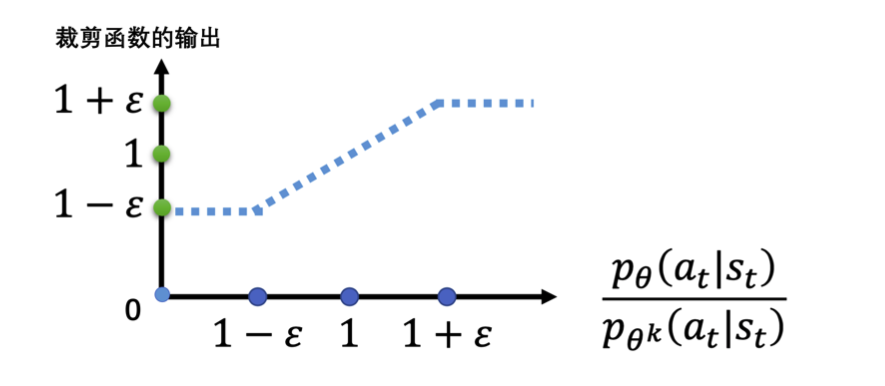

## 一、PPO简述

PPO (Proximal Policy Optimization) 是一种改进的策略梯度的算法，结合了重要性采样和 GAE（Generalized Advantage Estimator）的思想，对新旧策略的分布进行限制，保证每一次新计算出的策略能够和原策略相差不大，稳步提升算法的表现。

近端策略优化算法借鉴了信任区域策略优化算法，通过采用一阶优化，在采样效率、算法表现以及实现和调试的复杂度之间取得了新的平衡。

## 二、重要性采样
importance sampling

### 1. 先导知识
对于一个随机变量，我们通常用**概率密度函数** f (x) , 来刻画该变量的概率分布 p 特性。
具体来说，给定随机变量的一个取值 x，可以根据概率密度函数来计算该值对应的概率 (密度)。  x $\rightarrow$ f (x)
反过来，也可以根据概率密度函数提供的概率分布信息来生成随机变量的一个取值，这就是**采样**。 x ~ p
因此，从某种意义上来说，采样是概率密度函数的逆向应用。与根据概率密度函数计算样本点对应的概率值不同，采样过程往往没有那么直接，通常需要根据待采样分布的具体特点来选择合适的**采样策略**。

### 2.重要性采样方法

我们通过计算一个目标函数的期望值，来体现重要性采样的使用方法和使用场景

#### 问题描述

已知函数 $f(x)$、及其对应分布 $p$，我们从分布 $p$ 中对 $x$ 进行采样，然后带入 $f$，即可得到 $f(x)$，如果我们可以对分布 p 进行积分如何求解期望，如果我们不能对分布 p 进行积分，如何求解 $f(x)$ 的期望？如果我们不能从分布 p 采样数据，如何求解 $f(x)$ 的期望？

#### 问题解决

对于问题 1（**积分**）：如果我们可以对分布 $p$ 求积分的话，可以直接利用积分公式进行求解：
$$
\mathbb{E}_{x \sim p}[f(x)] = \int f(x) p(x) \mathrm{d} x
$$
> 通过积分的方法，我们可以获取分布p中所有的x的值，这样计算出来的期望值也是最准确的。 p(x)为概率函数

对于问题 2 （**采样**）：如果不能对分布 $p$ 求积分，此时我们可以通过在 p 中进行采样数据 $x^i$，把 $x^i$ 带入 f，计算求平均值，即可近似 $f(x)$ 的期望值。
$$
\mathbb{E}_{x \sim p}[f(x)] \approx \frac{1}{N} \sum_{i=1}^N f\left(x^i\right)
$$
> 由于我们可以对p分布进行采样，通过从p分布中采样尽可能多的值来近似最后的期望值

对于问题 3（**重要性采样**），如果我们无法从 p 中进行采样的话，我们可以从其他分布 q 来进行采样计算，由于 p、q 分布存在差异，所以我们得需对 q 分布进行纠正，这就需要用到我们所说的重要性采样的方法。

==重要性采样核心公式==
首先我们问题1的积分公式进行转换：
$$
\int f(x) p(x) \mathrm{d} x=\int f(x) \frac{p(x)}{q(x)} q(x) \mathrm{d} x=\mathbb{E}_{x \sim q}\left[f(x) \frac{p(x)}{q(x)}\right]
$$
通过转换，我们就可以将原问题：从 p 分布中采样计算 f (x) 的期望，转换为从 q 中转换，计算 $f(x) \frac{p(x)}{q(x)}$ 的期望，其中，$\frac{p(x)}{q(x)}$ 就是**重要性权重**，用来修正这两个分布的差异。
$$
\mathbb{E}_{x \sim p}[f (x)]=\mathbb{E}_{x \sim q}\left[f (x) \frac{p (x)}{q (x)}\right]
$$
#### 重要性采样的使用场景

计算期望时，由于无法从原始分布 p 采样的情况，通过在相似分布 q 中采样，来近似待求的期望结果，或者说逼近所求分布p。

#### 重要性采样的问题

对于重要性采样，虽然 q 的分布可以是任取的，但是实际上 **p、q 的分布不能差距过大**，否则可能会出现问题：

*期望相同，方差较大*
通过下图可知，p、q 分布差距是比较大的，p 分布采样到的 x 主要集中在左侧，而 q 分布采样主要集中在右侧，但是如果采样方差计算的话，两者之间的差距就会表现出来。其中方差的计算公式为：$\operatorname{Var}[X]=E\left[X^2\right]-(E[X])^2$
$$
\begin{align*}
&\operatorname{Var}_{x \sim p}[f(x)]=\mathbb{E}_{x \sim p}\left[f(x)^2\right]-\left(\mathbb{E}_{x \sim p}[f(x)]\right)^{2}\\\\	
\operatorname{Var}_{x \sim q}\left[f(x) \frac{p(x)}{q(x)}\right] &=\mathbb{E}_{x \sim q}\left[\left(f(x) \frac{p(x)}{q(x)}\right)^2\right]-\left(\mathbb{E}_{x \sim q}\left[f(x) \frac{p(x)}{q(x)}\right]\right)^2\\
\\&=\mathbb{E}_{x \sim p}\left[f(x)^2 \frac{p(x)}{q(x)}\right]-\left(\mathbb{E}_{x \sim p}[f(x)]\right)^2
\end{align*}

$$
![[importance_sampling.png]]
通过对比两者的方差公式，主要的差距是体现在方差公式的第一项，从q分布的采样方差要比p分布的采样方差多一个重要性权重，因此如果重要性权重很大的话，他们的方差差距也是比较大的。

因此从 p、q 中只要采集够多的样本，就可以让他们他们的期望值是比较相似的，但是如果采样的样本不够多的话，由于两者方差比较大， 就很容易使最后期望值的计算结果差距比较大。

**总结：**
因此要想解决重要性采样的缺点：
- 从 p、q 分布中采集足够多的样本
- p、q 分布的差异不能过大

### 3. 重要性采样在异策略中的应用

将同策略的策略梯度，通过重要性采样，转换为异策略的策略梯度。

#### 方法介绍

在策略梯度中，我们是通过策略 $\pi_\theta$ 来与环境进行交互，采样获得轨迹 $\tau$，通过计算 $\mathbb{E}_{\tau \sim p_\theta(\tau)}\left[R(\tau) \nabla \log p_\theta(\tau)\right]$ 来更新策略，而现在我们使用策略 $\pi_{\theta^\prime}$ 代替策略 $\pi_\theta$ 来与环境交互，策略 $\pi_{\theta^\prime}$ 只用于给策略 $\pi_\theta$ 做示范，提供与环境的交互数据，策略 $\pi_\theta$ 借由这些交互数据来更新参数 $\theta$。

基于重要性采样的思想，我们原本是希望从 $\theta$ 中进行进行采样的，但是现在改为通过 $\theta^\prime$ 进行采样，这样采集的轨迹数据 $\tau$ 就都来自于分布 $\theta^\prime$，而我们要学习的策略是 $\theta$，由于两个分布存在差异，现在通过重要性权重 $\frac{p_\theta(\tau)}{p_\theta^\prime(\tau)}$ 来修正

*为什么要用 $\theta^\prime$ 替换 $\theta$ 来进行采样？*
使用 $\theta^\prime$ 进行采样时，采样的数据是与 $\theta$ 无关的，$\theta$ 可以利用 $\theta^\prime$ 采样的大量数据完成**多次更新**，一直到 $\theta$ 训练更新到一定程度时，在使用 $\theta^\prime$ 重新进行采样。

#### 梯度计算方法

在进行策略梯度计算时，我们并不是针对 $\tau$ 来进行的，而是面向每个状态-动作对分开计算：
$$
\mathbb{E}_{\left(s_t, a_t\right) \sim \pi_\theta}\left[A^\theta\left(s_t, a_t\right) \nabla \log p_\theta\left(a_t^n \mid s_t^n\right)\right]
$$
这里采用的技巧是：[[5. 策略梯度#四、策略梯度改进]]，优势函数表示在当前状态 $s_t$ 下未来奖励的累积减去基线（Critic 的预测值），用于判断当前状态下采取动作的**相对好坏**，如果优势函数值大于 0，则增大当前状态下输出该动作的概率。

由于重要性采样，将同策略的策略梯度改变为了异策略，之前与环境进行交互的策略 $\pi_\theta$ 变为了 $\theta^\prime$，所以现在 $s_{t}、a_{t}$ 是策略 $\pi_{\theta^\prime}$ 与环境交互采样到的数据，同时优势函数也需要进行修改；但是要进行更新的策略是 $\pi_\theta$，因为 $\theta^\prime$ 与 $\theta$ 是不同的模型，所以要有一个修正的重要性权重：$\frac{p_\theta(s_t, a_t)}{p_{\theta^{\prime}}(s_t,a_t)}$，其中分子分母拆开为：
$$
\begin{aligned}
p_\theta\left(s_t, a_t\right) &=p_\theta\left(a_t \mid s_t\right) p_\theta\left(s_t\right) \\
p_{\theta^{\prime}}\left(s_t, a_t\right) &=p_{\theta^{\prime}}\left(a_t \mid s_t\right) p_{\theta^{\prime}}\left(s_t\right)
\end{aligned}
$$
基于此，带入原本的策略梯度的公式可以得出：
$$
\mathbb{E}_{\left(s_t, a_t\right) \sim \pi_{\theta^{\prime}}}\left[\frac{p_\theta\left(a_t \mid s_t\right)}{p_{\theta^{\prime}}\left(a_t \mid s_t\right)} \frac{p_\theta\left(s_t\right)}{p_{\theta^{\prime}}\left(s_t\right)} A^{\theta^{\prime}}\left(s_t, a_t\right) \nabla \log p_\theta\left(a_t^n \mid s_t^n\right)\right]
$$
但是由于通常我们很难计算环境中的$p(s_t)$发生的概率，而$p(a_{t} | s_{t})$是可以根据策略网络模型得出的，因此计算时我们常常会忽略掉$p(s_t)$的计算。所以基于重要性采样的**异策略的梯度**：
$$
\mathbb{E}_{\left(s_t, a_t\right) \sim \pi_{\theta^{\prime}}}\left[\frac{p_\theta\left(a_t \mid s_t\right)}{p_{\theta^{\prime}}\left(a_t \mid s_t\right)} A^{\theta^{\prime}}\left(s_t, a_t\right) \nabla \log p_\theta\left(a_t^n \mid s_t^n\right)\right]
$$
#### 目标策略

当未使用重要性采样时，我们要去优化的目标函数为：
$$
J(\theta)=\mathbb{E}_{\left(s_t, a_t\right) \sim \pi_{\theta^{\prime}}}A^{\theta}\left(s_t, a_t\right)]
$$
当我们使用重要性采样的时候, 要去优化的目标函数为
$$
J^{\theta^{\prime}}(\theta)=\mathbb{E}_{\left(s_t, a_t\right) \sim \pi_{\theta^{\prime}}}\left[\frac{p_\theta\left(a_t \mid s_t\right)}{p_{\theta^{\prime}}\left(a_t \mid s_t\right)} A^{\theta^{\prime}}\left(s_t, a_t\right)\right]
$$

我们也根据梯度与目标函数的关系，可以反推原来的目标函数：
$$
\nabla f(x)=f(x) \nabla \log f(x)
$$
即$\nabla p_\theta(a_{t}\mid s_t)$ 

$\theta$ 求梯度时, $p_{\theta^{\prime}}\left(a_t \mid s_t\right)$ 和 $A^{\theta^{\prime}}\left(s_t, a_t\right)$ 都是常数。

## 三、GAE
Generalized Advantage Estimator

首先采用时序差分的方式来计算回报（ $r_t+\gamma v(s_{t+1})$ ）和其增量$\delta_t$
$$
 {TD_{Error}}=\delta_t=r_t+\gamma v\left(s_{t+1}\right)-v\left(s_t\right)
$$
然后运用GAE公式进行**优势函数**的估计：
$$
\sum_{l=0}^{\infty}(\gamma \lambda)^l \delta_{t+1}^V
$$

为了快速估计序列中所有时刻的估计值，采用**倒序计算**，从 t+1 时刻估计 t 时刻：
$$
\hat{A}_t^{G A E(\gamma, \lambda)}=\sum_{l=0}^{\infty}(\gamma \lambda)^l \delta_{t+1}^V=\delta_t^V+\gamma \lambda \hat{A}_{t+1}^{G A E(\gamma, \lambda)}
$$

### rewards to go
其中 rewards-to-go（$\hat{R}_t$）是计算每个状态的回报值。
$t$ 时刻的剩余可得回报 $\hat{R}_t$ 是指在一个Trajectory $\tau=\left(s_1, a_1, r_1, s_2, \cdots, s_T\right)$ 中, $t$ 时刻及其以 后所有奖励的累计, 其计算如下所示。
$$
\hat{R}_t=\sum_{k=t}^T r_k
$$
它可以通过最小化损失函数的方法，指导 Critic 网络（value function）的更新，使得 Critic 网络更好的预测每个状态的回报值。

## 四、近端策略优化

**问题解决**：
当我们使用重要性采样时，如果两个分布相差太多（方差较大），会影响梯度计算的结果，因为为了避免分布之间相差太多，就提出了 PPO 方法来解决。

### 1. 同策略

同样是使用重要性采样，PPO 在这里的话是同策略的，这是因为 PPO 中与环境交互采样数据的策略 $\theta^\prime$ 是 $\theta_{old}$ ，即行为策略同目标策略（[[强化学习/常问问题#行为策略 目标策略]]）都是 $\pi_\theta$ , 因此 PPO 是同策略的算法。

### 2. 目标函数约束

为了有效避免行为策略与目标策略的分布相差较大，应多加一个约束，这个约束就是 $\theta$ 与 $\theta^{\prime}$ 输出的动作的**KL 散度**（ [[常用解释#KL 散度]]），这一项用于描述 $\theta$ 与 $\theta^{\prime}$ 的相似程度
> 在这里应用的 KL 散度描述的并不是这两个分布之间参数上的距离，二是它们行为上的距离。行为距离就是给定同样的状态，输出动作之间的差异，由于这动作的分布都是概率分布，所以我们计算的是这两个概率分布的 KL 散度。

*为什么不直接计算 $\theta$ 和 $\theta'$ 分支之间参数上的距离，而是行为的距离 ?*
这是因为对于策略网络，参数的变化与动作的变化不一定是完全一致的，有时候参数稍微改变，输出的动作会差异很大，有时参数变化很多，输出的动作可能没什么改变。因为我们最终关注的是动作上的差异，所以通过 KL 散度来控制动作分布的差距。

### 3. 近端策略优化流程

- 首先我们初始化一个策略的参数 $\theta^0$、价值函数参数 $\phi^0$
- 在每一个迭代里，我们用前一个训练的迭代得到的策略的参数 $\theta^k$ 去与环境交互，采用得到大量状态-动作对。
- 根据 $\theta^k$ 交互的结果，结合价值函数 $\phi^k$ 我们估测 $A^{\theta_{k}}(s_t,a_t)$  ，可以使$\theta$完成多次更新，同时也会更新我们的价值函数参数$\phi$。

#### 核心方法
因为我们采用了**重要性采样**的方法， 可以利用旧策略采样的数据完成新策略的更新。
为了避免不同分布之间差异过大，可以通过**KL 散度**、**裁剪**的方法来对分布差异进行纠正。

所以 $\theta$ 可以利用 $\theta^k$ 采样的数据完成多次更新。

### 4. 近端策略优化惩罚 （PPO1）

对于近端策略优化惩罚 (PPO-penalty)，有一个**自适应 KL 散度**（adaptive K divergence） 的纠正方法，其要最大化的目标函数为：
$$
\begin{aligned}
&J_{\mathrm{PPO}}^{\theta^k}(\theta)=J^{\theta^k}(\theta)-\beta \mathrm{KL}\left(\theta, \theta^k\right) \\
&J^{\theta^k}(\theta) \approx \sum_{\left(s_t, a_t\right)} \frac{p_\theta\left(a_t \mid s_t\right)}{p_{\theta^k}\left(a_t \mid s_t\right)} A^{\theta^k}\left(s_t, a_t\right)
\end{aligned}
$$
在这里将 KL 散度作为惩罚项，其中参数 $\beta$ 是可以动态调整的，我们需要事先设定一个可接受的 KL 散度的最大值 $KL_{max}$ 和最小值 $KL_{min}$，如果我们优化一次上述公式后：
- ${KL}\left(\theta, \theta^k\right)$ > $KL_{max}$，说明新旧分布差异是比较大，说明后面的惩罚项没有起到作用，因此应该增加惩罚力度，即**增大** $\beta$ 的值。
- ${KL}\left(\theta, \theta^k\right)$ < $KL_{min}$，说明新旧分布差异是比较小的，就说明后面的惩罚项太强了，因为我们更想要的优化的的目标是前一项，如果新旧分布差异过小的话，就有可能会倾向于优化后一项，因此我们减少 $\beta$ 的值。

### 5. 近端策略优化裁剪 （PPO2）

对于近端策略优化裁剪（PPO-clip），策略目标函数里面是没有KL散度的，而是增加了一个**裁剪**操作，其要最大化的目标函数为：
$$
\begin{aligned}
J_{\mathrm{PPO} 2}^{\theta^k}(\theta) \approx \sum_{\left(s_t, a_t\right)} \min \left(\frac{p_\theta\left(a_t \mid s_t\right)}{p_{\theta^k}\left(a_t \mid s_t\right)} A^{\theta^k}\left(s_t, a_t\right),\right.
\left.\operatorname{clip}\left(\frac{p_\theta\left(a_t \mid s_t\right)}{p_{\theta^k}\left(a_t \mid s_t\right)}, 1-\varepsilon, 1+\varepsilon\right) A^{\theta^k}\left(s_t, a_t\right)\right)
\end{aligned}
$$
- **min** 表示将在原始目标函数与裁剪后的目标函数中选择一个较小的项；之所以选择较小项的原因是 PPO 想要每次更新的步幅小一点。
- **clip** 表示直接对分布差异的进行裁剪限制，当分布差异高于上限（$1 + \epsilon$ ） 和低于下限（ $1 - \epsilon$ ）时直接裁剪截断；而 PPO1 中设定的最大值 $KL_{max}$、最小值 $KL_{min}$ 仅仅是判断条件。其中 $\epsilon$ 是一个超参数，通常设定为 0.1 或 0.2。裁剪效果如下图所示：

对于整个目标函数来看，优势函数 $A^{\theta^k}\left(s_t, a_t\right)$ 的正负值会对目标函数的选取造成影响：
- A > 0 ; 说明当前的状态-动作对是好的， 我们希望增大这个状态-动作对的概率 $p_\theta(a_{t}\mid s_{t})$，但是它与 $p_{\theta^k}(a_{t}\mid s_{t})$ 的比值不能超过 $1+\epsilon$ ；
- A < 0 ；说明当前状态-动作对是不好的，我们希望把 $p_{\theta}(a_{t} \mid s_{t})$ 减小。如果这时 $p_\theta(a_{t}\mid s_{t})$ 比 $p_{\theta^k}(a_{t}\mid s_{t})$ 还大的话，明显是错误的，我们需要尽可能的减小 $p_{\theta}(a_{t} \mid s_{t})$，但是它与 $p_{\theta^k}(a_{t}\mid s_{t})$ 的比值不能小于 $1-\epsilon$；

之所以设定这样的裁剪方式，是PPO2希望每次概率分布更新时，无论是增加某状态-动作对的概率还是减小状态-动作对的概率，都要有一定的限度，**不能使的两个分布差距相差过大**，这也就是PPO解决重要性采样缺点的方式。PPO每次更新的步幅虽然小，但是每次都是有效的。

![[PPO.png]]

在 PPO 中 KL 散度应用在优化目标函数的公式中：
$$
\begin{aligned}
&J_{\mathrm{PPO}}^{\theta^{\prime}}(\theta)=J^{\theta^{\prime}}(\theta)-\beta \mathrm{KL}\left(\theta, \theta^{\prime}\right) \\
&J^{\theta^{\prime}}(\theta)=\mathbb{E}_{\left(s_t, a_t\right) \sim \pi_{\theta^{\prime}}}\left[\frac{p_\theta\left(a_t \mid s_t\right)}{p_{\theta^{\prime}}\left(a_t \mid s_t\right)} A^{\theta^{\prime}}\left(s_t, a_t\right)\right]
\end{aligned}
$$
在TRPO（信任区域策略优化(trust region policy optimization) PPO前身）中把KL散度当作约束。
$$
J_{\mathrm{TRPO}}^{\theta^{\prime}}(\theta)=\mathbb{E}_{\left(s_t, a_t\right) \sim \pi_{\theta^{\prime}}}\left[\frac{p_\theta\left(a_t \mid s_t\right)}{p_{\theta^{\prime}}\left(a_t \mid s_t\right)} A^{\theta^{\prime}}\left(s_t, a_t\right)\right], \mathrm{KL}\left(\theta, \theta^{\prime}\right)<\delta
$$

补充：

一个策略的熵越大，意味着这个策略选择各个动作的概率更加“平均”。在PPO中，为了提高算法的探索能力，我们一般在actor的loss中增加一项策略熵，并乘以一个系数`entropy_coef`，使得在优化actor_loss的同时，让策略的熵尽可能大。一般我们设置`entropy_coef=0.01`。

是否使用策略熵的对比如图7所示，通过对比可以看出，使用策略熵可以一定程度提高训练效果

https://zhuanlan.zhihu.com/p/512327050

Critic 网络：
拟合状态值函数，

**为什么需要 Critic 网络而不是采用奖励？**
Critic 网络用于判断当前状态在未来中可能获得的价值（累积奖励），奖励通常是衡量当前状态下的及时奖励，无法判断当前状态在未来中是否是好的，因此通过 Critic 网络评判状态的好坏会更加合理。

优势函数是正的就增大概率，如果是负的就减小概率。

Policy：
$$
L\left(s, a, \theta_{k}, \theta\right)=\min \left(\frac{\pi_{\theta}(a \mid s)}{\pi_{\theta_{k}}(a \mid s)} A^{\pi_{\theta_{k}}}(s, a), \quad \operatorname{clip}\left(\frac{\pi_{\theta}(a \mid s)}{\pi_{\theta_{k}}(a \mid s)}, 1-\epsilon, 1+\epsilon\right) A^{\pi_{\theta_{k}}}(s, a)\right)
$$
Value ：
