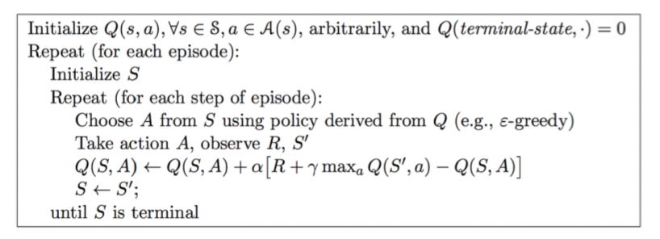

# DQN

(Deep Q-Learning)、DeepMind

# 一、 简述

DQN就是 价值函数近似（在这里使用**神经网络**来表示）+  Q-Learning 的算法 。相较于Q-Learning，DQN做的改进是：

1. 神经网络：使用了神经网络来进行值函数的逼近 
> 相较于 Q-learning遍历表格获取Q值的方式，使用神经网络对 Q值进行预测，当状态的解空间过大时，Q表遍历的难度也增加，因此使用神经网络对Q值预测更具效率；同时使用神经网络可以处理高维状态空间，

2. 目标 Q 网络：使用目标网络来估计每个状态下最优动作Q值，以便计算目标值 。
> 目标 Q 网络与进行预测的 Q 网络是相互独立的网络，在训练过程中会定期更新，通过目标网络可以提供稳定的目标Q值，通过延迟参数更新以及避免过早更新，有助于提高强化学习训练的稳定性，减少训练过程中的震荡。
> 在传统监督任务中，标签值（目标值）是确定的，而在强化学习中目标值是通过神经网络进行预测得到的，如果神经网络预测不准确，更新就不稳定，导致智能体训练偏离正确轨道，为了尽可能降低目标估计的误差，就提出了目标网络，它不会像当前的Q网络一样频繁更新，通过延迟更新的方式，不会随着训练回合而经常变化，有助于确保目标网络提供的目标Q值是相对稳定的，从而尽可能改善训练的稳定性。同时，目标网络的更新不宜过早更新，尤其在训练初期，过早更新目标网络可能会导致智能体学到不准确的Q值估计，因为目标Q值的估计需要时间来收敛。

3. 经验回放： 使用**经验回放池**（Experience Replay）：智能体在与环境交互的时候 将交互数据存放在一个库里面，然后训练的时候 从中随机采样数据进行训练；

神经网络的输入是state，通过神经网络计算出值函数之后，DQN使用$\varepsilon - greedy$策略来输出action，环境接收到此action后会给出一个奖励reward以及下一个状态，如此不断迭代下去。

#  二、 Q-Learning

Q-Learning 是强化学习中**value-based** 的算法， Q即为Q(s,a) 就是在某一时刻的 s 状态下(s∈S)，采取动作a (a∈A)能够获得收益的期望，环境会根据agent的动作反馈相应的回报reward r，所以算法的主要思想就是将==State与Action构建成一张**Q-table**来存储Q值，然后根据Q值来选取能够获得最大的收益的动作。==

| Q-Table | a1       | a2       |
| ------- | -------- | -------- |
| s1      | q(s1,a1) | q(s1,a2) |
| s2      | q(s2,a1) | q(s2,a2) |
| s3      | q(s3,a1) | q(s3,a2) |

其中 Q-Learning的伪代码为：

【Q函数更新公式】：

$$
Q\left(S_{t}, A_{t}\right) \leftarrow Q\left(S_{t}, A_{t}\right)+\alpha\left[R_{t+1}+\gamma \max _{a} Q\left(S_{t+1}, a\right)-Q\left(S_{t}, A_{t}\right)\right]
$$

【$\varepsilon -greedy$策略】

$\varepsilon -greedy$ 是一种平衡利用和探索的一种方式，有很大的几率它每次都选择使得值函数最大的 action，同时也有小概率去随机选择动作。

# 三、DQN

而在DQN中，**将Q-Learning中的Q表变成了Q-Network**，并加入了经验回放池、目标策略网络。

## 1. 经验回放池

使用一块内存空间$D$，用来存储每次探索获得的数据$<s_t,a_t,r_t,s_{t+1}>$，然后按照以下步骤重复进行：

- sample：从$D$中取出一个batch数据$(s,a,r,s') \in D$

- 对于取出的样本数据计算目标值：$r+\gamma \max _{a^{\prime}} Q\left(s^{\prime}, a^{\prime} ; \theta_{i-1}\right) \mid s, a$

- 使用随机梯度下降来更新网络权重$w$：
  $$
  \Delta w=\alpha\left(r+\gamma \max _{a^{\prime}} \hat{Q}\left(s^{\prime}, a^{\prime}, w\right)-\hat{Q}(s, s, w)\right) \cdot \nabla_{w} \hat{Q}(s, a, w)
  $$

设置经验回放池，它主要克服了经验数据的**相关性和非静态分布**问题，输入到 Q 学习算法的数据因为其上一个决策会影响下一步的状态空间,所以数据样本是有相关性的，假设如果没有设置经验回放,DQN 模型算法的输入数据可能具有相关性，那么就会让智能体陷入一个经验误区,在很长一段时间内选择一个经验上正确, 实际上错误的决策, 最终可能得到局部最优解或者模型不会收敛。因此让智能体在 DQN 网络模型训练的过程中直接从已有的记忆库中随机选取了一些经验回放, 打乱连续状态空间的相关性, 然后再求梯度, 从而避免了训练数据相关性和经验误区。

## 2. Target Q 网络

它和Q网络结构一样，权重初始化也一样，只是Q网络每次迭代都会更新，而target Q网络则是每隔一段时间才会更新，之所以这样设置的原因是通过计算Q网络和target Q网络的误差来查看Q网络的拟合情况，如果Q网络计算出来的值与 target Q网络的值差距较大的话，就说明网络训练的并不是特别好，误差较小，则说明该网络训练基本已经训练完成。

设置Target Q网络，Q-targets 值在指定时间范围内是稳定的,这在一定程度降低了当前状态动作得出的 Q-eval 值和 Q-targets 值的相关性，因此可以打断**经验数据相关性**。

## 3. 整体流程

- 首先智能体不断与环境进行交互，对于每一个完整状态序列里的每一个状态转换，依据当前状态$s_t$价值，以$\varepsilon -greedy$策略选择一个动作$a_t$，执行该动作得到奖励$r_t$和下一个状态$s_{t+1}$，将交互数据$<s_t,a_t,r_t,s_{t+1}>$存入经验回放池，
- 当经验回放池中有足够多的数据时，从经验池中随机取出一个 batch-size 大小的数据，用状态转换中的下一个状态来计算当前状态的目标价值（利用当前的Q网络计算Q的预测值，使用 target Q网络计算出Q目标值），然后计算两者之间的损失函数，
- 利用小批量梯度下降来更新Q网络参数，重复迭代几次后，将当前Q网络的参数复制给Q Target网络。

补：DQN是off-policy的原因：

- 使用了经验回放池，

### 7. 伪代码：

**NIPS 2013版**:

**Nature 2015版**

注：

![500][total.png]]

# 四、简述

DQN 是基于深度学习的 **Q 学习**算法，主要结合了价值函数近似与神经网络技术，并采用目标网络和经验回放的方法进行网络的训练。

#### Critci 学习对象
DQN 是基于价值的算法，在基于价值的算法里，我们**学习的不是策略， 而是 Critic**（评论员）， Critic 用于评价现在 Actor 输出动作的好坏,即策略评估。

#### Critic 类型： 
- **状态价值函数**：输入是一个状态，它根据状态计算出这个状态以后的期望的累积奖励
- **动作状态价值函数**：输入是一个状态-动作对，其指在某一个状态采取某一个动作，假设我们都使用策略 $\pi$ ，得到的累积奖励的期望值有多大。

>Critic 评估的不是当前状态下采取动作的即时奖励，而是期望累积奖励，即预期到该回合结束时，可以获得多大的奖励。

#### 衡量Critic的方法：
- 基于蒙特卡洛的方法
- 基于时序差分的方法

Critic 通常需要绑定一个 Actor，它是衡量 Actor 的好坏，而不是衡量一个状态的好坏，Critic 的输出与 Actor 有关，状态的价值则取决于 Actor，当 Actor 改变的，状态价值函数的输出也会跟着改变。
> 这是因为 Critic 使用状态动作值函数 Q (s, a) 进行评价，而 PPO 中的则是使用状态价值函数 V (s) 进行评价。

