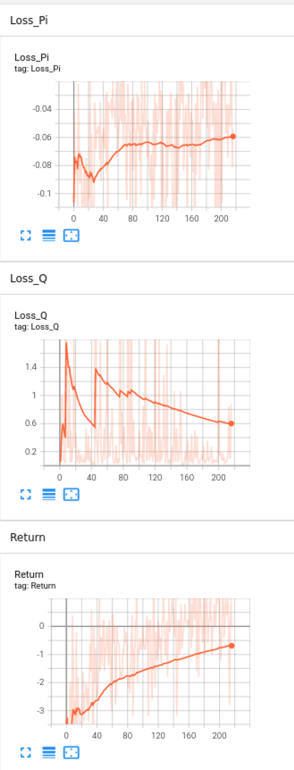

### 1. 背景

#### 1.1 基于Voronoi分区选点多智能体协同探索建图缺点

- **选点：** 基于Voronoi的选点公式是启发式的算法，固定策略，效率低。

- **到达选定目标点：**基于人工先验数据的PER-DDDG算法单智能避障鲁棒性不强，在一个未训练的陌生环境中可能会发生碰撞的情况。

  - 原因：
    - 用于训练的地图较少，仅用一、两张地图完成训练，且待训楼地图较为简单，因此在新地图环境下表现不好。
    - 人工先验数据需要人类在某个地图自主控制机器人完成探索并记录相关数据，对这张地图适配较好，在新地图上直接采用这些数据效果不好。
    - DDPG算法本身的缺陷

- 虽然存在一定的信息交流，但每个智能体的运行是相对独立的。

#### 1.2 可加入创新点

- 多/单智能体强化学习
  - action：下一步所选要达到的目标点
  
- 循环神经网络：
  - 记住相关的历史信息
  
- 课程学习（由简单到复杂）
  - 地图由简单到复杂
  - 初始点先固定在随机
  
- 内在奖励；内在动机；好奇心

- 元强化学习

- 辅助任务

  +

#### 1.3 两种方式：

- MARL只选点，控制移动通过路径规划算法($A^*$)完成：

  - 将待选目标点离散化，即在一个地图中可选的目标点是有限的。

  - 所选目标点是连续的，即地图上任何一点都可以是目标点。

    > 可以产生一个（-1，1）的值+传感器的最大范围

  > 节省计算资源，相对于传统基于边界点的方法可能会缩短机器人行走的距离，

- MARL直接控制移动

  > 计算量较大，轨迹可能会短；因此在计算量方面可以进行改进

补：若采用建图百分比作为奖励函数，则需要人工获取地图信息，因此很多使用该方法的，训练地图一般都为1张。

#### 1.4 基本框架

将未知环境探索分解为建图、决策和规划三个部。

#### 1.5 应用

- 救援机器人的搜索任务
- 未知环境下扫地机器人
- 监控
- 定位与制图

### 2. MARL

优先探索边界区域，可以记录上次一次的边界点的情况

#### 状态空间

#### 动作空间

离散动作空间，由待选目标点组成

待选目标点，先进行一个初步评价(类似PER)，选择经排序后较好的点作为待选目标点。动作空间是实时更新的

> 初步筛选：类似于Voronoi分区，对于在其他区域的待选目标点，其评价值要低一些。

#### 奖励空间

- 未探索区域越大，奖励越大

- 机器人所选目标点越接近，负奖励越大

- 基于边界点的

  > Cooperative Exploration and Networking While Preserving Collision Avoidanc; FrontierSearch(Ri)边界点搜索算法，

- 小车之间的距离
- 时间步惩罚

激光雷达 + 摄像头

### 3. 自主探索基础

#### 3.1 基础环境搭建：

- 测试新的建图方式，hector建图，相较于gmapping建图，可通过命令直接重置地图.**需要对参数进行调节**。不过建图效果一般。基于hector重建地图的命令，修改gmapping的部分源码，加入了地图重建命令。

  > rostopic pub -1 /syscommand std_msgs/String "reset"

  > Ref:https://www.ncnynl.com/archives/201702/1367.html

- 整体环境搭建
  - 机器人：turtlebot3；burger
  - 激光雷达：检测范围为180度//360
  - 环境地图：

#### 3.2 三大模块

为了方便调试，先通过单机器人将建图、规划、决策模块整合到一起，然后不经过许年

- **建图**：通过Gmapping算法，完成建图任务。

- **规划**：基于SLAM的**路径规划算法**，通过代码指定某点后，能无碰撞的到达目标点，并完成建图操作。

  > 之前路径规划是通过强化学习完成的

- **决策**：完成PPO代码的编写和调试，通过输入雷达激光等信息，输出相应的目标点。

  

## 4. 多智能体自主探索(PPO)

#### 4.1 任务目标

每个智能体通过强化学习的方法选择目标点，通过路径规划算法到达目标点，不断迭代循环，尽快完成对整个地图的探索（建图率）。

#### 4.2 选点策略：

- **输入信息**：
  
  - 通过激光雷达获取的每条射线的距离信息。
  
    > 上一时刻所选目标点信息（相对位置//神经网络的原始输出信息）。
    >
    > 其他智能体的位置信息（相对位置）
  
- 问题解决：

  - 如何通过RL选择相对目标点（离散、连续）
  - 判断RL选出的点**是否在实际检测范围内（不规则的区域）**，防止超出实际检测范围或真实环境，对接下来导航造成误导。
  - 将选出的相对目标点转换为环境中的实际目标点（已解决）

  

- ==基于每条射线选择动作==（两个）：

  - **选择激光射线**：输出 [0,1] 之间的浮点数，通过映射的方法，将其离散化成25(激光数量)个区间，即在所有激光射线中选择一条射线$i$。

    > 例如输出的浮点数乘以25，向上取整或向下取整得出的值作为要选择的射线。

  - **选择激光射线的距离**：输出 [0,1] 之间的浮点数，然后乘以所选激光的距离，即可选距离空间为$[0,laserDistance_i]$，其中distance_laser表示上一步所选激光的检测距离。这样可以保证距离不会超过其最大限值。

  - **位置转换：**根据所选激光射线和激光射线的距离通过位置转换公式，转换成接下来机器人要前往的目标点。
    $$
    x: robot\_position\_x + laser\_distance_{index}*\sin\theta \\
    y: robot\_position\_y - laser\_distance_{index}*\cos\theta \\
    \theta:index*angle\_increment  + robot\_position\_z + (\pi/2(\pi)-angle\_max)
    $$

- 基于区域选择动作

  以机器人为圆心，激光雷达最大检测范围为半径的圆形区域内，通过限制条件，在**可选区域**内选择接下来要到达的目标点。

  -  只在边界区域选点：只在未与障碍物接触的每个扇形区域内选点，每次选点需要判断是否在其扇形内，不在则重新选点。 
    - 问题：当限定机器人只在**边界区域**进行选择选点时，当机器人在陷入角落时候，可能会无法选择接下来要到达的点。
  - 缩小整个选点区域：以激光射线到障碍物最短的距离为圆心的**圆形区域**内选点。（激光射线需要360）

#### 4.3 奖励函数：

每个时刻//时间步 表示为每次的选点

- **任务完成：**当智能体完成建图任务时，即智能体总体建图率大于设定值时，获得一个较大的正奖励。

- **建图差值**：智能体 $i$ 刚选出下一个目标点时的建图与到达所选目标点后的建图差值。

  - 每个智能体 $i$ 新建局部地图 （基于像素点）= $(Map_i^t - Merge^t_i) - (Map_i^{t-1} - Merge^{t-1}_i)$  

    > 当前时刻智能体 $i$ 所建局部地图 当前智能体 $i$所建局部地图与全局地图重合部分的差值  减去（上一时刻智能体$i$ 所建局部地图与 上一时刻智能体 $i$所建局部地图与全局地图重合部分的差值），即智能体i无重合区域的大小的差值。

    > 因为每个智能体的会有自身的局部建图，因此多个智能体一起建图时，会有重复建图区域，地图融合可以将重合部分合并到一起。因此每个智能体探索到的新区域可能是其他智能体之前就探索过的旧区域。

- **香农熵**

- **目标点之间的距离**：智能体 $i$ 与其他智能体所选目标点的距离较小时，会获得惩罚。

- **内在奖励：**智能体到达所有智能体未前往的区域的时会获得奖励

  - 记录每个智能体的所选的目标点，若机器人新选的目标点与所有的智能体历史选择的目标点距离都大于k时，会获得一个正奖励。

- **基于所选目标点：**

  - 如果智能体选择的目标点所在的射线本身距离很短时，会获得一个负奖励

- **基于时间步的惩罚：**完成任务选点越多，惩罚越大

### 4.4 PPO神经网络

- **方式1:**集中式

  - 输入：所有智能体的激光雷达检测信息
  - 输出：所有智能体的动作（所选激光+距离）

  > 当输出所有的agent动作时，可能存在有的智能体完成的快，要等其他智能体完成后，在输出下一个动作。只输入激光雷达信息，可以增加鲁棒性，同时不加入位置等信息，方便移植到现实中。

- **方式2**：分布式
  
  - 输入：单个智能体的激光雷达检测信息；其他智能体的相对坐标（x，y，r）
  - 输出：单个智能体的动作（激光+距离）
  
  > 如果使用单智能体算法，如果对于某个智能体恰好完成任务会获得一个大的正奖励，而其他智能体却无法获得，会影响学习效果。
  
- 网络结构：

  - 对于 激光 (0-24 离散)、 距离([0,$laserDistance_i$] 连续) 的选择，通过输出神经网络的到 **[0,1]** 的数值，然后通过映射的方法，得到最终的激光、距离。
  - 使用**Beta分布**替换正态分布，方便输出[0,1]的数值，因为beta分布有两个参数$\alpha、\beta>0$，因此通过两个神经网络输出相应的获得相应的$\alpha、\beta$，然后通过对Beta分布采样获得相应的目标值。

  

### 4.5. 训练版本

####  0.0版本

奖励设置：

- **任务完成：**当智能体完成建图任务时，即智能体总体建图率大于设定值时，获得一个较大的正奖励。（+3）

- **目标点之间的距离**：智能体 $i$ 与其他智能体所选目标点的距离较小时，会获得惩罚。（-0.2）

- **内在奖励：**智能体到达所有智能体未前往的区域的时会获得奖励 （-0.2）

  > 每个epoch不更新历史信息点，只需要与其中任意点距离大于3即可获得内在奖励

- **基于所选目标点：**

  - 如果智能体选择的目标点所在的射线本身距离很短时，会获得一个负奖励（-0.2）

- **基于时间步的惩罚：**完成任务选点越多，惩罚越大

  - 每回合获得 -0.1的负奖励

评价：
内在奖励代码函数逻辑写错了，导致了不准确。训练时为每回合（epoch）15次，即每个智能体选15个点，训练200个回合。测试时每个智能体选10次，建图率大概在70%。

#### 0.1版本

- **任务完成：**当智能体完成建图任务时，即智能体总体建图率大于设定值时，获得一个较大的正奖励。（+3）

- **目标点之间的距离**：智能体 $i$ 与其他智能体所选目标点的距离较小时，会获得惩罚。（-0.2）

- **内在奖励：**智能体到达所有智能体未前往的区域的时会获得奖励 （-0.2）

  > 每个epoch重置所有信息点一次，与所有位置点的距离大于2，就会获得一个0.2的正奖励，最多一次选点可以获得0.6的正奖励。

- **基于所选目标点：**

  - 如果智能体选择的目标点所在的射线本身距离很短时，会获得一个负奖励（-0.2）

  

五次选点大约在百分之六十左右，十次选点，建图在百分之八十五左右。训练100个回合。前期建图效果还可以，当建图在百分之八十左右时，有时很难到达百分之九十左右的建图。一方面可能是训练回合数较少，另一方面可能是因为内在奖励的激励效果在后期很难达到，因此还需要设计一定的奖励函数，鼓励探索。

#### 0.2版本

- **任务完成：**当智能体完成建图任务时，即智能体总体建图率大于设定值时，获得一个较大的正奖励。（+3）

- **目标点之间的距离**：智能体 $i$ 与其他智能体所选目标点的距离较小时，会获得惩罚。（-0.2）

- **内在奖励：**智能体到达所有智能体未前往的区域的时会获得奖励 （+0.2）

  > 每个epoch重置所有信息点一次，与所有位置点的距离大于2，就会获得一个0.2的正奖励，最多一次选点可以获得0.6的正奖励。

- **基于所选目标点：**

  - 如果智能体选择的目标点所在的射线本身距离很短时，会获得一个负奖励（-0.1）

- **建图率：**

  - 执行当前动作后建图率与未执行前建图率之差

<video src="/Users/mapeixin/Documents/Typora/未知环境/实验/img2/run0_2.mp4"></video>

> 选六次点，达到百分之九十建图率。

### ==5. MAPPO + RNN==

### 1. 基本参数

- **方法**：每个智能体共享同一个网络结构，即共用同一个Actor-Critic网络进行训练。测试时每个智能体根据Actor网路直接输出下一个动作，不需要等待所有智能体完成任务要求。

- **神经网络**

  - **actor神经网络输入** （54 dim）
    
    - 激光雷达信息（48dim）
    
    - 当前时刻与其他智能体的**相对距离**（2 dim）
    
      > 相对距离通过距离差值和角度差值进行表示。
    
    - 与上一时刻该智能体位置的相对距离（2 dim）
    
    - **actor神经网络输出 （**2 dim）
    - 智能体的动作（激光+距离）
  
- **critic神经网络输入** （162 dim）
    - 所有智能体的输入
  
- **critic神经网络输出** （1 dim）
  
  

- **预训练**（课程学习） —— 接下来的训练将在此模块上展开训练。

  先让其学习，尽量选择较远的点，每个智能体的奖励函数不同，仍是基于RMAPPO的策略。

  - 若所选距离小于1，获得负奖励 （-0.2）
  - 若所选激光的自身最大距离小于1，获得负奖励（-0.2）
  - 若所选距离大于1小于1.5，获得负奖励（-0.1）
  - 若所选距离大于2，获得正奖励（ （所选距离 - 2））
  
  > 开始时，若所有智能体共享这些奖励(rmappo/run1)，效果并不是特别好，因此每个智能体拥有自己独立的奖励，每个智能体的奖励不同(rmappo/run2)
  
  

- **奖励函数**

  - 集中式奖励：
    - **任务完成：**当智能体完成建图任务时，即智能体总体建图率大于设定值时，所有智能体都会获得一个较大的正奖励。（+3）
    - 
    - **建图率**：每个智能体前往目标点后的建图率与 未移动前建图率之差
    - 时间惩罚

  - 分布式奖励：

    - **基于历史目标点的惩罚**：如果智能体 $i$ 所选的目标点与历史目标点的距离小于0.5m，就会获得-1的奖励，数量越多负奖励越大 （-0.1*n）

    - **内在奖励：**智能体 $i$ 到达所有智能体未前往的区域（与所有历史位置点的距离大于2.5）的时会获得奖励 （+0.5）

    - **基于所选目标点：**
      - 如果智能体 $i$ 选择的目标点所在的射线本身距离很短时，智能体 $i$ 会获得一个负奖励（-0.1）
      - 两个智能体间所选目标点的距离小于1时，两个智能体都会获得惩罚。（-0.1）

  > 问题总结
  >
  > - 共享奖励函数；会出现个别智能体呆在原地不动的情况出现，当其他智能体完成了较好的探索，但它动作不好，却有较高的奖励。

  

- **超参数设定：**
  - 总回和（epoches）数量：1000
  - 每个回合的总步数：10
  - 判断是否到达边界点：0.5m
  - 隐藏层神经元个数：256

- 

### **2. 训练版本：**

- 版本一：未使用课程学习（预训练课程），仅使用内在奖励的训练方式。**输出动作(2 dim)**：任选激光、距离。

- 版本二：使用课程学习、内在奖励的训练方式。**输出动作（2 dim）**：任选激光、距离。

​		

- 版本三：未使用课程学系，使用内在奖励的训练方式。**输出动作（2 dim）**：仅选择边界点的激光，距离任选。
- 版本四：未使用课程学习，使用内在奖励的训练方式。**输出动作（1 dim）**：近选择边界点的激光，距离固定（最大）

## ==5. MAPPO + RNN + Voronoi==

#### 1. 整体流程

- Voronoi分区：

  - $X$表示未知环境中所有智能体通过激光雷达产生的未与障碍物接触的边界点集合，随着机器人不断运动，$X$是动态变换的，环境中共有$N$个机器人$R_i$  $\forall \in(1,2,...N)$，$p_i$表示机器人$R_i$的位置， $\mathcal{N}_{R_i}$表示与机器人$R_i$在一定范围内的邻接机器人集合，$\operatorname{Vor}(R_i)$表示满足Voronoi分区性质的坐标点集合：

    

    $\operatorname{Vor}\left(R_{i}\right)=\left\{x \in X \mid d\left(x, p_{i}\right) \leq d\left(x, p_{j}\right)\right.$ ，$\left.i \neq j\right\}$

    

    $d(x,p_i)$表示点$x$和$p_i$的距离，其中$\operatorname{Vor}(R_i)$ 是 Voronoi中cell的简化，原cell为凸多边形，在这里可以简化为$X$中所有离散点中到基点(site) $p_i$ 的距离小于其他所有相邻基点距离的点集。

    

#### 2. 算法流程：

- 算法参考：
  - Joint optimization of Handover Control and Power Allocation based on Multi-Agent Deep Reinforcement Learning

调参经验：

- 首先先确定奖励函数，开始时在大范围去调，然后小范围去细调
- 再去调整batch-size 、lr 、gamma等参数
