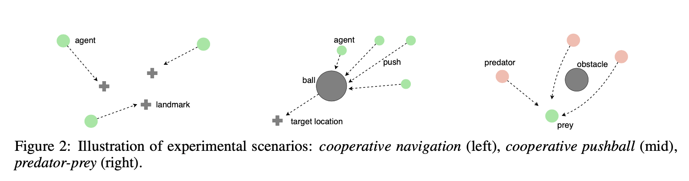

# Learning Attentional Communication for Multi-Agent Cooperation

## 一、简述

- **问题背景**：
  - 预定义的通信结构，可能会限制潜在的合作，从而限定智能体间相互的交流。
  - 当前可学习的一些通信方式（DIAL、CommNet、BiCNet），要交流所有智能体的信息，可能会无法提取出关键通讯信息，从而不利于交流，而且当智能体数量过多时，代价较高，学习难度大。
- **整体流程**：在DDPG算法基础上，加入了注意力通信（**Attention communicatio**，ATOC） 机制，使智能体可以自己选择与部分智能体进行通信。
- **创新点**：
  - ATOC实现了大规模智能体间通信协作（50、100）‘
  - ATOC因为是在DDPG基础上进行修改，在网络中间加入通信层，输入只有自身的观测信息，改进了CommNet要输入所有智能体的信息。动态交流信息的同时不会改变输入和输出的结构。

## 二、网络结构

### 1. 大体流程

受视觉注意力循环模型的启发，设计了一个注意力单元（**attention unit**），输入该智能体编码的局部观测和动议动作意图，输出该智能体在其可观察领域内是否应该与其他智能体进行通信。

如果该智能体需要通信，则将其称为**initiator**，可以从其视野范围内选择其他智能体作为collaborators，从而形成一个 communication group。这个通信组是可以动态变化的，通过一个 **communication channel**（双向LSTM单元 ）来处理通信组中每个代理的信息。

>  其中LSTM单元将内部状态（局部观察和行动意图的编码）作为输入，返回指导智能体协调策略的 integrated thought。

###  2.Attention model

- **简述**

  - 注意力单元不会去感知整个环境，只利用该智能体编码的局部观测和动作来决定交流是否有助于合作。该注意力单元可以由MLP或RNN进行实例化。

  - 首先由第一部分的 ActorNet处理局部观测信息，产生特征向量 thought  $$h_i^t$$​ ，
    $$
    h_{t}^{i}=\mu_{\mathrm{I}}\left(o_{t}^{i} ; \theta^{\mu}\right)
    $$

  - 注意力单元（**二分类器**）将该特征向量作为输入，输出通信概率。注意力单元是一个**二分类器**，用于**决定智能体是否需要进行通信**，如果需要通信则将其称为 **initiator**（发起者），然后它只会在其观测区域内选择collaborators，形成 communication group，这里有一个参数$$T$$,表示**接下来的$$T$$时刻保持该交流组不变**。因为是**所有智能体分享同一个策略网络**，因此相邻的智能体可能具有相似的行为，但是通信可以增加其策略的多样性。

    

- **优点**：

  与CommNet、BiCNet所有智能体一直共享彼此的信息不同，ATOC可以仅在必要时与相应的智能体进行通信，节省了通信代价，另一方面避免了没用信息对通信合作的干扰，可以更有效率更准确的进行通信交流合作。

### 3. Communication

- **群组组成**：

  发起者在其可观察领域中有三种类型的：其他发起者、其他发起者选择的智能体、尚未选择的智能体。通常通信时会有一个固定的通信带宽，即发起**者只能选择 m 个协作者组成通信组。**其优先选择尚未选择的智能体，然后在选择被其他发起者选择的智能体，最后选择其他发起者。

- **跨群组交流：**

  如果一个智能体被多个发起者同时选择，他将会参与每个通信组的交流。这样做的好处是，该智能体可以起到一个**信息桥梁**的作用，**将一个群体内的thought传递给其他群体**，通信信息可以在不同的通信组之间传播，从而可以协调群体之间的交流，这样的交流方式，特别**适合所有智能体协作完成单个任务**。

  > 例如智能体 k 被两个发起者 p和q选中，那么该智能体在当前通信组p交流的集成向量输出$$\tilde{h}_{t}^{k'}$$将作为他在下一个通信组q中的隐藏层编码向量输入。
  >
  > p群组计算：$$\left\{\tilde{h}_{t}^{p}, \cdots, \tilde{h}_{t}^{k^{\prime}}\right\}= g\left(h_{t}^{p}, \cdots, h_{t}^{k}\right)$$
  >
  > q群组计算：$$\left\{\tilde{h}_{t}^{q}, \cdots, \tilde{h}_{t}^{k^{\prime \prime}}\right\}=g\left(h_{t}^{q}, \cdots, \tilde{h}_{t}^{k^{\prime}}\right)$$

- **通信信道**：

  选用**双向LSTM（bi-directional LSTM）**单元作为通信信道，它的作用就是整合群体内所有智能体的内部状态(state)，引导所有智能体进行协调决策。通过LSTM单元通过门控技术可以有选择的输出促进合作的信息，忽略阻碍合作的信息。为了解决不同智能体角色和异构智能体的问题，所以双向 LSTM 网络中智能体的**输入顺序是固定**。
  $$
  \left(\tilde{h}_{t}^{i}, \tilde{h}_{t}^{1}, \ldots, \tilde{h}_{t}^{j}\right)=g\left(h_{t}^{i}, h_{t}^{1}, \ldots, h_{t}^{j} ; \theta^{g}\right)
  $$

- **最终输出**：

  在ActorNet(2)中，将该智能体的隐藏层编码向量$$h^i_t$$和其集成向量$$\tilde{h}^i_t$$作为输入，然后输出其动作。
  $$
  a_{t}^{i}=\mu_{\mathrm{II}}\left(h_{t}^{i}, \tilde{h}_{t}^{i} ; \theta^{\mu}\right)
  $$

### 4. Training

- **Critic 网络损失函数**

$$
\mathcal{L}\left(\theta^{Q}\right)=\mathbb{E}_{o, a, r, o^{\prime}}\left[\left(Q^{\mu}(o, a)-y\right)^{2}\right], \quad y=r+\left.\gamma Q^{\mu^{\prime}}\left(o^{\prime}, a^{\prime}\right)\right|_{a^{\prime}=\mu^{\prime}\left(o^{\prime}\right)}
$$
- **actor 网络求导**

$$
\nabla_{\theta^{\mu}} J\left(\theta^{\mu}\right)=\mathbb{E}_{o, a \sim \mathcal{R}}\left[\left.\nabla_{\theta^{\mu}} \mu(a \mid o) \nabla_{a} Q^{\mu}(o, a)\right|_{a=\mu(o)}\right]
$$
- **communication channel 网络求导**

$$
\nabla_{\theta^{g}} J\left(\theta^{g}\right)=\mathbb{E}_{o, a \sim \mathcal{R}}\left[\left.\nabla_{\theta^{g}} g(\tilde{h} \mid H) \nabla_{\tilde{h}} \mu(a \mid \tilde{h}) \nabla_{a} Q^{\mu}(o, a)\right|_{a=\mu(o)}\right]
$$

- **attention unit**

  注意力单元作为一个二分类器，不通过强化学习训练，而是单独收集训练数据，通过**监督学习**进行训练。

  - **训练数据**：对于每一个initiator及其communication group，我们计算通信组中每一个智能体采用协作动作（即使用集成向量作为额外输入得到的动作）与不采用协作动作（$$\bar{a}$$）在Q值上带来的差值的平均值$$\Delta Q_{i}$$ ，然后将（$$\Delta Q_{i}，h^i$$）作为一个训练样本。
    $$
    \Delta Q_{i}=\frac{1}{\left|G_{i}\right|}\left(\sum_{j \in G_{i}} Q\left(o_{j}, a_{j} \mid \theta^{Q}\right)-\sum_{j \in G_{i}} Q\left(o_{j}, \bar{a}_{j} \mid \theta^{Q}\right)\right)
    $$

  - **损失函数**：采用二分类交叉熵损失函数
    $$
    \mathcal{L}\left(\theta^{p}\right)=-\Delta \hat{Q}_{i} \log \left(p\left(h^{i} \mid \theta^{p}\right)\right)-\left(1-\Delta \hat{Q}_{i}\right) \log \left(1-p\left(h^{i} \mid \theta^{p}\right)\right)
    $$
    

  

  

## 三、 实验验证

在三个协作环境上进行实验，智能体规模都比较大（50、100），验证了ATOC要好于CommNet 、 BiCNet 、 DDPG算法。

CommNet 和 BiCNet 通信协作效果差的原因：在大规模智能体问题中 CommNet 对所有智能体的通信信息进行平均，而其中会包含很多无效信息，这样便无法区分其中有价值的信息。