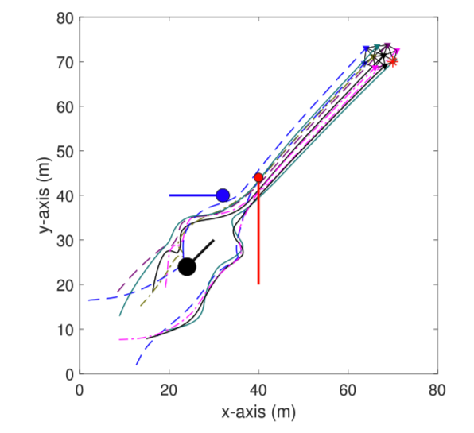

### Cooperative control for swarming systems based on reinforcement learning in unknown dynamic environment

## 未知动态环境下基于强化学习的集群系统协同控制

- 简述

  - 任务完成：群智能体采用完全分布式的方式移动，参考轨迹由虚拟动态领导者决定，每个智能体需要与邻居智能体保持一定的距离，同时需要与动态威胁发生碰撞。
  - 技术实现：
    - 上述这些复杂的需求都被集成并设计为每个智能体的**性能指标函数（performance index function）**
    - 应用**强化学习**理论实现了集群系统的合作学习行为
    - 采用**神经网络**对控制方案进行建模和训练，使性能指标最小化，基于梯度下降算法实现了神经网络的在线更新。

- 问题描述

  - 动力学特征

    - 每个智能体都有**位置和速度**进行描述（reward）
      $$
      \begin{aligned}
      \dot{p}_{i}(t) &=v_{i}(t) \\
      \dot{v}_{i}(t) &=u_{i}(t)+f_{i}(t)
      \end{aligned}
      $$

      > 其中 u 为控制变量
      >
      > f 为未知外部干扰

    - 智能体之间可以通过**无线通信**获取邻居节点的信息（位置和速度）

    - 一个虚拟智能体会引导整个群智能体进行运动，群智能体知道虚拟领导者的信息

      > 群智能体的参考轨迹由虚拟领导者的运动决定

  - 限定条件

    - 与虚拟领导者在可控范围
    - 与其他邻居智能体保持一定距离（所有）
    - 智能体与动态威胁保持一定安全距离、安全速度以及安全角度

  - 性能指标函数（评价）

    - **效应函数**（utility function）（reward）
      - 跟随虚拟领导者
      - 与邻居智能体保持状态同步同时避免碰撞
      - 躲避动态威胁
    - 性能指标函数（效应函数的总和）

- 算法设计
)

  > 类似于MADDPG，对于策略网络的输入，只输入他自身的状态，而对于价值网络，则将所有的agent的信息以及虚拟领导者和动态威胁者的信息都进行输入。其中将原DDPG中Q函数换成了与他相关的性能指标函数。

  - 系统模型
    - 基于复杂约束对应的总效用函数
    - 内容包含：动态群智能体、虚拟领导者以及动态威胁者
  - 价值网络
    - 作用：输出**性能指标函数**
    - 近似性能指标函数 +激活函数 +  性能指标函数误差 + 权重更新规则
  - 策略网络
    - 作用：输出最优**控制策略**
    - 近似最优控制策略 +激活函数 +  性能指标函数误差 + 权重更新规则

- 两个仿真实验

  - 实验一：20个智能体 + 1个动态威胁

    

  - 实验二：10个智能体 + 3个动态威胁

    

- 创新点

  - 自适应效用函数：考虑了群系统各种复杂的条件，包括动态威胁
  - 加强通信交流：群智能体之间协同学习，不仅交流状态信息，而且包括近似性能指标。
  
  - 多个动态威胁
  
- 不足

  - 缺少静态障碍物