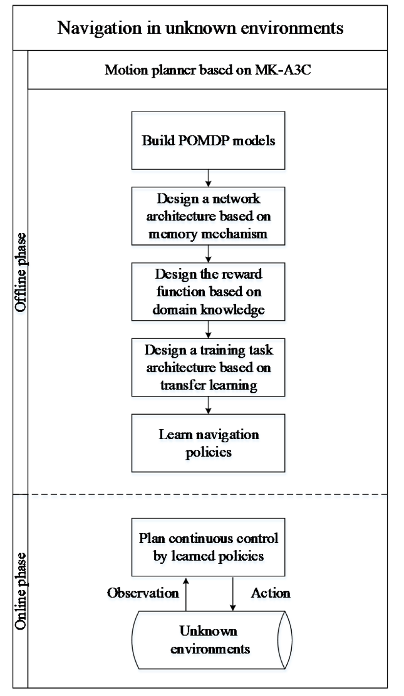
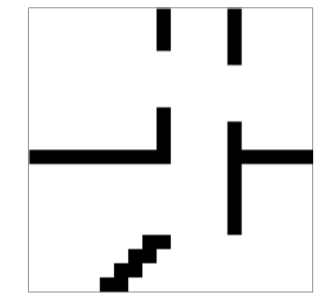
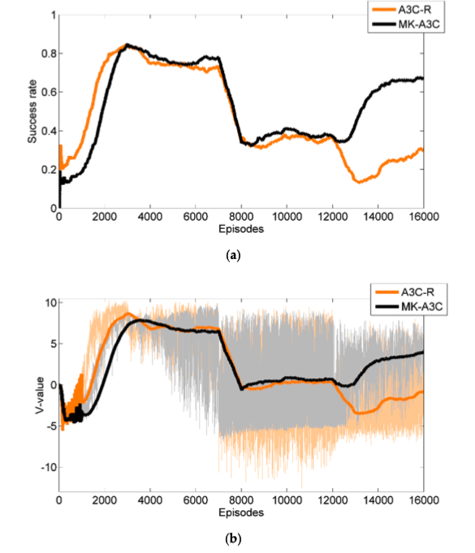

### Navigation in Unknown Dynamic Environments Based on Deep Reinforcement Learning

### 基于深度强化学习的未知动态环境下的导航

### 1. 简述

- 任务完成：

  提出了一种名为**MK-A3C**（(Memory and Knowledge-based Asynchronous Advantage Actor-Critic）的新型DRL算法，可以在未知复杂环境含有动态障碍物的环境中导航非完全的机器人

  > 非完全：通过传感器只能知晓部分信息
  >
  > Knowledge-based ：特定领域的知识库系统（通常需要人们的智力与经验来扩展知识面）

- 问题解决

  - 部分可观察状态POMDP
  - 稀疏奖励
  - 局部最优解

  > 机器人只配置了简单的局部距离传感器，传感器可以检测周围360度范围，以15度为间隔，共24维，最大距离检测为7m

  > 只有一个目标位置，可能会导致奖励函数稀疏

  > 通过自身的传感器只能获得有噪声的不完整的数据，在某些地形上容易陷入局部最优解

- 技术提升（相较于A3C）

  - 内存机制（**GRU**）

    > 基于GRU记忆网络结构去提升时间推断能力，可以避免陷入局部最优解

  - 领域知识

    > 结合领域知识的奖励函数设计

  - 迁移学习

    > 基于迁移学习的训练任务框架
    >
    > 可以解决解决由于奖励稀疏引起的非收敛问题

### 2. MK-A3C算法流程图

MK-A3C算法流程：（两个阶段：offline阶段和online阶段）

- offline阶段（训练）

  任务：学习未知动态环境中的导航策略

  方法：

  -  提取机器人与环境的关键信息，建立POMDP模型

  - 建立一个具有记忆机制的神经网络结构（GRU）求解POMDP模型（历史数据与当前观测数据结合）

  - 基于领域知识设计了奖励函数；用于处理稀疏奖励

  - 通过迁移学习构建了训练任务的体系结构

  - 最后通过 MK-A3C学习导航策略

- online 阶段（测试）

  输入：将offline阶段学习的导航策略以传感器检测到的环境信息和机器人内部状态作为输入。

  输出：连续的控制命令。

  目标：将机器人导航到给定的目标位置

### 3. POMDP

- **Observation**
  $$
  O=\left(S_{1}, S_{2}, \ldots, S_{24}, d_{t a r}, a_{t a r}, \theta, \omega_{l}, \omega_{r}\right)
  $$

  > $S_1,S_2...S_{24}$：通过传感器获取周围障碍物距离信息；共360度，间隔15度，共24维；$S_i \in [0,7]$
  >
  > $d_{tar}、a_{tar}$:分别表示机器人与目标的距离和方向（机器人的方向与机器人与目标之线的夹角；$a_{tar}\in [-\pi,\pi]$）
  >
  > $\theta$：机器人自身的方向；$\theta \in [0,2\pi]$
  >
  > $w_l,w_r$：分别表示机器人左轮和右轮的角速度。$w_1、w_2 \in [-0.5,0.5]$

- **Action**
  $$
  A=\left(\dot{\omega}_{l}, \dot{\omega}_{r}\right)
  $$

  > 轨道上左右驾驶轮的角加速度；
  >
  > $\dot{w_1}、\dot{w_2} \in [-0.5,0.5]$

- **Reward**(终端奖励 & 非终端奖励)

  - 终端奖励

    - 即将接近目标获得正奖励： $r_{arr} = 10;$ if $d_t < d_{tol}$

      > $d_t$：机器人与目标距离
      >
      > $d_{tol}$：机器人与目标的容忍距离(极小)

    - 即将碰撞障碍物获得负奖励： $r_{col} = -5$ if $S_{min}< d_{saf}$

      > $S_{min}$：机器人与障碍物的最小距离
      >
      > $d_{saf}$：机器人与障碍物的安全距离

  - 非终端奖励
    $$
    \begin{gathered}
    r_{s_{ {ori }}}=0.002 \\
    r_{ {step }}=0.001 \\
    r_{ {dang }}=\eta * 2^{\zeta d_{\min }} \\
    r_{ {d_gol }}=\lambda \left(d_{\text {tart-1 }} - d_{\text {tart }}\right)
    \end{gathered}
    $$
    
    
    - $r_{s_{\text {ori }}}$：安全定向；机器人前进的方向，与障碍物能够保持安全距离就获得一个较小奖励；不仅确保正确的导航，也能帮助机器人跳出局部最优解。
    - $r_{\text {step }}$：基于时间的惩罚；每迭代一次都获得一个较小惩罚的负奖励；鼓励机器人较短时间内到达目的地
    - $r_{\text {dang }}$：危险惩罚；当机器人更接近障碍物时，它将获得更多的负奖励；给机器人提供强烈的安全意识
    - $r_{ d_{gol}}$：接近目标奖励；当前时刻机器人相比上个时刻越接近目标距离时会获得正奖励，相反会获得负奖励；其中$\lambda$是用于控制此奖励强度的参数。
    
    > 随着训练任务难度增加，超参数会发生轻微的改变

### 4.MK-A3C

- 创新点：

  - **基于GRU建立记忆网络结构**
  - **基于领域知识建立了奖励函数**（上面奖励函数的设立）
  - **基于迁移学习（课程学习）构建一个训练任务**

- 基于GRU的记忆网络结构

  

  - Actor共有三个输入两个输出

    输入：

    - 当前时刻的观测值经过两个全连接层（ReLU；256、64）处理得到的数据
    - 上一时刻GRU隐藏层状态数据（32）
    - 上一时刻的动作（2）

    加工：

    - 包含一个ReLU的GRU处理单元（32）

    输出：

    - 经过一个激活函数为Tanh的全连接层后输出动作空间的高斯期望分布

      > 相比于直接输出动作，构造动作空间分布可以提高训练过程中动作选择的随机性，从而增加探索

    - 过一个激活函数为Softplus的全连接层后输出方差

  - Critic共有三个输入一个输出

    输入相同，其中输出只有一个，且不包含激活函数

- 基于迁移学习（课程学习）构建训练任务

  - 本文中使用课程学习的方法来增加训练样本的复杂性了，从而加速训练，解决奖励稀疏的问题。
  - 因为神经网络采用GRU神经单元，所以不方便直接使用课程学习的方法。所以提出了一种改进的课程学习方法，可以把整个学习任务分成两个部分。
    1. 第一部分随着训练次数的增加复杂性不断增加
    2. 第二部分的复杂性随机确定，但其复杂性的最小值也大于第一部分的复杂性
  - 本文通过移动障碍物的数量和机器人与目的地之间的初始欧几里得距离来量化学习任务的复杂性。

  > 我认为它在训练时先从简单环境开始，并保留该模型，环境变的比刚才环境复杂，开始时调用上个环境下训练出来的模型开始训练，然后随着训练环境不断复杂，不断迁移对应的上个版本的模型。

### 实验

- 实验训练：

  - 环境：设计了有长廊和死角这些容易陷入局部最优解的情况

    

    > 环境大小为20x20；
    >
    > 机器人起始点在左下角开始初始化
    >
    > 目标点是从起始点的某个范围内开始初始化
    >
    > 移动障碍物随机初始化，为了增加难度，移动障碍物的初始方向大致朝向机器人

  - 结束条件：机器人到达目标或与障碍物发生碰撞就结束该回合

- 实验验证：

  - 验证基于GRU记忆网络的优越性（同A3C-R策略相比）

    

    > 将MK-A3C算法痛A3C-R算法相比较
    >
    > MK-A3C与A3C-R的区别是A3C-R没有采用GRU的记忆神经单元，而是普通的全连接层
    >
    > 在前3000次迭代中A3C的成功率以及V(s)均优于MK-A3C算法。
    >
    > 3000 — 12000次迭代中，A3C与MK-A3C算法基本差距不大
    >
    > 大于12000次迭代时，MK-A3C明显优于A3C-R策略
    >
    > A3C-R策略在处理简单任务时因为只采用全连接层要优于MK-A3C方法，但随着迭代次数的增加，MK-A3C能更好的利用之前历史轨迹和当前的观测值得到更优的导航策略

  - 验证基于领域学习的奖励函数的设计以及基于迁移学习的任务架构能够有效训练策略

    > 当不采用非终端奖励时，MK-A3C很难完成收敛

  - 在不同测试环境下测试MK-A3C的泛化能力

    

    > 第一个为训练环境，后三个为测试环境

### 可改进

- 增加环境的复杂性
- 延迟动作
- 添加不规则的移动障碍物（贴近现实）
- 本文是使用主观经验设计的奖励函数，接下里可以使用分级强化学习、辅助任务、内在奖励替换领域知识的奖励功能。

- 应用场景
  - 视频游戏
  - 机器人

迁移学习

A3C

领域知识

reward shape

GRU：类似于LSTM的循环神经网络

课程学习（Curriculum learning）

分级强化学习

多任务学习

idea：

- 未知动态环境下基于强化学习的多智能体目标搜索

