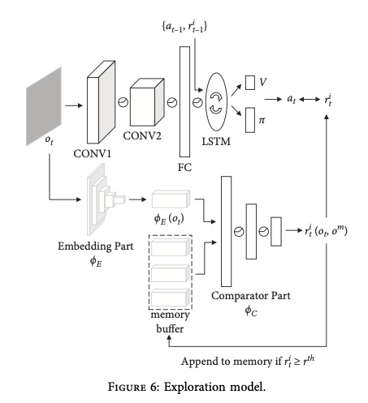

## End-to-End Autonomous Exploration with Deep Reinforcement Learning and Intrinsic Motivation

### 一种端到端的基于强化学习和内在奖励的自主探索

Computational Intelligence and Neuroscience（3.633）

## 1. 简述

- **整体流程**：本文设计了一个神经网络用于产生内在奖励，另一个神经网络用于学习探索策略，通过这两个神经网络一同完成自主探索任务。
- 创新点：
  - TC网络 + 基于好奇心的内在奖励

- 缺点：
  - 在复杂环境下存在一定的局限
  - 没有在真实环境下测试
  - 没有与基于SLAM方法进行对比
  - 没有直接在新地图上直接进行测试，而是通过训练的方式来进行测试。

## 2. 总体设计

### 2.1 Nav A3C model

**端到端**到导航框架，类似于**A3C**的结构，在其基础上增加了对原始图像的**预处理**操作。

- **组成结构**：

  - 输入：智能体的原始观测（三维图像） + 上一时刻动作 + 上一时刻奖励
  - 卷积层：提取出了图像的局部特征。
  - 循环层：实现记忆存储功能；
  - Actor-critic：循环层后分别接两个线性层，分别用作actor和critic的输入。
  - 输出： 动作（ 前/后 ； 左转/右转 ； 向左转并前进/向右转并前进）

  

### 2.2 TC-network model

通过训练TC（ Temporal Correlation ）网络计算观测值之间的**时间距离**（temporal distance）来完成**分类**任务，从而用于接下来内在动机的计算。

- **原理**：时间距离上接近的观测对具有高相似性，时间距离上遥远的观测对具有低相似性。

- **组成结构**：

  - 输入：原始观测对$i$ 、$j$；
  - 嵌入模块（embedding part ）：ResNet-18结构；用于计算原始观测值 $i$ 、$j$ 的特征向量
  - 比较模块（comparator part）：处理特征向量，计算观测对的相关程度。
  - 输出：时间距离

  

### 2.3 内在动机

基于好奇心的内在动机去鼓励智能体对环境进行充分探索。内在奖励共有两部分组成：

- **基于计数的方法**：通过一个内存缓冲区存储历史观测信息，利用TC网络计算当前观测信息与历史观测信息的相似性，如果当前观测值与历史观测值相似次数越少，则获得的内在奖励越多。**关注已探索环境的新奇性，鼓励智能体前往未探索区域。**
  $$
  r^{c b}\left(o^{c}, o^{m}\right)=\frac{\alpha}{\sqrt{n\left(\phi_{T C}\left(o^{c}, o^{m}\right)\right)}}
  $$

  > $\alpha$为奖励系数，$o^c$为当前时刻的奖励信息，$o^m$为历史观测。
  >
  > 两个观测对之间的时间距离低于某个阈值，则认为观测对具有较高的相似性，即当前时刻观测与某一历史观测相似，分母+1
  >
  > 并非将所有观测都存入内存缓冲区中，因为这样会导致当前的观测结果与之前时间步相似，因此只存入内在奖励大于一定阈值的观测信息。

- **基于时间距离的方法**：为了解决基于计数方法的中无法处理未探索观测问题（分母为0），内在奖励的大小与当前观测和缓存区中观测之间的最短时间距离相关。如果当前观测与历史观测相似性越低，内在奖励越多。**关注计算未探索区域的新奇奖励，希望智能体去往较远的区域。**
  $$
  r^{t d}\left(o^{c}, o^{m}\right)=\min _{o^{m} \in M}\left\{\frac{\beta}{\phi_{T C}\left(o^{c}, o^{m}\right)}\right\}
  $$
  

## 3. 实验

### 3.1 实验设置

- 实验环境：DMLab
- 对比算法：TRPO、VIME、EX2、ICM
- 环境以每秒60帧的速度运行

### 3.2 参数选择实验

- **采样分离参数**（Sample Separation Parameter）：为了平衡TC网络的精度和内存缓冲区的大小，选择多少时间步长$k \in[1,10]$分离的数据作为训练样本（一个动作执行几个时间步）。共有两个评测标准：

  - **TC网络的精度**：智能体与环境进行进行1.5M次交互的训练结果作为TC网络精度的评判。
  - **观测值存储到内存缓冲区的比例（POSM**）：随机选择30个随机观测序列，判断有多少观测值可以被存入到内存缓冲区中。

  > 如果采样分离参数比较小，每个时间步的差异较少，可能会影响TC网络的精度。因为每走一小步就要进行判定，增加计算压力，增加内存缓冲区的大小。

-  **交互量参数**（Interaction Quantity Parameter）：预训练阶段智能体与环境交互（采取随机动作）次数。评测标准：

  - **TC网络的精度**：通过设定不同的交互次数，观察TC网络的精度。

  > 在预训练阶段，所有的样本都来自于同一个环境，可能会导致TC网络缺乏通用性。

- **内在奖励参数**：选择合适的$\alpha$和$\beta$的组合（两者相加为1），去提高探索效率，与只是使用一种内在奖励相比（$\alpha$或$\beta$为0），使用两种内在奖励，会有更好的探索效率。共有两个评测标准：

  - **内在奖励值**：1800时间步（大概半分钟）获得的内在奖励值。
  - **编译环境所需要的交互量**  （interaction quantity required to encode the environment ；IQRE）：预先确定的环境特征和勘探过程中存储的观测值来计算的。

### 3.3 对比实验

接下来的对比试验在下面这三个地图中进行。在这里使用统一的基于计数的奖励来作为其中之一的评估标准，每个回合（episode）包含7200步（两分钟），每个回合结束后。智能体会被安排到一个新的地点，重新开始探索环境。

>  与前面内在动机下基于计数的奖励不同，这里的基于计数的奖励是一个回合内

- **从头(Scratch)开始的训练方式**：在不同地图下，通过不同的算法观察随着训练回合数不断增加回报的变化情况。其中作者提出的方法需要先进行2.5M次的预训练。与此同时还设置了另外两个评测标准进行验证：maximum exploration ratio (MER)和 IQRE。实验证明，作者提出的方法和ICM方法可以获得较好的实验效果。

  

- **TC网络的二次训练**：采用之前预训练的方法，在新环境下，TC网络的精度不断下降。如果对每个迷宫，TC网络都进行预训练，虽然会获得较好的预测能力，但会增加预训练的成本，推迟创造内在动机的过程。因此通过**在线**的方式，在学习控制策略的过程中，**从每个测试迷宫中抽取训练数据**，通过这样泛化训练的，虽然会降低TC网络精度，但是还是可以保持之前的2.5M的交互量，不会推迟智能体通过内在动机的方式探索环境。

- **微调(Fine-Tuning)训练方式**：在图8的环境中，采用在参数选择实验中设定好的参数，进行的训练，并将该训练策略作为接下来微调策略的初始输入，在此基础上去训练ICM策略和作者提出的策略。虽然最终效果差不多，但是收敛速度更快。

- **微调+外部奖励训练方式：**其中外部奖励的设置为：在地图中放置一个最终目标点（+10）和多个临时点（+1），如果到达相应的点会获得相应的奖励，如果到达最终目标点，则智能体会重新探索该环境。其中评估的标准还是之前的统一累积奖励。结果表明，加入外部奖励后，虽然会在早期获得较好的奖励，但是**需要与环境进行更多的交互**，与此同时可能会使智能体在某段时间专注于导航而不是探索，从而降低训练效率。

- **“Noisy-TV” 实验**：因为ICM策略与作者提出的策略在某些场景下都能达到比较好的效果，对智能体每个观测信息增加一个固定大小随机采样的噪声区域作为干扰，去判断算法是否还能保持较高探索效率。由于作者提出的方法会根据历史信息引导智能体进行探索，所以仍会保持较好的探索效率。从而验证作者提出的方法更具鲁棒性。