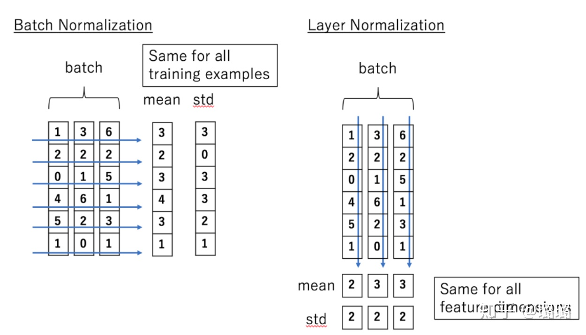

# 归一化

## 一、 归一化简述

### 1.1 Normalization理解

归一化/规范化，是一种对数值的进行特殊函数变换方法，将需要处理的数据通过某种算法处理后，限定在任务需要的一定范围内，不同的规范化目标导致具体方法中函数所采用的形式不同。

> 也就是说假设原始的某个数值是 x，套上一个起到规范化作用的函数，对规范化之前的数值x进行转换，形成一个规范化后的数值f(x)

### 1.2 为什么需要Normalization？

解决 **Internal Covariate Shift（内部协变量偏移） 问题，调整各层输入数据分布**，

#### 1.2.1 独立同分布 & 白化

在使用机器学习和深度学习的时候，[**独立同分布**](概念解释#独立同分布)的数据可以加快模型的训练速度和提升模型的性能

**白化 whitening**：是数据预处理的一个重要方式，

* 去除数据之间的关联性 $\rightarrow$  **独立** 
* 使得特征具有相同的均值和方差 $\rightarrow$  **同分布**

> 白化最典型的方法就是PCA（Principal Components Analysis 主成分分析：可以将输入向量转换为一个维数低很多的近似向量，且两者误差非常小。

**1.2.2 Internal Covariate Shift** 
内部协变量偏移可以拆成两个部分来看*内部、协变量偏移* ，其中 内部 指的是协变量偏移发生在神经网络中间层（隐藏层），协变量偏移则是指，由于神经网络更新修改权重和偏置，这可能会导致各个中间层的输入数据分布（上一层输出）不一致，而这种差异会随着网络深度增加而增大。

首先原始输入数据与输出结果之间存在一定的**非线性映射关系**，我们希望神经网络尽可能的准确的拟合这样的映射关系，这就得需要神经网络的各个中间层之间尽可能传递与输入数据相同的数据分布（中间层输出），即我们希望这些中间层的输入数据分布可以和原输入数据保持一致的。由于神经网络的更新会不断打破各层原有的数据分布，因此上层参数（接近输入）需要不断适应下层参数变化。因此训练一个好的模型，需要谨慎的设置学习率、权重初始化、参数更新策略、激活函数等。

基于上述现象，传统Internal Covariate Shift （ICS）是 [**源空间和目标空间**](概念解释#源空间 & 目标空间)分布不一致问题的一个分支问题（是指源空间和目标空间的条件概率是一致的，但是其边缘概率不同。）
$$
\begin{gathered} P_{s}(Y \mid X=x)=P_{t}(Y \mid X=x) \\ P_{s}(X) \neq P_{t}(X) \end{gathered}
$$
而神经网络中的内部协变量偏移问题含义稍有不同，中间层的输入数据（上一层输出）分布不同，

> 也就是说对于神经网络各层输出，经过层内操作作用，其分布显然与各层对应的输入信号分布不同，而且差异会随着网络深度增大而增大，可是它们所能“指示”的样本标记（label）仍然是不变的，这便符合了covariate shift的定义，由于是对层间信号的分析，也即是“internal”的来由。

#### 1.2.3 ICS导致的问题

简而言之，每个神经元的输入数据不再是“独立同分布”。

* 导致梯度消失的情况（[参考](https://www.cnblogs.com/Luv-GEM/p/10756382.html)），即输入数据分布偏移，导致梯度落入包河区，梯度变化就会很小乃至消失。
* 上层参数需要不断适应新的输入数据分布，降低学习速度。
* 下层输入的变化可能趋向于变大或者变小，导致上层落入饱和区，使得学习过早停止。
* 每层的更新都会影响到其它层，因此每层的参数更新策略需要尽可能的谨慎。

#### 补：从量纲角度来说：

刚才是在ICS角度分析数据分布变化对模型学习影响，如果对于输入数据本身来说：

一个原始样本数据通常包含多个特征(维度)，每个特征的量纲和取值范围是不同的；在模型的学习过程中，不同的特征对模型的影响也是不同的，当不同特征的量级差距较大时，消除量纲是有必要的，否则数据的分析的结构就由量级较大的特征决定，从而忽略了量级小的特征。因此需要通过Normalization等方法对数据进行预处理，**消除量纲**，使之全部变成没有单位的数据（同一量级），便于之后的分析。

> 量纲：描述的是一个物理量(唯一；速度)； 单位：衡量该物理量的标准(多个；m/s,cm/s)

### **1.3 Normalization 的通用框架**

对于一个神经元接收的输入向量 $\mathbf{x} =(x_1,x_2,...x_d) =(x_1,x_2,...x_d)$​,通过内部激活函数的计算后输出标量$y=f(x)$。

由于ICS问题的存在，经计算后每层输入数据分布差异较大。为了使数据能够“独立同分布”，一般来说，就是对每一层数据都进行白化操作，不过白化操作代价较高，且希望白化操作是可微的，从而满足反向传播更新梯度。

以 BN 为代表的 Normalization 方法退而求其次，进行了简化的白化操作，再将输入数据$\mathbf{x}$ 输入神经元之前，先对其进行**平移和伸缩的变化**，将$\mathbf{x}$的分布规范化成在**固定区间范围的标准分布**。其中变换框架：

$$
h=f\left(\mathbf{g} \cdot \frac{\mathbf{x}-\mu}{\sigma}+\mathbf{b}\right)
$$

其中$\mu$为平移参数(shift parameters)，$\sigma$是缩放参数(scale parameters)，通过这两个参数进行平移缩放变换

$$
\widehat{\mathbf{x}} = \frac{\mathbf{x}-\mu}{\sigma}
$$

得到的数据符合均值为0、方差为1的标准分布。经过这样规范化的操作，会几乎将所有区域映射到激活函数的非饱和区（线性区），仅利用线性变化能力，会**降低神经网络的表达能力**，这样就没法很好利用底层学习的内容。

为了保证模型的表达能力不因为规范化而下降，充分利用底层学习的能力，还需要将上述的标准分布进行再平移、再缩放。将数据从线性区域变换到非线性区，通过区分饱和区和非饱和区，使得神经网络的数据变换具有了非线性计算能力，**恢复模型的表达能力（非线性能力）**。

$\mathbf{b}$是**再平移参数**(re-shift parameter )和$\mathbf{g}$是**再缩放参数**(re-scale parameter），将上一步得到的$\widehat{\mathbf{x}}$进一步变换：得到数据符合均值为$\mathbf{b}$、方差为$\mathbf{g^2}$的分布，这两个参数都是**可学习的**。

$$
\mathbf{y}=\mathbf{g} \cdot \hat{\mathbf{x}}+\mathbf{b}
$$

> 在旧参数中，$\mathbf{x}$的均值取决于下层神经网络的复杂关联，而再变换中，通过引入两个新参数，可以去除与下层计算的密切耦合，通过梯度下降方法来学习，简化了网络的训练。

标准白化操作的目的是获得“独立同分布”的数据分布，而Normalization并不是严格的同分布，只是映射到一个确定的区间范围。

### **1.4 Normalization优点**

* 提高梯度下降速度
* 如果权重初始值分布不好时，数据尺度会随着网络层数加深而发生异常（梯度消失、梯度爆炸），通过归一化的方法，可以不会过度依赖权重初始值。

#### Normalization的应用

## 二、 Batch Normalization

### 2.1 BN简述

BN是针对单个神经元(维度$i$)进行的，利用训练时的一个mini-batch的数据来计算该神经元$x_i$的均值和方差，其中**均值和方差的是基于该维度计算的。**可以理解为对**批样本的同一维度**特征做归一化，batch\_size的大小会影响均值和方差的大。因此数据有多少维度就有多少均值和方差。

#### BN的适用场景

BN独立的规划化每一个输入维度$x_i$，规范化的参数是一个mini-batch的一阶统计量和二阶统计量，这就要求每一个mini-batch的统计量时整体统计量的近似估计，或者说每一个 mini-batch 彼此之间，以及和整体数据之间，都应该是近似同分布的。分布差距较小的规范化操作和模型训练引入了噪声，可以增加模型的鲁棒性；但如果每个mini-batch的原始分布差距很大，那么不同的mini-batch 的数据将会进行不一样的数据变换，增加模型的训练难度。

BN比较**适用的场景**就是：**每个mini-batch比较大，数据分布比较接近**。因此在训练前需要对数据做好充分shuffle，否则效果不佳。

另外，由于 BN 需要在运行过程中统计每个 mini-batch 的一阶统计量和二阶统计量，因此**不适用于动态的网络结构 和 RNN 网络**。

### 2.2 BN正向传播

[批归一化](../shen-du-xue-xi/shen-du-xue-xi-ru-men-ji-yu-python-de-li-lun-yu-shi-jian-bi-ji/#6.3-batch-normalization)，是神经网络中一种特殊的层，在激活函数前/后都可以达到差不多的效果，BN主要分为两个部分：

* **Standardization**：对$m$个输入数据$x$进行标准化，得到0均值标准化（Z-score方法）的分布$\widehat{x}$
* **scale and shift：** 对分布$\widehat{x}$进行平移和缩放，得到新的分布 y ，和新的待学习的均值(平移参数)$\beta$和方差（缩放参数）$\gamma$

$$
\begin{array}{rlr}\mu_{{i}} & \leftarrow \frac{1}{m} \sum_{i=1}^{m} x_{i} & \text { // mini-batch mean } 
\\
\\
\sigma_{i}^{2} & \leftarrow \frac{1}{m} \sum_{i=1}^{m}\left(x_{i}-\mu_{\mathcal{B}}\right)^{2} & / / \text { mini-batch variance } \\ 
\\
\widehat{x}_{i} & \leftarrow \frac{x_{i}-\mu_{\mathcal{B}}}{\sqrt{\sigma_{\mathcal{B}}^{2}+\epsilon}} & \quad / / \text { normalize } \\
\\y_{i} & \leftarrow \gamma \widehat{x}_{i}+\beta \equiv \operatorname{BN}_{\gamma, \beta}\left(x_{i}\right) & \quad / / \text { scale and shift }\end{array}
$$

设BN层有$H$​个输入节点，则$x$可以构成 $H$ x $m$大小的矩阵 $X$ ，BN层相当于通过 **行操作** 将其映射为另一个$H$ x $m$大小的矩阵 $Y$。

完整公式如下所示。

$$
y_{i}^{(b)}=B N\left(x_{i}\right)^{(b)}=\gamma \cdot\left(\frac{x_{i}^{(b)}-\mu\left(x_{i}\right)}{\sqrt{\sigma\left(x_{i}\right)^{2}+\epsilon}}\right)+\beta
$$

其中参数$u$和$\sigma$是对当前行$i$的统计量，不可学习。$\gamma$和$\beta$为该行缩放和平移的参数，它们才是真正进行学习的参数（反向传播时对这两个参数求偏导）。因此**无论**$x_i$**原本的均值和方差是多少，通过BN后其均值和方差分别变为待学习的**$\gamma$**和**$\beta$**​.**

### 2.3 BN优缺点

#### 优点：

* **缩短训练时间**：BN会使得每层输入数据分布更加平滑，从而加速收敛速度。
* **有利于梯度下降**；没有BN层的情况下，网络没办法直接控制每层输入的分布，其分布由于前面层的权重决定，或者说分布的均值和方差“隐藏”在前面层的每个权重中，网络若想调整其分布，需要通过复杂的反向传播过程调整前面的每个权重实现，**BN层的存在相当于将分布的均值和方差从权重中剥离了出来，只需调整**$\gamma$**​和**$\beta$**​就可以直接调整分布，让分布和权重的配合变得更加容易。**
* **不会过度依赖权重初始值**；对于深层网络来说，权重的初始化要求是很高的，BN可以“动态”的调整数据分布，因此对权重初始化要求也就没那么严格了。
* **可以支持更多损失函数**；BN可以“拉平”数据分布，避免输入落入激活函数的饱和区域，从而减缓梯度消失的问题，可以更好支持不同的损失函数。
* **可以适应更高学习率**； 协变量偏移通常会导致各层之间数据分布差距较大，为了解决该问题，通过需要设置较小的学习率，减少数据分布差异，而BN可以较好解决协变量偏移，可以使用更大的学习率，尽早跳出不好的局部极值。
* **可以提供正则化的作用**，BN在一定的程度上起到了dropout的作用，因此在适用BN的网络中可以不用dropout来实现。
* BN可以让损失函数更平滑

#### 缺点

* **对batch\_size的大小比较敏感**；batch size很小的时候，其梯度不够稳定，效果反而不好。
*

## 三、 Layer Normalization

### 3. 1 LN简述

LN是针对BN的不足而提出来的，与BN不同的是，LN是针对单个样本进行，它综合考虑一个样本的所有特征，即LN针对所有神经元进行的，所有神经元共享均值和方差。

均值和标准差的计算如下所示，其中$H$​表示该层神经元的个数，即输入数据的所有特征数。对于规范化以及缩放平移的计算与BN相同。

$$
\mu^{b}=\frac{1}{H} \sum_{i=1}^{H} a_{i}^{b} \\ 
\\
\quad \sigma^{b}=\sqrt{\frac{1}{H} \sum_{i=1}^{H}\left(a_{i}^{b}-\mu^{b}\right)^{2}}
$$

#### 适用场景

**LN不依赖于其他样本数据**，这样就可以避免BN中受mini-batch数据分布影响的问题，可以用于小mini-batch、动态网络RNN，此外LN不需要保存mini-batch的均值和方差，节省了额外的存储空间。

### 3.2 LN优缺点

#### 优点：

* 对batch size大小并不敏感；LN是针对一层网络上所有神经元做归一化（处理单个样本数据的所有特征）。
* LN能很好的应用在循环神经网络中；在NLP中更加适合，

### 3.4 LN & BN 区别

* BN针对的是同一个**mini-batch**内同一特征维度上数据归一化，而LN则是针对**单个样本**的所有特征维度来做归一化。
* BN有多少维度就有多少个均值和方差，batch size大小不同，计算出来的均值和方差也不同，因此**batch size不能太小**；LN的均值和方差的数量和batch size大小相关，但其均值和方差的大小却独立 batch size。

#### 参考
[Batch Normalization详解](https://www.cnblogs.com/shine-lee/p/11989612.html)
https://www.cnblogs.com/shine-lee/p/11989612.html

[关于batch normalization和layer normalization的理解](https://blog.csdn.net/HUSTHY/article/details/106665809)

[深度学习中的Normalization - Batch Normalization、Layer Normalization、Weight Normalization](https://www.cnblogs.com/ying-chease/p/13846413.html)

[Normalization](https://blog.csdn.net/qq_38213612/article/details/84942908?biz_id=0&ops_request_misc=%257B%2522request%255Fid%2522%253A%2522165201686216781818799479%2522%252C%2522scm%2522%253A%252220140713.130102334.pc%255Fall.%2522%257D&request_id=165201686216781818799479&spm=1018.2226.3001.4187)

[batchNormalization与layerNormalization的区别](https://zhuanlan.zhihu.com/p/113233908)
