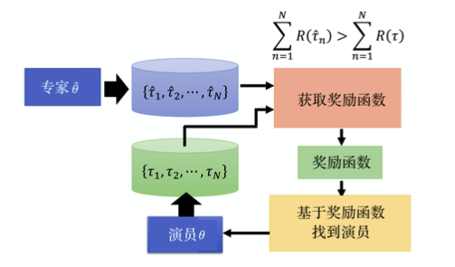

## 一、简述

模仿学习是学习器尝试模仿专家行为从而获取最佳性能的一系列任务。
>Imitation Learning is a sequential task where the learner tries to mimic an expert’s action in order to achieve the best perfomance.

从专家范例中进行学习，即对专家数据进行建模。

组成：
策略神经网络、专家连续行为（标准动作）

分类：
行为克隆、逆强化学习、元学习

## 行为克隆

根据专家在训练过程中是否进行指导，可以将模仿学习分为两类，即**离线模仿学习**（offline imitation learning）和**在线模型学习**（online imitation learning）。传统的行为克隆就属于离线模仿学习，基于行为克隆的数据数据聚合方式属于在线模型学习。

### 1. 离线行为克隆
通过一个固定的专家范例训练集来进行学习，使得我们学习的策略能够近似专家策略。这可以近似看作监督学习，通过对比模型的输出和专家范例的输出来进行学习。通常称这钟方式为**行为克隆**（behavioural cloning）

#### 专家范例数据
包含多条训练轨迹，每个轨迹包含了状态序列，以及专家执行的动作序列。
#### 目标 
最小化模型策略与专家行为的差异

Dataset： $D=\left\{\tau_i\right\}_{i=0}^N$
Trajectory： $T_i^{\prime}=\left\{s_1^i, a_1^i, s_2^i, a_2^i \quad s_{T}^i a_T^i\right\}$ 
policy $\prod: s \rightarrow a$
$$
\prod_\theta(a \mid s) \sim \operatorname{argmin} \sum_{i=1 j=1}^{j \leq N} L\left(\prod_\theta\left(s_i^j\right), a_i^j\right)
$$

#### 损失函数
量化我们设定的目标
如果动作是离散的，可以看作是一个分类问题，可以将交叉熵作为损失函数；如果动作是连续的，可以看作是一个回归问题，可以采用L2损失函数。
L2 损失函数等价于基于高斯分布的最大化期望 log 似然
$$
\begin{aligned}
a&=\pi_\theta(s)+\epsilon \\
p(a | s, \theta) &=\frac{1}{\sigma \sqrt{2 \pi }} \exp \left(-\frac{\left(a-\pi_\theta(s)\right)^2}{2 \sigma^2}\right) \\
\operatorname{argmax} E[\log ]] &=\operatorname{argmax} E\left[\log \exp \left(-\frac{\left.\left(a-\pi_\theta(s)\right)^2\right)^2}{2 \sigma}\right]\right.\\
& \approx \operatorname{argmin} \frac{1}{N} \sum\left(a-\pi_\theta(s)\right)^2: l_2 \text { error }
\end{aligned}
$$
[参考：L2损失与高斯分布推导 ](常用解释#L2损失和高斯分布)

#### 缺点
- **范化困难**；由于专家数据无法包含所有的状态动作，例如自动驾驶时，由于专家的驾驶经验很丰富，采集到的数据通常是正常驾驶的情况，如果智能体此时遇到危险的状态，由于没有对应的专家数据，因此智能体此时通常无法很好的处理这种“陌生”的状态其根本原因为 [协变量偏移](常用解释#协变量偏移 内部协变量偏移])。

#### 解决方法
- 丰富专家数据
- 在线模仿学习

### 2. 在线行为克隆
目前比较流行的在线模仿学习算法通常称为  **Data Aggregation Approach: DAGGER** ；这种方法可以有效的减少训练样本和测试样本之间分布的差异。简单来说，在训练过程中，*专家可以对来自学习者自身行为的示例提供正确的动作*，从而纠正过去学习者失败的行为。

#### 在线模仿学习与离线模仿学习
在线模仿学习与离线模仿学习（行为克隆）基本思想是一致的，即专家动作指导模型的学习，而离线模仿学习，专家数据集是固定的，而在线模仿学习会在学习过程中不断的收集专家轨迹。

#### 基本流程
1. 首先，该策略利用初始专家范例集合 $D$，通过行为克隆来生成策略 $\pi_1$
2. 智能体通过策略 $\pi_1$ 来与环境进行交互生成新的专家范例集 $D_1$
3. 把新生成的专家范例集 $D_1$ 加入总的专家范例集合 $D$
4. 在新的专家范例集合$D$中继续训练

行为克隆和DAgger

### 应用
- 自动驾驶

## 二、模仿学习与强化学习
智能体可以和环境进行交互，但是它无法从环境里得到任何的奖励，只能通过专家的示范来学习什么是好的，什么是不好的。

#### 适用场景：
无法根据环境设计非常明确的奖励，例如聊天机器人、自动驾驶，无法给出明确的奖励，对于一个问题，如果我们连奖励都没有，怎么更新策略，来完成智能体与环境的交互。这是我们可以收集人类专家的数据，通过收集专家范例，来去学习怎样与环境进行交互，

专家范例数据的本质就是状态-动作对组成的轨迹。

### 方法应用

#### 行为克隆

如前文所言，行为克隆 (behavior cloning，BC) 与监督学习较为相似。专家做什么，智能体就做一模一样的事；
同样专家数据是有限的，由于专家数据表现的很好，不会遇到一些极端情况，或失败情况，一旦智能体遇到这样的情况时，由于没有示范样例，此时智能体就不知道如何处理当前的情况，所以我们需要对专家范例进行“扩充”，即**数据集聚合**(dataset aggregation，DAgger)。

通过数据集聚合的方法，我们就不会仅收集专家所看到的观测，也希望收集专家在各种极端情况下所采取的行为，通过这样的方式不断扩充专家数据集。有了更加多样的专家数据集，我们待学习的策略表现的也会越好。

**行为克隆存在一定的缺陷**：
- 通过行为克隆，智能体会完全模仿专家的行为，但是由于网络容量有限，策略网络学习到的准确率往往不是 100% ，这就说明智能体不会掌握所有的专家技能，而专家的有些动作其实是多余的，因此这个时候，需要让智能体学习什么东西是需要模仿的、什么东西是不需要模仿的，而**行为克隆无法区分行为的重要性**。
- 训练数据与测试数据不匹配问题（[协变量偏移](常用解释#协变量偏移 内部协变量偏移)）；对于强化学习有一个重要的特征，就是我们采取的动作会影响我们接下来的状态，即影响状态分布，对于监督学习而言，每个样本都是独立的，执行策略与专家策略有一点偏差，不会造成很大的影响，而强化学习，由于**误差累计**，最后的结果可能就会差很多。

 因此只通过行为克隆的方法无法完全解决模型学习的问题。

#### 逆强化学习

逆强化学习 (inverse reinforcement learning，IRL) 也被称为逆最优控制 (inverse optimal control)。逆强化学习智能体可以与环境进行交互，但它得不到奖励，它的奖励必须从专家那里推出来，即根据环境和专家范例反推奖励函数。

强化学习中，是由于奖励函数去学习什么样的动作、策略是最好的，而逆强化学习则是反过来，**我们利用专家的范例，反推是因为什么样的奖励函数才会采取这些行为**，有了奖励函数之后，就可以使用一般的强化学习的方法找出最优的策略。

利用专家范例时有一个原则：**专家是完全正确的**。

强化学习是根据奖励函数去优化动作行为，而逆强化学习则是从最优行为中提取奖励函数，简单来说：==强化学习是根据所画的靶去射箭，而逆强化学习则是先射箭在画靶==

设计思路：
- 初始化一个输出奖励函数的神经网络，记录专家策略 $\hat \theta$ 与环境交互的轨迹 $\hat \tau$，记录执行策略（Actor） $\theta$ 与环境交互的轨迹 $\tau$ （离线策略、在线策略均可）
- 对于奖励函数，输入可以是整个轨迹 $\tau$，也可以是是状态-动作对（推荐），输出的是分数，我们期望的目标是专家策略的奖励值始终大于执行策略的奖励。
- 通过不断的迭代，奖励函数网络也会不断的更新，策略网络在已经学习出来的奖励函数的指导下，不断取得更高分，从而着专家策略靠近。
  

如果把我们的策略网络可以看成生成器，奖励函数看成判别器，IR就是**生成对抗网络**。

### 背景
使用模仿学习可以让智能体在比强化学习短得多的时间内得到与人类操作相近的结果，但是这种做法并不能超越人类。
而强化学习能够得到远超人类的智能体，但训练时间往往非常漫长。

- [模仿学习与强化学习的结合](https://blog.csdn.net/tianjuewudi/article/details/122169309)

