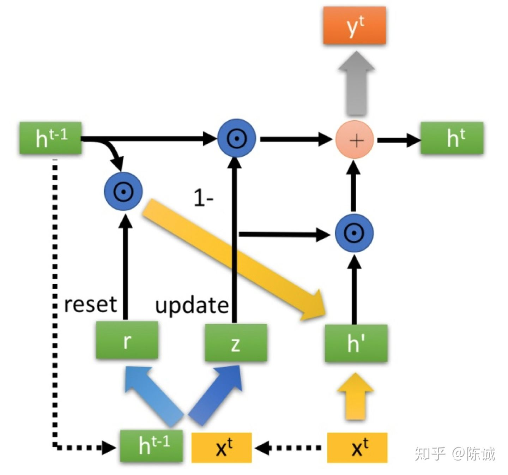

Recurrent Neural Network

# RNN 

## 简述
CNN 和普通的算法大都是输入和输出是一一对应的，不同输入之间是没有联系的，但是有些场合中，一个输入是不够的，例如处理序列数据时，就需要使用 RNN 来解决。

> RNN 最大的特点就是神经元在**某时刻的输出可以作为输入, 再次输入到神经元**，这种串联的网络结构非常 适合于时间序列数据，可以保持数据中的依赖关系
> 当时间序列数据存在长距离的依赖，并且该依赖的范围随时间变化或者未知，那么 RNN 可能是相对较好的解决方案。

-   **基本运行原理**：RNN跟传统神经网络最大的区别在于每次都会将前一次的输出结果，带到下一次的隐藏层中。

-   **缺点**：
	- RNN有短期记忆问题，无法处理很长的输入序列
	-   训练 RNN 需要投入极大的成本

# LSTM

# GRU

Gate Recurrent Unit

## 简述
- **问题解决**：GRU是RNN的一种，和LSTM一样，是用于解决解决长期记忆和反向传播中的梯度等问题而提出来的。
- **优点**：
  - 相比LSTM，GRU能够达到相当的效果
  - 并且相比 LSTM 更容易进行训练，很大程度上提高了训练效率。

## 结构

### 整体结构

  GRU的输入输出结构与普通的RNN一样。

  一个当前的输入 $x^t$ ，和上一个节点传递下来的隐藏状态（hidden state） $h^{t-1}$ ，这个隐藏状态包含了之前节点的相关信息。结合 $x^t$ 和 $h^{t-1}$，GRU 就会得到当前隐藏节点的输出 $y^t$ 和传递给下一个节点的隐状态 $h^t$。
  

### 内部结构

$\odot$： Hadamard Product 阿达玛乘，也就是操作矩阵中对应的元素相乘，因此要求两个相乘矩阵是同型的。
$\oplus$：则代表进行矩阵加法操作。

#### 门控信号

先通过上一个传输下来的状态 $h^{t-1}$ 和当前节点的输入 $x^t$ 来获取两个门控状态。其中 $r$ 控制**重置的门控**（reset gate），$z$ 为控制**更新的门控**（update gate）。

> $\sigma$ ：为 sigmoid 函数，通过这个函数可以将数据变换为 0-1 范围内的数值，从而来充当门控信号。

***重置***

得到门控信号后，首先使用重置门控来得到 “重置之后的” 数据 $h^{t-1^{\prime}}=h^{t-1} \odot r$ ，然后再将 $h^{t-1^{\prime}}$ 与输入 $x^t$ 进行拼接，然后在通过一个 $tanh$ 激活函数来将数据放缩到 -1 到 1 的范围之内，即可得到 $h'$。

这里的 $h'$ 主要是包含了当前输入的 $x^t$ 数据。有针对性的对 $h'$ 添加到当前的隐藏状态，相当于“记忆了当前时刻的状态”。类似于 LSTM 的**选择记忆**阶段。

***更新***：

在该阶段，同时进行了**遗忘和记忆**两个步骤。

首先使用先前得到的更新门控 $z$（update gate）<z的范围为0-1>，然后通过 **更新表达式**：
$$
h^t = (1-z) \odot h^{t-1} + z \odot h'
$$
其中 $z$越接近1，代表记忆下来的数据越多；同理，越接近0则代表遗忘的越多。

> - 前半部分：表示对原本隐藏状态的选择性遗忘，类似遗忘门
> - 后半部分：对当前节点信息进行选择性记忆，类似记忆门

将遗忘门和记忆门进行拼接。

## LSTM 与 GRU

**GRU 只使用了两个个门控 $r、z$ 就可以同时进行遗忘和选择记忆功能，而 LSTM 则需要三个门控

- GRU 的 $h'$ 可以堪称对应于 LSTM 的隐藏状态 (hidden state) $h^t$
- GRU 的上一个节点传下来的 $h^{t-1}$ 对应于 LSTM 的细胞状态 (cell state) $c^t$
- GRU 的 $1-z$ 对应于 LSTM 的遗忘门 $z^f$  (forget gate) ，对**过去**遗忘多少
- GRU的$z$ 对应于LSTM的记忆门$z^i$  (information gate)，对**现在**记忆多少
- GRU 内部少了一个"门控"，参数比 LSTM 少，但是却也能够达到与 LSTM 相当的功能。考虑到硬件的**计算能力**和**时间成本**，因而很多时候我们也就会选择更加”实用“的 GRU 。

