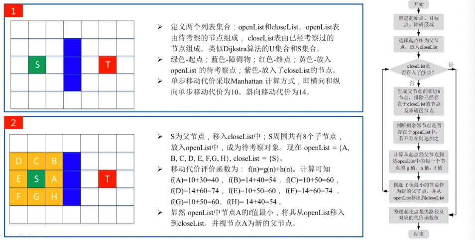

# 一、概述
路径规划解决无人车从起点到终点，走怎样路径的问题。规划的总体要求是不要撞到障碍物、保持自身的安全和可能相遇的车辆和行人的安全，在此基础上，依次追求以下目标：车体平稳、乘坐舒适、寻求路径最短。

**全局路径规划**是基于*已知环境* 中，给机器人规划一条路径，路径规划的精度取决于环境获取的准确度，若环境完全已知，全局路径规划可以找到最优解，当环境发生变化，如出现障碍物，就需要重新进行规划，因此全局路径规划是一种**事先规划**，对实时计算能力要求不高，规划结果是较优的，但是对环境模型的错误及噪声的**鲁棒性较低**。

**局部路径规划**侧重于考虑机器人当前的*局部环境信息*，让机器人具有良好的避障能力，局部规划将对环境的建模与搜索融为一体，需要对**环境模型动态更新**，对规划结果可以实时反馈和矫正，鲁棒性高，但是由于缺乏全局环境信息，所以规划结果可能不是最优的。

*局部路径规划一般是基于各种传感器建立的实时局部地图，在此基础上在进行最优线路选择，实时性更强。并为每个路径点分配一个时间戳和速度，然后用一条曲线将这些路径点进行拟合生成轨迹*

全局路径规划和局部路径规划没有本质的区别，全局路径规划和局部路径规划可以改进后适应于不同的场景，两者协作，可以更好的规划从起始点到终点的行走路径。

机路径规划除了考虑已知环境和未知环境地图，还要考虑动态环境和静态环境下的路径规划。

***核心步骤***
- 建立包含障碍区域与自由区域的环境地图
- 在环境地图中选择合适的路径规划搜索算法，快速实时地搜索可行路径。

# 二、全局路径规划

给无人车设定目的地，从出发到目的地走哪条路最好。

### 1.1 简述

**简述**：路径规划是指在在一定的环境模型基础上（全局地图数据库信息），给定自动驾驶汽车的起始点和目标点后，按照性能指标规划出一条无碰撞、能安全到达目标点的最优全局路径。路径规划通常是指**全局的路径规划**，也可称为全局导航规划，从出发点到目标点之间的纯几何路径规划，无关时间序列，无关车辆动力学。

**全局路径规划**：全局路径规划是由获取到的地图信息，规划出一条在特定条件下的**无碰撞最优路径**。

> 在电子地图、路网以及宏观交通信息等先验信息下，根据某优化目标得到两点之间的最优路径，常见于卫星定位导航等，完成路径规划的传感信息主要来自GPS定位信息以及电子地图。

**任务描述**：智能驾驶中进行道路、车道和行驶三级任务分工

- **道路级**：全局的任务规划
- **车辆级：** 根据周边交通状况规划运动轨迹
- **行驶级：** 根据前后车进行智能运动控制

### 1.2 基于图搜索

自动驾驶环境系统通常简化为有向网格图（Directed Graph Network；DGN），该图能够表示道路与道路之间的连接情况、通行规则、道路的路宽等各种信息，这个有向图也被称为路网图（Route Network Graph；RNG），自动驾驶车的路径规划问题可以转换为一个有向图搜索问题，处理此问题的成熟算法主要有：基于图搜索的方法、基于采样的方法、基于最优化的方法、基于曲线拟合轨迹规划算法。

#### 简述

利用一定的方法将自动驾驶车辆所在空间的环境模型转换成**离散图**，在满足搜索算法约束下从图中计算出行驶路径。图中每个节点表示状态空间的一个离散状态，节点之间的连接表示状态跳转。

#### 构建图方法

- **维诺图**：源于计算机图形学，构造维诺图需要依靠障碍物顶点，生成的路径有较好的平滑性，但是未必时最优路径。

- **栅格法**：将车辆所在的工作空间根据一定的规律分解成若干方形栅格，分解实时性较高，但该方法**适用于地图分辨率不高的场景**。

#### Dijkstr 算法

单源点最短路径算法，计算出一个节点到其他所有节点的最短路径。

Dijkstra算法 = 广度优先搜素 + 贪心策略

基于广度优先搜索算法，从根节点开始，沿着树的宽度遍历树的节点，如果所有节点均被访问则算法终止，广度优先搜索算法是在所有方向上均匀搜索。

基于贪心它只会选择当前最好的，而不是整体方面最好的；为了确定是整体最好的，需要对所有路径点都进行遍历。

> Dijkstra 能找到最短路径，但是需要遍历整个地图，由于搜索过程中没有目标，对于复杂环境时分耗时。

*如果不完全遍历会出现什么问题*

例如我们想从初始点去往某个目标点，到达这个目标点之前，可能有很多个可选点，但是根据贪心策略，会在已有可选点中选出一个点最近的点,如果这些可选点不完整，则不能保证这个点一定是最优的，因为他不像A* 算法一样，有一个明确的选点公式。

#### A*

$A^*$ 算法是一种简单有效的基于图搜索方法，$A^*$ 算法可以很好的解决最短路径问题，它在 Dijikstra 算法基础上加入了启发估算函数，引导搜索路径向目标节点扩展，减少搜索空间，加速规划过程。$A^*$ 算法的计算公式如下所示：

在 Dijkstra 算法基础上加入启发估算函数来决定每个节点搜索的权重，慢慢向目标靠近，用于加速运算。

A* 算法是一种静态路网中求解最短路径最有效的直接搜索方法，算法中距离估算值与实际值越接近，最终的搜索速度越快，同时A* 算法也可用于动态路径规划中，只是当环境发生变化时，重新规划路线。

计算一个**成本函数**，选择成本函数最低的节点作为接下来要前往的节点：
$$
f(x) = g(s) + h(x)
$$
- $g(x)$ ： 表示起始节点到当前节点路径长度；
- $h(x)$ ：启发式函数，当前节点到目标节点的估计值，通常用欧式距离表示。
  > 启发式函数的作用是引导搜索向目标节点扩展，减少搜索所需的状态节点，从而提高效率。因此在未检测到障碍物时，它会以一条直线作为接下来可能的预测轨迹，随着不断对周围感知，会不断修正预测的轨迹。

#### D* 算法

是一种适应于动态环境的启发式的路径搜索算法。不需要预先探索环境，在位置环境下，随着机器人不断探索，路径也会时刻调整。

- 特点：同A * 算法类似，D * 通过维护一个优先队列openList来对场景中的路径节点进行搜索，不同的是，D * **从目标点开始搜索**，通过将目标置于openList中来开始搜索，直到机器人当前位置节点从openList出队为止

- D * 分为两个阶段：第一阶段基于Dijkstra/ A * 算法从**目标点往起点进行搜索**，得到搜索区域节点距离目标点最短路径的信息；第二阶段是**动态避障搜索**阶段。
- 因此D* 算法主要分为两个部分，第一部分是Process state，主要用于处理节点信息；第二部分是Modify_cost，主要用于修正若干个受障碍物影响而导致代价值发生变化的那些节点信息。

- 流程

### 1.3 基于最优化

自动驾驶的汽车的路径规划问题可以用多目标优化问题来描述，利用**目标函数**对规划问题进行描述（对无人车姿态和环境约束条件建模），并利用**数值优化**的方法对其进行在线求解，从而得到最优轨迹。基于优化的方法，包括基于状态空间的最优控制、凸优化。

**最优控制方法**：将车辆视为一个动态系统，建立满足车辆动力学的状态空间方程，通过设计目标函数增加约束条件和任务目标。

> 由于在最优控制方法中考虑时间的因素，因此生成的最优轨线是轨迹而不是路径，轨迹具有曲率连续的优点，且生成的轨迹中包括和时间相关的速度、加速度等轨迹特征量。 

### 1.4 基于随机采样

基于随机采样的路径规划算法是**概率性**算法，通过对工作空间的采样来评估连通性信息，这一随机采样的策略针对复杂问题可以快速找到可行解。在Dijkstra算法的基础上改良的，为了减少计算量，加入了启发式算法，配合随机采用，只计算样本中最短路径，解决了计算量的问题，但路径可能不连续。

**缺点**：
- 但由于其随机性，找到的解通常是次优解。
- 基于随机采样的路径规划算法不能保证在一定时间内针对所有问题都能找到解，也就是完备性问题。

**方法**：随机势规划（RPP）算法、随机路标图（PRM）算法、**快速搜索（RRT）树**、扩展空间树（EST）算法等。

**过程**：采样、度量、最近邻搜索、父节点搜索、局部优化、碰撞检测。

*RRT算法：*

是一种采用**增量方式**增长的随机采样算法，RRT算法是基于初始点和目标点进行随机采样，增量式地生成随机树。它将初始点作为随机数的根节点，通过随机采样，增加叶子节点的方式，不断向四周扩展，构造一个随机扩展树。

它可以快速的搜索整个可行域，到那时它的主要缺点在于其创建的干扰路径以及在树的扩展过程中对最近邻居的度量标准有很强的依赖性。

> 在路径规划方面，搜索最近路径主要有两种方式，增量式方法和局部搜索。其中局部搜索的方法主要有：人工势场法、矢量柱状图（VFH）算法、模糊逻辑算法、遗传算法、蚁群算法、神经网络算法等。

### 1.5 基于曲线拟合

规划算法中，可以通过计算机图形学相关技术对若干路点进行路径平滑，综合物理可行性、车辆动力学、舒适性等因素来拟合车辆轨迹。

**曲线拟合算法将离散节点拟合成斜率连续的平滑路径**， 一般可以通过高阶多项式、Dubins曲线、Reeds-Sheep曲线、贝塞尔曲线等方式实现。常用的曲线拟合算法包括：直线和圆弧、Clothoid曲线、多项式曲线、三次样条曲线、B样条曲线。

**1. 多项式曲线**：

根据给定节点处的研究对象的状态信息，在给定约束条件下获得**曲率连续**可导的路径。如果约束条件不满足，必须对整条轨迹进行调整来满足约束条件的要求，计算量较大、使其应用受限。

> 贝塞尔曲线式一种光滑插值曲线，有多个给定节点共同控制其形状。
> Dubins 曲线由直线线段和不同半径的圆弧组成，虽然考虑到了系统的非完整性约束，却无法处理复杂碰撞情况。
> Reeds-Sheep曲线在Dubins曲线基础上有了更强适用性，它允许自动驾驶车辆在行驶过程中执行倒车操作。

**2. 三次样条曲线**：

从车道地图获得的一组航路点的**中心线**，生成一系列三次样条的参数，其使用**弧长和偏移**到中心线来表示可能的路径候选，避免了静态和移动障碍，然后这些候选都被转换为**笛卡儿坐标**。考虑到静态安全性、舒适性和动态安全性的总成本，该方法选择最佳路径的同时还确定了最佳路径的适当加速度和速度，包括单车道道路和具有静止与移动障碍物的多车道的道路。

**3. B样条曲线**：

由一组称作**控制点**的向量来确定，这些控制点按顺序连成一个**控制多边形**，B样条曲线就是逼近这个控制多边形。B样条曲线具有**曲率连续**的优点，在相邻曲线段的节点处曲率也是连续的，且具有局部支撑性等特点，如果轨迹局部的约束条件不满足，可以通过调整相应控制单的方法来对轨迹进行修正，从而不影响其他的轨迹段，具有应用性强的特点。

# 二、 运动轨迹规划

在行进过程中，遇到障碍物、行人、车辆等，怎样获得理想的行进路径，利用卫星定位和自身保存的离线地图规划出理想路径。

## 2.1 简述

运动规划可理解为局部路径规划和速度规划，也可理解为常说的运动轨迹规划。

**运动轨迹规划**：在静态路径规划的基础上考虑时间因素和车辆的动力学、运动学等约束条件，根据车辆当前的位姿以及传感器收集到的周围环境的状态信息，为提升智能汽车安全、高效和舒适性能，规划出可行的运动轨迹，包括行驶轨迹、速度、方向和状态等。最后将轨迹、车速等信息以控制量的方式供给到后续的控制系统，使得车辆可以沿着相应的轨迹行驶，避免碰撞。

> 轨迹规划能对任务决策层产生的各种任务分解做出合理规划，规划结果的安全性、舒适性是衡量运动规划层性能的重要指标

**原因**：全局路径规划所生成的路径只能是从起点到目标点的**粗略路径** （离散的路径点），并没有考虑路径的方向、宽度、曲率、道路交叉以及路障等细节信息，加之车辆在行驶过程中受局部环境和自身状态的不确定性的影响，会遇到各种不可测的情况。

**任务**：生成一条轨迹，并将其发送到对车辆进行实际控制的反馈控制模块。

**局部路径规划**：全局路径规划的引导下，根据实时获取的环境信息，以及定位信息，规划出可以**安全避障并能跟踪全局路径的局部期望路径**，最终到达目标点的过程。局部路径规划输出的是一条满足车辆运动学约束、几何学约束的曲率连续的局部期望路径。

> 环境信息主要来自车载传感器如雷达、相机等，用以识别道路障碍、车道线、道路标识信息和交通信号灯信息等。

**速度规划：** 在局部期望路径基础上系统的考虑驾驶安全性、乘坐舒适性等约束，规划出车辆行驶的速度曲线。

## 2.2 局部路径规划

智能汽车进行局部路径规划（实时路径规划），一般是指在有障碍物的环境中，利用自身传感器感知周边环境，寻找一条从当前点到目标点的局部行驶路径，使智能汽车在本次任务中能安全快速的到达目标位置

以全局路径为参考，优化行走路径，并为原离散的点，加入方向、速度等信息。

*关键步骤：*

- **建立环境模型**， 即将智能汽车所处的现实世界抽象后，建立计算机可认知的环境模型。
- **搜索无碰撞路径**，即在某个模型的空间中，在多种约束条件下，选择合乎条件的路径搜索算法。

*局部路径规划方法*：

- **基于滚动时域优化的轨迹规划方法**：依靠智能汽车通过传感器实时探测到的局部环境信息，以滚动的优化的方式进行在线规划。反应速度快，能快速适应变化的环境，但是计算量相对较大。
- **基于轨迹片段的运动规划方法**：轨迹片段包含配平轨迹和机动轨迹。可以通过考虑车辆的运动学和动力学约束条件，基于最优控制原理和机动轨迹设计方法和随机采样法，实现基于轨迹片段的连接的最优运动轨迹规划和快速运动规划。较为复杂，在实际应用中受限。
  - 配平轨迹：系统处于相对平衡时所经历的轨迹
  - 机动轨迹：系统从一个相对平衡的跃入另外一个相对平衡所经历的轨迹。

***为什么有全局路径规划还需要局部路径规划？***

全局路径规划所生成的路径只是从初始点到目标点的**粗略路径**，未考虑到路径的宽度、曲率、车体自身大小以**及未知障碍物的信息**，而且车体在运行过程中，容易受到实时环境和自身状态不确定的影响，因此全局路径规划的实时性效果不佳。

*局部路径规划一般是基于各种传感器建立的实时局部地图，在此基础上在进行最优线路选择，实时性更强。并为每个路径点分配一个时间戳和速度，然后用一条曲线将这些路径点进行拟合生成轨迹*

因此，在路径规划中，先规划出一条全局最优路径，再以局部环境信息和车体自身状态为基础，规划出一定范围内无碰撞的局部路径。

### 2.2.1  DWA

设定一个模拟周期，在此周期内充分考虑自动驾驶汽车的初速度、车的运动模型、自身硬件的性能因素，模拟车体在当前环境下的速度采样空间，对所有速度轨迹利用**评价函数**进行评价，从动态速度窗口中选择评价最高的速度，从而规划车体下一时刻的运动 。

DWA算法是一种对局部环境进行规划的算法，在运行过程中考虑当前最优速度，在实际应用中要与全局路径规划结合。动态窗口局部运动规划算法具有很好的稳定性和避障效果等优势。

*算法步骤*
- 【初始化】**初始化**算法运行所需要的参数，包括目标点与初始点位置，车体动力学模型参数等。
- 【速度搜索空间】根据当前车体的状态与运动模型参数，计算**速度空间**；根据车体自身的最大、最小速度、电机性能、安全距离等因素的限制，确定下一时刻所有可允许**速度搜索空间**；
- 【轨迹生成】；遍历所有速度组合（线速度、角速度），将数据代入到运动模型中，就可以计算一段轨迹；
- 【轨迹评价】依据**评价函数**对速度空间的值（轨迹）进行评价，选取一组最优速度； 将选出的最优速度作为下一时刻车体的运动状态参数
- 不断迭代循环，直至到达目标点。

> 对于评价函数，有三种评价方式：
> - 轨迹末端到目标点的距离，离目标点越近越好
> - 末端到障碍物的距离，离障碍物越远越好
> - 速度越快越好

### 2.4 TEB
时间弹性带

针对初始全局轨迹进行后续修正，从而优化机器人的运动轨迹， TEB 可以被表述为一个**多目标优化**，例如整体路径长度、轨迹运行时间、与障碍物距离、通过中间路径点以及机器人运动学、动力学以及几何约束的符合性。 

TEB 生成的局部轨迹由一系列带有时间信息的**离散位姿**组成，g2o 优化（通用图优化）的目标是这些离散的位姿，使最终由这些离散位姿组成的轨迹能够达到时间最短、距离最短、远离障碍物等目标，同时限制速度与加速度使轨迹满足机器人运动学。

> g2o优化若参数设置不合理可能会失败，TEB算法包含一个**冲突检测**，用于在生成轨迹后逐点判断轨迹上的点是否与障碍物冲突，

[[图优化]]

*TEB算法与DWA算法*
TEB算法在运动过程中会调整自己的朝向，到达目标点不需要旋转，DWA是先到目标点后，在原地旋转到目标朝向。因此TEB算法在移动过程中改变朝向，可能会使得运动路径不流畅。