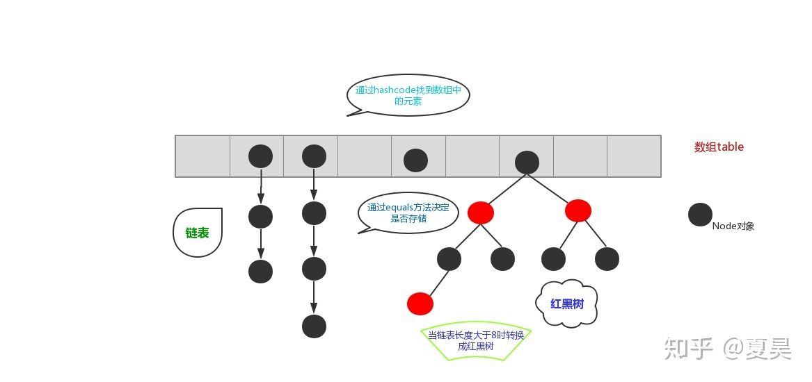

研究生的方向是多智能体深度强化学习方向，目前是在中国空间技术研究院杭州中心实习，做的方向是深度强化学习在仿生机器人中的应用。
研究生期间，接触较多的是强化学习相关的项目。
- 在研一时做过基于深度强化学习的智能小车对战，目标就是智能体通过激光的攻击方式尽可能短的时间击败敌方小车，完成了 1v1 和 2v1 的训练和测试，
- 研二上，完成了未知环境下基于强化学习的多自主体智能决策和协同控制的项目，目标就是合理避障的同时，优化智能体的行走路径，以最小的代价完成未知环境的探索和建图。基于 Linux 下 ROS 框架，通过分层控制结构，Voronoi 分区进行为每个智能体分配目标点，深度强化学习方法引导智能体前往分配的目标点；
- 项目结题后，发现可以进行改进，通过多智能体深度强化学习并结合 Voronoi 分区、基于好奇心驱动的内在奖励进行决策，通过 A* 算法完成规划导航，从而有效率的完成未知环境下多智能体的协同探索和建图。

研究生期间也做过和其他的专业交叉融合的项目，将粒子群和神经网络应用在交通、土木方向上，接触过图像处理和机械臂的相关任务。

**实习的难点**
- 做项目的整体过程，对一个项目，通常调研不是很充分，通常就是边做边规划，而在工作中通常需要有一个完整的调研，然后规划出几个月的任务安排，任务安排到天，这需要对对整个项目有一个清晰的认知。
- 项目开始时的难点是，对一个问题进行数学建模，转换成强化学习的模式
- 任务汇报的时候，不同于学校的一些技术、组会、答辩汇报，对领导汇报时，需要更加简洁、清晰、明了。

**什么是集成学习？**
集成学习算法本身不算一种单独的机器学习算法，而是通过构建并结合多个机器学习器来完成学习任务。集百家之所长，能在机器学习算法中拥有较高的准确率，不足之处就是模型的训练过程可能比较复杂，效率不是很高。
目前常见的集成学习算法主要有 2 种：
- 基于 Bagging 的算法：随机森林
- 基于Boosting的算法：Adaboost、GBDT、XGBOOST等。

**Pytorch：model. train () 和 model. eval () 用法和区别 ？**
- `model.train ()` 的作用是启用 Batch Normalization 和 Dropout，用于训练阶段。
- `model.eval ()` 的作用是不启用 Batch Normalization 和 Dropout ，用于测试阶段。
	此时 pytorch 会自动把 BN 和 DropOut 固定住，不会取平均，而是用训练好的值。不然的话，一旦 test 的 batch_size 过小，很容易就会因 BN 层导致模型 performance 损失较大；
- `torch.no_grad()` 也是用于测试阶段，用于关闭梯度计算，节省 eval 的时间。

只进行 inference 时，model. eval () 是必须使用的，否则会影响结果准确性。 而 torch. no_grad () 并不是强制的，只影响运行效率。


**梯度消失和梯度爆炸？**
链式法则计算梯度时，下层梯度计算小于 1，经过层层累积，上层梯度越来越小，即上层权重更新速率低于下层权重更新速率，导致梯度消失，梯度爆炸则是上层权重更新速率高于下层权重更新速率。
产生原因：层数过多，激活函数不正确
解决：选择合适激活函数，BN/LN
[[梯度消失 & 梯度爆炸]]


**BN 和 LN 的区别？**


**强化学习在推荐、广告中的应用？**
购物想法是很容易改变的。假设用户在购物平台停留时间越长，则有可能消费的话，
总体上：监督学习可能希望推荐的每一个商品都停留时间长一点，通过贪婪思想，则整体停留的时间就多一些；强化学习优化目标关注的是整个停留时间，可能有些推荐的商品用户很快划走了，但是最终浏览的累积的时间变长了。所有优化目标就需要去设计相应的状态、动作、奖励。

**什么是 xgboost 算法**

### TCP 和 UDP
1、基于连接与无连接；
2、对系统资源的要求（TCP较多，UDP少）；
3、UDP程序结构较简单；
4、流模式与数据报模式 ；
5、TCP保证数据正确性，UDP可能丢包；
6、TCP 保证数据顺序，UDP 不保证。

### 字典、哈希表、红黑树 
字典由哈希表实现，哈希表是由 数组+链表+红黑树的形式的
散列表（Hash table，也叫哈希表），是根据关键码值(Key)而直接进行访问的数据结构。也就是说，它通过把关键码值映射到表中一个位置来访问记录，以加快查找的速度。这个映射函数叫做**散列函数**，存放记录的数组叫做**散列表**。

哈希表的数据结构
```Python
class HashTable:
    def __init__(self, size):
	    # 使用list数据结构作为哈希表元素保存方法
        self.elem = [None for i in range(size)]  
        self.count = size  # 最大表长

    def hash(self, key):
	    # 散列函数采用除留余数法
        return key % self.count  

    def insert_hash(self, key, value):
        """插入关键字到哈希表内"""
        address = self.hash(key)  # 求散列地址
        while self.elem[address]:  # 当前位置已经有数据了，发生冲突。
            address = (address + 1) % self.count  # 线性探测下一地址是否可用
        self.elem[address] = value  # 没有冲突则直接保存。

    def search_hash(self, key):
        """查找关键字，返回布尔值"""
        star = address = self.hash(key)
        while self.elem[address] != key:
            address = (address + 1) % self.count
            if not self.elem[address] or address == star:  
            # 说明没找到或者循环到了开始的位置
                return False
        return True
```

大体流程：
- **定位**；确定 key 在数组中的对应位置；计算 key 值对应的 hashcode；再对该 hashcode 取一次 hash, 该值用来定位要将这个元素存放到数组中的什么位置。若不同key值对应不同散列地址（存储位置称散列地址），则直接存储即可，
- **冲突解决**：而不同的 key 值可能得到同一散列地址，这种现象称为冲突。如果冲突，则首先判断 value 值是否相同，如果两者相等则直接覆盖，如果不等则在原元素下面使用**链表**的结构存储该元素。
- 数组 + （链表/红黑树）：因为链表中元素太多的时候会影响查找效率，所以当链表的元素个数达到8并且数组长度超过64的时候使用链表存储就转变成了使用红黑树存储，原因就是**红黑树是平衡二叉树（自平衡二叉查找树）**，在查找性能方面比链表要高。

参考
- https://zhuanlan.zhihu.com/p/79507868
- https://www.jianshu.com/p/d04edc8aaf0f
- http://static.kancloud.cn/alex_wsc/java_source/1852265

**多线程和多进程的区别？：**
线程时进程的子集，一个进程有多个线程组成。
多进程数据是分开的，共享复杂，但是同步方便
多现成的共享进程数据，共享简单，但是同步复杂。